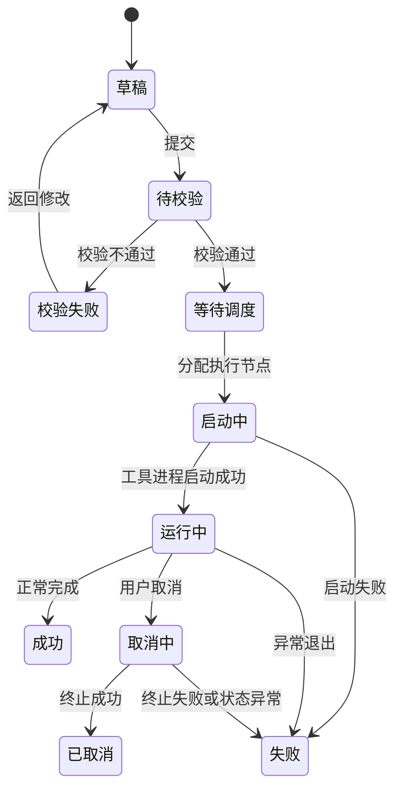

# OB Loader/Dumper 轻量级调度平台产品需求文档（PRD）

> 文档版本：V0.1（需求讨论整理稿）  
> 目标工具版本：OceanBase Loader/Dumper V4.3.5  
> 文档状态：待产品评审  
> 整理范围：依据产品需求讨论中已确认的内容，形成可继续细化原型、参数映射、接口设计和开发任务的 PRD 基线。  
> 文档位置：`docs/01-product/PRD.md`  
> 关联文档：[产品范围](product-scope.md)｜[关键决策](decisions.md)｜[文档中心](../README.md)

> 现行范围注记（2026-07-22）：当前工程切片只使用私有 ODP 连接；本文中任何“直连 OBServer 或 ODP”的历史表述不再作为当前实现选项。云 ODP、ODP Sharding 和未确认的集群参数映射不自动纳入。原始需求保留，现行决策见[关键产品决策](decisions.md#dec-045-当前连接范围仅使用私有-odp)。

> Export 现行注记（2026-08-22）：第 7 章保留原始需求讨论，不再作为六步顺序和参数呈现的实现依据。现行顺序、普通新建格式、对象下拉、高级设置、`--query-sql` 与 `--retain-empty-files` 规则见 [DEC-046](decisions.md#dec-046-export-v1-六步向导与参数分层定版) 和 [Export Canonical](../02-design/export-module.md)。

---

## 0. 文档说明

### 0.1 文档目的

本文档用于明确 OB Loader/Dumper 轻量级调度平台的产品定位、功能边界、信息架构、核心业务流程、页面功能、交互规则、异常处理和验收标准，作为后续以下工作的共同基线：

- UI/UX 原型设计；
- 前端页面开发；
- 后端调度与执行服务开发；
- OB Loader/Dumper 命令生成器开发；
- 参数校验规则开发；
- 执行节点 Agent 开发；
- 测试用例设计和产品验收。

### 0.2 文档结论口径

本稿分为两类内容：

1. **已确认的产品需求**：来源于双方需求讨论，可作为 V1.0 产品设计基线。
2. **待官方参数明细补充的内容**：已经确定产品结构和交互原则，但仍需继续基于 V4.3.5 官方命令行选项及实际 `--help` 输出，补齐所有参数、默认值、互斥关系和适用条件。

本稿不将未经逐项核验的命令行参数名称、默认值或组合关系写成最终结论。

### 0.3 产品命名

当前建议名称：

**OB Loader/Dumper 调度平台**

产品简称可暂定为：

**OB Data Orch**

V1.0 不以“通用数据迁移平台”为目标，也不在产品宣传或架构设计中提前承诺接入其他迁移引擎。产品首先服务于 OB Loader/Dumper 的可视化封装、任务调度和运行监控。

---

# 1. 产品概述

## 1.1 建设背景

OB Loader/Dumper 以命令行方式提供 OceanBase 数据导入、导出能力，功能丰富，但参数数量较多，参数之间存在必填、依赖、条件显示、互斥和版本适用关系。对于不熟悉工具的开发人员，直接手工拼写命令存在以下问题：

- 学习成本高，难以快速掌握完整参数；
- 容易出现参数遗漏、格式错误或非法组合；
- 每次执行需要重复查阅文档和拼接命令；
- 多用户在不同执行机器上运行，任务状态和资源使用情况分散；
- 无统一任务视图，不便于查看进度、失败原因、历史命令和执行日志；
- 缺少统一的数据源、执行节点、配置模板和任务记录管理。

因此，需要建设一套轻量级 Web 调度平台，将 OB Loader/Dumper 的官方命令行能力转化为向导式操作，并对任务进行统一调度、监控和追踪。

## 1.2 产品定位

> 面向开发和运维人员，以可视化向导替代复杂的 OB Loader/Dumper 手工命令，提供标准化的数据导入、导出配置、执行调度、命令确认和运行监控能力。

平台与 OB Loader/Dumper 的关系如下：

- OB Loader/Dumper 是实际执行引擎；
- 执行节点负责运行官方工具命令；
- 平台负责任务配置、参数校验、命令生成、任务调度、日志采集和状态展示；
- 平台不重新实现数据导入、导出内核；
- 平台不提供超出官方工具能力范围的数据处理功能。

## 1.3 产品目标

V1.0 重点实现以下目标：

1. 降低 OB Loader/Dumper 的学习和使用门槛；
2. 通过向导和参数联动避免非法参数组合；
3. 在执行前展示完整命令，便于用户核对；
4. 集中管理数据源和执行节点；
5. 统一展示任务状态、进度、日志和失败信息；
6. 支持历史配置复用，减少重复操作；
7. 保持轻量、清晰、可落地，不建设大而全的数据库客户端。

## 1.4 V1.0 非目标

V1.0 明确不包含以下能力：

- 不建设 Navicat、ODC 类通用数据库客户端；
- 不提供 SQL 编辑器和数据库对象日常管理；
- 不开发自研导入、导出协议或迁移内核；
- 不扩展 OB Loader/Dumper 官方未支持的导入、导出格式；
- 不在数据源连接测试中执行复杂权限评估或对象级检查；
- 不自动修改数据库结构；
- 不自动生成目标表结构；
- 不提供复杂的数据清洗、字段转换或 ETL 编排；
- 不在首页堆叠大量监控图表或复杂拓扑；
- 不建设完整的基础设施监控平台；
- 不承诺旁路导入的断点续传或任务级续跑能力。

---

# 2. 用户与使用场景

## 2.1 用户角色

### 2.1.1 开发人员

主要诉求：

- 不手工拼写复杂命令；
- 快速完成导入、导出任务；
- 查看自己的任务状态和失败原因；
- 复用历史配置或模板；
- 在执行前核对最终命令。

### 2.1.2 运维人员 / DBA

主要诉求：

- 管理数据源和执行节点；
- 查看所有用户任务；
- 排查失败任务和执行日志；
- 了解执行节点负载和在线状态；
- 控制高风险参数和生产环境操作。

### 2.1.3 系统管理员

主要诉求：

- 管理执行节点；
- 配置工具安装目录、日志目录和平台默认项；
- 查看平台审计记录；
- 管理用户权限和环境范围。

## 2.2 核心场景

1. 开发人员从测试环境导出指定数据库或表的数据；
2. 开发人员将标准数据文件普通导入 OceanBase；
3. 运维人员对大批量单表数据执行旁路导入；
4. 用户查看正在运行任务的阶段、进度和日志；
5. 用户复制平台生成的完整命令进行人工复核；
6. 用户基于历史成功任务重新创建任务；
7. 运维人员查看执行节点在线状态和资源负载；
8. 管理员排查执行节点离线、工具异常或任务调度失败。

---

# 3. 产品设计原则

## 3.1 以任务为中心

用户的目标是“完成一次导入或导出”，而不是“填写一组命令参数”。所有页面和流程围绕任务创建、确认、执行、追踪和复盘展开。

## 3.2 向导式操作

复杂参数按照用户决策顺序拆分，不在一个页面堆叠全部参数。前一步选择决定后一步显示内容。

## 3.3 官方能力一一映射

页面中的每一个执行选项必须能够映射到：

- OB Loader/Dumper 官方命令行选项；或
- 官方配置文件参数；或
- 平台自身的调度管理字段。

无法映射到上述三类的功能，不进入 V1.0。

## 3.4 默认值优先采用官方默认

普通用户不需要理解全部高级参数。平台默认不主动改变官方默认行为；用户展开高级配置后，才允许修改对应参数。

## 3.5 参数约束由系统主动限制

对于互斥、依赖和条件显示关系，系统应通过控件状态和流程设计阻止非法组合，而不是等任务执行后再报错。

## 3.6 最终命令必须可见

向导最后一步必须展示完整命令，支持复制和核对。用户确认命令后才能提交执行。

## 3.7 数据源回归数据源本质

数据源管理仅负责保存连接信息和验证连接是否可用，不在该模块衍生权限检查、对象扫描、容量分析等功能。

## 3.8 首页只负责看状态

首页不是任务配置页，也不是完整监控平台。首页需要让用户在较短时间内理解：

- 当前系统是否正常；
- 当前是否繁忙；
- 我的任务是否正常；
- 是否存在需要处理的失败或异常。

## 3.9 列表做管理，详情做分析

- 首页：看状态；
- 列表页：做筛选和管理；
- 详情页：看参数、命令、进度、日志和错误。

---

# 4. 产品信息架构

```text
OB Loader/Dumper 调度平台
├── 首页
├── 数据源管理
├── 导出任务
│   └── 新建导出向导
├── 导入任务
│   ├── 普通导入
│   └── 旁路导入
├── 任务中心
│   └── 任务详情
├── 日志中心
├── 模板中心
├── 执行节点
└── 系统设置
```

## 4.1 一级导航建议

| 一级菜单 | 主要职责 |
|---|---|
| 首页 | 展示平台整体运行概况、任务趋势和节点健康情况 |
| 数据源 | 管理 OceanBase 连接信息并执行连接测试 |
| 导出 | 创建 OBDUMPER 导出任务 |
| 导入 | 创建普通导入或旁路导入任务 |
| 任务中心 | 统一管理导入、导出任务 |
| 模板中心 | 保存和复用常用参数配置 |
| 执行节点 | 管理运行 Loader/Dumper 的执行机器 |
| 日志中心 | 查询任务日志、调度日志和节点日志 |
| 系统设置 | 管理平台级基础配置 |

日志中心和系统设置可根据页面空间放入“更多”或管理员菜单，但功能边界保持不变。

---

# 5. 首页

## 5.1 页面定位

首页是运行概览页，不承担复杂操作。首次进入平台的用户应能够快速了解整体运行情况。

## 5.2 首页需要回答的问题

1. 平台当前是否健康？
2. 当前有多少任务正在执行、等待或失败？
3. 执行节点是否全部在线，是否存在高负载节点？
4. 我的任务是否需要处理？
5. 最近是否发生明显失败或异常？

## 5.3 页面结构

建议采用以下布局：

```text
┌────────────────────────────────────────────────────────────┐
│ 平台运行摘要 + 核心指标卡                                   │
├────────────────────────────────┬───────────────────────────┤
│ 任务趋势图                     │ 执行节点健康度             │
├────────────────────────────────┼───────────────────────────┤
│ 我的任务                       │ 最近失败 / 异常            │
└────────────────────────────────┴───────────────────────────┘
```

## 5.4 平台运行摘要

以一句自然语言描述当前状态，例如：

> 当前平台运行正常，6 个执行节点在线，4 个任务执行中，1 个任务等待调度，最近 1 小时无失败任务。

状态摘要由任务和节点状态聚合生成，不使用复杂评分算法。

## 5.5 核心指标卡

V1.0 建议最多保留 4 个：

- 运行中任务数；
- 等待中任务数；
- 今日成功任务数；
- 今日失败任务数。

可选显示“在线执行节点数 / 总节点数”，但不再增加过多业务指标。

## 5.6 任务趋势图

首页只保留一张主要图表。

### 默认展示

- 时间范围：最近 24 小时；
- 统计粒度：按小时；
- 指标：任务总数、成功数、失败数；
- 图表类型：折线图或柱线组合图。

### 交互

- 支持切换最近 24 小时、最近 7 天；
- 点击某个时间点跳转任务中心，并自动带入时间筛选条件；
- 不在首页显示大量资源曲线。

## 5.7 执行节点健康度

首页展示执行节点的简要状态，而不是调度平台服务器自身的资源监控。

### 展示字段

- 节点名称；
- 在线状态；
- 正在运行任务数；
- CPU 使用率；
- 内存使用率；
- 最近心跳时间。

### 展示规则

- 默认展示异常节点和负载最高的若干节点；
- 全部节点正常时，按运行任务数或负载排序；
- 点击进入执行节点详情或节点列表。

## 5.8 我的任务

展示当前登录用户最近的重点任务：

- 运行中；
- 等待中；
- 最近失败；
- 最近完成。

### 字段

- 任务名称；
- 类型；
- 状态；
- 当前阶段；
- 进度（工具输出可解析时展示）；
- 开始时间或更新时间。

## 5.9 最近失败 / 异常

展示需要用户关注的内容：

- 最近失败任务；
- 执行节点离线；
- 调度失败；
- 工具进程异常退出。

V1.0 不建设复杂告警平台，只展示平台已识别的核心异常。

## 5.10 首页验收标准

- 页面打开后无需进入二级页面即可看到整体状态；
- 页面只包含一张主要趋势图；
- 节点监控对象为执行节点；
- 任一任务或节点摘要均可跳转到对应详情；
- 首页不出现新建任务向导的大量配置表单。

---

# 6. 数据源管理

## 6.1 模块目标

集中管理 OceanBase 数据源，避免用户在每次任务中重复输入连接信息。

## 6.2 功能边界

数据源模块仅提供：

- 新增；
- 编辑；
- 查看；
- 测试连接；
- 启用 / 禁用；
- 删除或归档。

不提供：

- 复杂权限检查；
- 数据库对象扫描；
- 数据量统计；
- 导入导出可行性判断；
- 数据库资源监控；
- 自动授权。

## 6.3 数据源列表

### 筛选项

- 关键字；
- 环境；
- 兼容模式；
- 连接状态；
- 启用状态；
- 创建人。

### 列表字段

| 字段 | 说明 |
|---|---|
| 数据源名称 | 用户自定义名称 |
| 环境 | 开发、测试、预生产、生产等 |
| 连接方式 | OBServer 或 ODP |
| 地址 | 主机名或 IP，敏感场景可脱敏 |
| SQL 端口 | 数据库 SQL 连接端口 |
| 集群 / 租户 | 根据连接方式显示 |
| 兼容模式 | MySQL 或 Oracle |
| 状态 | 可连接、连接失败、未测试、已禁用 |
| 最近测试时间 | 最近一次连接测试时间 |
| 创建人 | 数据源创建者 |
| 操作 | 查看、测试、编辑、禁用、删除 |

## 6.4 新增 / 编辑数据源

### 基础信息

| 字段 | 必填 | 说明 |
|---|---:|---|
| 数据源名称 | 是 | 平台内唯一或按环境唯一 |
| 环境 | 是 | 开发、测试、生产等 |
| 描述 | 否 | 说明用途和业务范围 |
| 连接方式 | 是 | OBServer / ODP |

### 连接信息

| 字段 | 必填条件 | 说明 |
|---|---|---|
| 主机地址 | 是 | IP、域名或 VIP |
| SQL 端口 | 是 | SQL 连接端口 |
| 集群名 | 否 | 连接 ODP 时可按官方连接方式配置；未填写时使用用户@租户身份 |
| 租户名 | 是 | OceanBase 租户 |
| 用户名 | 是 | 业务租户用户 |
| 密码 | 是 | 加密存储，页面不可明文回显 |
| 默认数据库 / Schema | 否 | 仅用于向导默认回填，不作为连接测试必须项 |

### 兼容模式

兼容模式优先在连接成功后识别并保存；无法可靠识别时，由用户选择 MySQL 或 Oracle，并在连接测试后校验。

## 6.5 连接测试

### 测试目标

连接测试只判断“能否建立数据库连接并完成基础查询”。

### 测试步骤

1. 校验地址和端口格式；
2. 建立 TCP / 数据库连接；
3. 执行账号认证；
4. 获取可安全读取的基础数据库信息；
5. 返回成功或失败及耗时。

### 成功结果

- 连接成功；
- 响应耗时；
- 数据库版本（能够获取时）；
- 兼容模式（能够获取时）；
- 当前租户 / 用户信息（能够获取时）。

### 失败结果

- 网络不可达；
- 端口连接失败；
- 认证失败；
- 租户、集群或用户格式错误；
- 连接超时；
- 其他数据库返回错误。

### 明确不做

连接测试不返回“适合导入”“适合导出”“权限完整”等综合诊断结论。具体权限和任务参数在任务提交前结合实际操作进行校验。

## 6.6 空状态

当用户首次进入且无数据源时：

- 展示数据源用途说明；
- 提供“新增数据源”主按钮；
- 不展示空白表格。

## 6.7 安全要求

- 密码必须加密存储；
- 页面不可回显原始密码；
- 编辑时密码字段默认留空，未修改则保留原密码；
- 非授权用户不得查看生产数据源连接详情；
- 所有新增、编辑、删除和测试操作记录审计日志。

## 6.8 验收标准

- 用户能够新增并测试 MySQL / Oracle 兼容模式的数据源；
- 向导只允许选择已启用的数据源；
- 数据源连接失败时，测试结果可明确区分网络、认证和超时类错误；
- 数据源页面不展示对象列表和权限评估。

---

# 7. 导出模块（OBDUMPER）

## 7.1 模块目标

通过分步向导将 OBDUMPER 官方导出能力可视化，让用户在不手工拼接命令的情况下完成合法的导出配置，并在执行前核对完整命令。

## 7.2 导出向导流程

```text
步骤 1：选择数据源
    ↓
步骤 2：选择导出对象
    ↓
步骤 3：选择导出内容
    ↓
步骤 4：选择导出格式
    ↓
步骤 5：执行与输出配置
    ↓
步骤 6：命令预览与执行确认
```

## 7.3 步骤 1：选择数据源

### 页面目标

选择一个已配置、已启用的数据源。

### 页面内容

- 数据源搜索；
- 环境筛选；
- 数据源单选列表；
- 选中后的只读连接摘要；
- “重新测试连接”按钮。

### 连接摘要

- 数据源名称；
- 环境；
- 地址和端口；
- 集群 / 租户；
- 兼容模式；
- 最近连接测试结果。

### 交互规则

- 不允许在向导内修改连接参数；
- 无可用数据源时，引导进入数据源新增页面；
- 连接测试失败时不可进入下一步；
- 从新增数据源页面返回后，应自动刷新列表。

## 7.4 步骤 2：选择导出对象

### 页面目标

回答“本次需要导出哪些数据库对象”。

### 设计原则

- 以 OBDUMPER 对象参数为依据；
- 不建设完整数据库对象浏览器；
- 不默认扫描和加载整个数据库对象树；
- 通过范围、对象类型和对象表达式生成官方参数。

### 导出范围

建议提供两个一级选项：

1. 全部导出；
2. 指定对象导出。

### 全部导出

选择全部导出后：

- 不再要求逐项选择对象；
- 隐藏指定对象输入区域；
- 生成对应的全部对象参数组合；
- 用户仍需在后续步骤选择导出内容和数据格式。

### 指定对象导出

选择后显示：

- 默认数据库 / Schema；
- 对象类型；
- 对象名称、通配符或匹配表达式；
- 多库 / 多 Schema 表达式（V4.3.5 支持范围内）；
- 已添加对象条件清单。

### 对象类型

对象类型必须以 V4.3.5 OBDUMPER 命令行选项为准，最终参数映射表中逐项列出。产品界面不得自行添加工具不支持的对象类型。

### 多库导出

V4.3.5 支持通过带 Schema / 数据库前缀的对象表达式执行多库导出。产品应提供明确的单库、多库模式提示，但不要求用户理解内部子任务拆分机制。

### 互斥与依赖

- “全部导出”与“指定对象导出”互斥；
- 指定对象导出时至少配置一个合法对象条件；
- 对象类型与对象表达式必须匹配；
- 多库模式与默认数据库字段的生效规则应在页面提示；
- 不合法表达式需在进入下一步前拦截。

### 页面输出摘要

例如：

> 将从数据源“测试集群 A”的 Schema `USERA` 中导出 3 个指定表和全部视图。

## 7.5 步骤 3：选择导出内容

### 页面目标

回答“导出对象定义、表数据，还是两者都导出”。

### 选项

- 仅导出对象定义（DDL）；
- 仅导出数据；
- 导出对象定义和数据。

### 联动规则

- 仅导出 DDL 时，不要求配置数据文件格式；
- 只要包含数据，必须进入数据格式配置；
- 对象类型与“仅数据”是否存在适用性冲突时，按官方参数规则限制；
- 最终命令预览中需要将 DDL 与数据相关参数分组高亮。

### 风险提示

当选择“对象定义和数据”时，页面提示：

> 本任务将同时输出对象定义和表数据，生成文件数量和执行时间可能增加。

## 7.6 步骤 4：选择导出格式

### 显示条件

只有导出内容包含数据时显示本步骤；仅导出 DDL 时自动跳过。

### 官方格式

V4.3.5 产品能力页面显示 OBDUMPER 支持将表数据导出为以下格式：

- CSV；
- Insert SQL；
- CUT（包括通过 CUT 参数与控制文件表达的 POS/定长场景）；
- ORC；
- Parquet（命令行参数为 `--par`）；
- Avro。

具体格式选项、版本限制和格式专属参数以 V4.3.5 命令行选项为准。

### 交互方式

格式采用单选卡片。每张卡片展示：

- 格式名称；
- 简短说明；
- 适用场景；
- 是否存在专属高级参数。

### 格式互斥

同一数据导出任务只能选择一种数据格式。切换格式后：

- 保留通用参数；
- 隐藏前一格式专属参数；
- 对已填写的前一格式参数进行临时保留或清空，需统一产品行为；
- 最终只生成当前选中格式对应的命令参数。

### CSV / CUT 类参数

可能包含分隔符、引用符、转义符、编码、空值表示、日期时间格式等。所有字段名称、默认值和互斥关系在参数映射表中逐项确定。

### SQL 类参数

只展示 Insert SQL 格式适用的官方参数，不显示 CSV / CUT 专属字段。

### ORC / Parquet 类参数

只展示列式文件格式适用的官方参数，包括官方支持的压缩、文件相关配置等，不将 CSV 参数混入。

## 7.7 步骤 5：执行与输出配置

### 页面目标

配置输出位置、执行性能和日志等运行参数。

### 页面分区

1. 输出配置；
2. 基础执行配置；
3. 高级配置。

### 输出配置

至少包括：

- 输出路径或官方支持的存储 URI；
- 文件编码；
- 文件大小 / 拆分相关配置（官方支持时）；
- 文件命名和目录结构相关配置（官方支持时）；
- 已存在文件或目录的处理方式（官方支持时）。

### 基础执行配置

只展示普通用户最常调整的官方参数，例如：

- 线程 / 并发类参数；
- JVM 内存启动参数；
- 日志输出路径或日志级别入口；
- 任务超时类配置（存在官方配置项时）。

### 高级配置

默认折叠，收纳：

- 数据筛选；
- 表 / 列黑白名单；
- 时间戳和日期格式；
- 特殊兼容参数；
- 错误处理参数；
- 性能调优参数；
- 官方配置文件中的相关运行参数。

### 参数展示要求

每个参数至少展示：

- 中文名称；
- 官方参数名；
- 是否必填；
- 官方默认值；
- 可选范围；
- 风险或影响说明；
- 适用格式和条件。

### V1.0 不做

- 不提供平台自行推导的“极速模式”参数组合；
- 不自动修改数据库参数；
- 不根据数据量自动调整工具线程数；
- 不承诺执行耗时估算。

## 7.8 步骤 6：命令预览与执行确认

### 页面目标

让用户在提交前完整核对任务内容和最终命令。

### 页面区域

#### 1. 任务摘要

- 任务类型：导出；
- 数据源；
- 数据库 / Schema；
- 导出对象范围；
- 导出内容；
- 数据格式；
- 输出位置；
- 执行节点；
- 关键性能参数。

#### 2. 完整命令

- 展示可实际执行的完整 OBDUMPER 命令；
- 支持一键复制；
- 对连接、对象、格式、路径和性能参数进行语义高亮；
- 密码默认脱敏；
- 提供“显示敏感信息”时需要权限校验和二次确认；
- V1.0 命令区域只读，不允许直接编辑后绕过表单规则。

#### 3. 执行前检查

至少包括：

- 数据源是否可连接；
- 执行节点是否在线；
- 执行节点是否安装目标版本工具；
- 输出路径或存储配置是否合法；
- 导出对象配置是否为空；
- 必填参数是否完整；
- 参数之间是否存在互斥；
- 执行节点资源是否达到最基本执行条件。

检查分为：

- 阻断错误：必须修正；
- 风险警告：允许用户确认后继续；
- 普通提示：不影响执行。

#### 4. 任务信息

- 任务名称；
- 任务描述；
- 任务标签；
- 执行节点；
- 保存为模板（可选）。

#### 5. 操作按钮

- 上一步；
- 保存草稿；
- 复制命令；
- 提交执行。

## 7.9 导出任务验收标准

- 用户不手工编写命令即可完成导出配置；
- 所有页面字段可追溯到官方参数或平台任务字段；
- 非法参数组合在提交前被阻止；
- 仅导出 DDL 时不显示数据格式配置；
- 数据格式之间保持单选互斥；
- 提交前可查看完整命令；
- 任务执行后可在任务中心查看状态和日志。

---

# 8. 导入模块总览

## 8.1 模块入口

导入模块包含两种独立模式：

1. 普通导入；
2. 旁路导入。

进入导入模块后，先通过两个模式卡片进行选择。

## 8.2 模式说明

### 普通导入

适用于使用 OBLOADER 客户端模式，将官方支持的文件和对象定义导入 OceanBase 的常规场景。

### 旁路导入

适用于大批量、单表数据导入，绕过 SQL 层并通过 RPC 端口执行直接写入，以提高导入效率。

### 交互原则

- 两种模式是两条独立流程；
- 旁路导入不是普通导入页面中的高级开关；
- 两种模式共用数据源选择、执行节点、命令预览、任务中心和日志能力；
- 两种模式的独有参数、校验规则和风险提示分别维护。

---

# 9. 普通导入（OBLOADER 客户端模式）

## 9.1 模块目标

通过向导配置 OBLOADER 普通导入任务，支持官方文件匹配规则、对象类型、格式和执行参数，避免用户直接手工拼接命令。

## 9.2 普通导入流程

```text
步骤 1：选择数据源
    ↓
步骤 2：选择导入文件与路径
    ↓
步骤 3：配置目标对象与文件匹配
    ↓
步骤 4：选择导入内容与格式
    ↓
步骤 5：执行配置
    ↓
步骤 6：命令预览与执行确认
```

> 低保真评审更新（DEC-036，2026-07-20）：后续产品设计将步骤 3 调整为“选择导入内容与格式”，步骤 4 调整为“配置目标对象与文件匹配”。原因是自动列映射、控制文件、Hive 来源和解析字段依赖先确定数据格式。以下 9.5、9.6 保留原始需求内容与章节编号，执行顺序以[普通导入低保真基线](../02-design/normal-import-low-fidelity.md)为准。

## 9.3 步骤 1：选择数据源

复用导出向导的数据源选择组件。

差异要求：

- 连接成功后仍需在提交前执行与导入任务相关的权限和参数校验；
- 不在数据源模块提前给出导入权限结论。

## 9.4 步骤 2：选择导入文件与路径

### 页面目标

回答“需要导入的文件位于哪里”。

### V1.0 支持方式

界面仅封装 V4.3.5 官方支持的文件路径或存储位置，包括：

- 执行节点可访问的本地目录 / 文件；
- 官方支持的对象存储或文件系统 URI；
- 官方配置允许的其他存储介质。

浏览器上传文件不作为默认能力，除非后续明确把“上传到执行节点”作为平台独立文件管理需求立项。

### 页面字段

- 文件或目录路径；
- 文件格式（也可在下一步确定）；
- 文件后缀；
- 文件匹配正则（高级）；
- 是否递归匹配（按官方行为）；
- 文件编码；
- 控制文件路径（使用官方控制文件时）；
- 字段映射文件路径（使用官方映射能力时）。

### 路径校验

平台通过选定执行节点检查：

- 路径是否存在；
- 节点进程是否具备读取权限；
- 文件数量是否大于 0；
- 文件后缀或正则是否能够匹配文件。

## 9.5 步骤 3：配置目标对象与文件匹配

### 页面目标

建立 OBLOADER 官方文件匹配规则与目标表之间的对应关系。

### 产品边界

- 平台不自研智能字段映射；
- 平台不根据文件内容自动创建表；
- 平台不隐式修改目标表；
- 平台仅将官方的表名、文件名、文件后缀、正则表达式和映射文件能力可视化。

### 配置内容

- 目标数据库 / Schema；
- 目标对象类型；
- 目标表名称或表达式；
- 单表 / 多表模式；
- 文件名与表名匹配规则；
- 自定义文件正则表达式；
- 控制文件；
- 字段映射文件。

### 默认匹配规则提示

页面需要用自然语言说明官方默认规则，例如：

> 工具默认按照“表名 + 可选序号 + 文件类型”的方式查找文件。使用通配符导入多表时，将根据文件名提取目标表名。

### 校验规则

- 未指定目标对象时不可继续；
- 单表导入时，文件匹配必须唯一或符合官方多文件导入规则；
- 多表导入时，文件名或正则必须能够提取目标表名；
- 自定义正则语法错误时阻断；
- 控制文件或映射文件启用后，对应路径必须存在。

## 9.6 步骤 4：选择导入内容与格式

### 导入内容

- 导入 DDL；
- 导入数据；
- 导入 DDL 和数据。

### 数据文件格式

根据 V4.3.5 官方能力提供格式选项。产品概览文档列出的格式包括：

- CSV；
- Insert SQL；
- CUT；
- POS；
- ORC；
- Parquet（命令行参数为 `--par`）；
- Avro；
- MIX（DDL 与 DML 混合 SQL 文件）。

最终格式范围、数据类型限制和适用条件以 OBLOADER V4.3.5 命令行选项和实际工具 `--help` 为准。

### 联动规则

- 仅导入 DDL 时隐藏数据文件专属配置；
- 包含数据时必须选择一种格式；
- 普通数据文件格式互斥单选；
- MIX 作为独立文件格式，不与 `--ddl + 数据格式` 的组合混淆；
- 切换格式后只展示当前格式对应参数；
- 当选择“DDL 和数据”且文件分开存放时，平台按官方参数组合生成 `--ddl` 与一种数据格式选项；当来源为 MIX 文件时，生成 `--mix`，两种方式互斥。

### 格式专属配置

- CSV / CUT：分隔符、引用符、转义符、文件编码、日期时间格式、空值规则等；
- SQL：SQL 文件相关官方参数；
- ORC / Parquet：列式文件格式相关参数；
- 控制文件和字段映射：只在适用格式和对象条件下显示。

## 9.7 步骤 5：执行配置

### 基础配置

- 线程数；
- 块大小；
- JVM 内存；
- 日志目录 / 日志级别；
- 错误处理策略；
- 官方支持的提交、批次或并行参数。

### 高级配置

- Buffer 大小；
- 数据预处理；
- 表 / 列筛选；
- 特殊数据类型；
- 日期时间格式；
- 文件拆分；
- 其他官方高级参数。

### 参数说明要求

对于可能引发内存溢出、频繁 GC、数据解析错误或性能下降的参数，界面必须提供风险说明，但不自动替用户修改。

## 9.8 步骤 6：命令预览与执行确认

复用导出模块的确认页结构，差异包括：

- 展示文件路径和匹配结果摘要；
- 展示目标表或对象；
- 展示导入内容和文件格式；
- 执行前检查文件存在性和可读性；
- 校验目标数据源连接；
- 校验必填参数和格式组合；
- 展示完整 OBLOADER 命令。

## 9.9 普通导入验收标准

- 可按官方默认文件匹配规则创建任务；
- 可配置单表和官方支持的多表匹配方式；
- 文件路径在执行节点侧完成校验；
- 不提供未经立项的浏览器文件上传；
- 不自动创建或修改目标表；
- 执行前可查看完整命令；
- 任务运行过程可在任务详情中查看日志和结果。

---

# 10. 旁路导入（Direct Load）

## 10.1 模块目标

将 OBLOADER 旁路导入能力设计为独立向导，针对大批量单表数据提供更高效的导入配置，并通过明确的适用条件和风险提示避免用户误用。

## 10.2 官方能力边界

旁路导入具有以下重要约束，产品必须在页面和校验规则中明确体现：

- 通过 RPC 端口传输数据，不是仅使用 SQL 端口；
- 按表粒度整体提交，不是普通会话级或事务级提交；
- 暂不支持任务重试或断点续传；
- 暂不支持 bit 类型数据；
- 暂不支持虚拟生成列；
- 小数据量任务不建议使用旁路导入；
- 不支持多张表同时导入；
- 即使启用替换数据参数，仍不能解决唯一索引冲突；
- `thread` 表示客户端连接池规模；
- `parallel` 表示服务端工作线程数；
- 官方建议 `thread` 与 `parallel` 保持一致。

## 10.3 旁路导入流程

```text
步骤 1：确认旁路导入适用条件
    ↓
步骤 2：选择数据源和连接目标
    ↓
步骤 3：选择单表数据文件
    ↓
步骤 4：配置目标表与格式
    ↓
步骤 5：配置旁路导入专属参数
    ↓
步骤 6：命令预览、风险确认与执行
```

## 10.4 步骤 1：适用条件确认

### 页面目标

在用户进入复杂配置前，明确旁路导入的适用范围和限制。

### 必须展示

- 适用于大批量单表数据；
- 不支持多表同时导入；
- 不支持断点续传；
- 任务失败后需要从头重新创建或重新执行；
- 存在不支持的数据类型和表结构；
- 需要 RPC 端口；
- 任务按表整体提交。

### 用户确认

用户勾选：

> 我已了解旁路导入限制，并确认目标任务符合单表、大批量数据导入场景。

未确认不可继续。

## 10.5 步骤 2：选择数据源和连接目标

### 页面内容

- 选择已有数据源；
- 选择连接 OBServer 或 ODP 的实际场景；
- SQL 端口；
- RPC 端口；
- 集群和租户信息；
- 连接测试。

### RPC 端口

RPC 端口为旁路导入必填字段。平台可以：

- 使用数据源或节点配置中的已知 RPC 端口；
- 允许有权限用户手工输入；
- 在能够安全查询时提供查询辅助，但不应在无权限情况下推测端口。

### 版本检查

提交前校验：

- OBLOADER 工具版本；
- OBServer 版本；
- ODP 版本（连接 ODP 时）；
- 是否满足 V4.3.5 官方旁路导入版本要求。

版本不满足时阻断任务。

## 10.6 步骤 3：选择单表数据文件

### 页面内容

- 执行节点；
- 文件或目录路径；
- 文件后缀；
- 文件正则；
- 文件编码；
- 文件大小和数量摘要。

### 校验规则

- 只能配置一个目标表；
- 可以允许该目标表对应多个分片文件，但不得匹配多个目标表；
- 文件必须在执行节点可读；
- 无匹配文件时阻断；
- 文件格式必须属于旁路导入支持范围。

## 10.7 步骤 4：配置目标表与格式

### 配置内容

- 目标数据库 / Schema；
- 目标表；
- 数据格式；
- 文件与目标表匹配；
- 控制文件或映射文件（官方支持时）；
- 替换数据等官方行为参数。

### 结构限制检查

在权限允许且能够查询元数据时，预检查：

- 是否包含 bit 类型；
- 是否包含虚拟生成列；
- 是否存在其他官方明确不支持的结构；
- 是否存在可能导致唯一索引冲突的风险。

无法获取元数据时，页面必须提示用户自行确认，而不是默认为通过。

## 10.8 步骤 5：旁路导入专属参数

### 必选参数

- 旁路导入标识；
- RPC 端口；
- 用户和连接信息；
- 单表目标；
- 数据格式；
- 文件路径。

### 性能参数

- 客户端线程数 `thread`；
- 服务端并行度 `parallel`；
- 其他 V4.3.5 旁路导入专属参数。

### 联动规则

- 默认建议 `thread = parallel`；
- 用户修改任一值导致两者不一致时，展示警告；
- `parallel` 的推荐值提示可引用租户 CPU 规格，但平台不自动修改数据库资源；
- 参数超过平台配置的安全阈值时，需要管理员权限或二次确认。

### 配置文件参数

对于 `session.config.json` 中的旁路导入参数，例如任务超时和心跳相关参数，平台应明确区分：

- 单任务命令参数；
- 执行节点工具级配置；
- 平台节点级默认配置。

V1.0 不应在每个任务中无差别修改执行节点全局配置文件。

## 10.9 步骤 6：命令预览、风险确认与执行

### 页面内容

- 任务摘要；
- 单表和文件摘要；
- SQL / RPC 端口摘要；
- 线程和并行度；
- 完整 OBLOADER 旁路导入命令；
- 版本检查结果；
- 表结构限制检查结果；
- 风险确认。

### 必须二次确认的内容

- 任务不支持断点续传；
- 失败后需要从头重新执行；
- 任务按表整体提交；
- 唯一索引冲突可能无法由替换参数解决；
- 旁路导入可能占用数据库和执行节点资源。

## 10.10 运行期展示

旁路导入的任务详情应至少展示以下阶段：

- 参数校验；
- 文件预处理；
- 数据写入；
- 服务端排序 / 索引构建 / 任务提交；
- 完成或失败。

进度百分比仅在工具日志能够可靠解析时展示；无法计算时展示当前阶段和持续时间，不生成虚假百分比。

## 10.11 失败后的操作

旁路导入不展示“断点续传”按钮。

可提供：

- 查看错误；
- 复制命令；
- 基于原配置新建任务；
- 从头重新执行。

界面文案必须明确“重新执行会从头开始”。

## 10.12 验收标准

- 旁路导入拥有独立入口和独立向导；
- 多表配置被阻断；
- RPC 端口为必填并参与预检；
- 版本不满足要求时不可提交；
- 页面明确提示不支持断点续传；
- `thread` 和 `parallel` 不一致时提示风险；
- 完整命令可预览和复制；
- 任务详情能够展示旁路导入阶段和日志。

---

# 11. 任务中心

## 11.1 模块目标

统一管理导出、普通导入和旁路导入任务。

## 11.2 任务列表

### 筛选项

- 任务名称 / ID；
- 任务类型；
- 任务状态；
- 数据源；
- 环境；
- 执行节点；
- 创建人；
- 创建时间；
- 开始时间；
- 标签。

### 列表字段

| 字段 | 说明 |
|---|---|
| 任务名称 | 用户定义名称 |
| 任务类型 | 导出、普通导入、旁路导入 |
| 数据源 | 目标或来源 OceanBase 数据源 |
| 对象摘要 | Schema、表或对象范围摘要 |
| 状态 | 草稿、等待、运行中、成功、失败、已取消等 |
| 当前阶段 | 参数校验、预处理、执行、提交等 |
| 进度 | 可可靠解析时显示 |
| 执行节点 | 实际运行节点 |
| 创建人 | 任务创建者 |
| 开始时间 | 实际开始时间 |
| 耗时 | 当前或最终耗时 |
| 操作 | 查看、取消、复制配置等 |

## 11.3 任务操作

### 草稿任务

- 编辑；
- 删除；
- 提交执行。

### 等待任务

- 查看；
- 取消；
- 调整执行节点（尚未启动且有权限时）。

### 运行中任务

- 查看详情；
- 查看实时日志；
- 取消任务。

取消是否能够安全终止工具进程以及数据库端任务，需要按任务类型定义，不得只修改平台状态。

### 成功任务

- 查看详情；
- 复制命令；
- 基于该任务新建；
- 保存为模板。

### 失败任务

- 查看错误；
- 查看日志；
- 复制命令；
- 基于原配置新建任务；
- 从头重新执行；
- 对普通导入和导出任务，在官方检查点文件存在且参数条件满足时，提供“从检查点继续”操作。

旁路导入不得展示“从失败点继续”。

## 11.4 任务状态建议

V1.0 建议状态：

```text
草稿
待校验
校验失败
等待调度
启动中
运行中
取消中
成功
失败
已取消
```

运行中通过“当前阶段”进一步表达具体执行过程，避免状态枚举无限扩张。

## 11.5 状态流转



## 11.6 验收标准

- 三类任务在统一列表中管理；
- 用户默认只能查看自己有权限的任务；
- 任务状态与实际执行进程一致；
- 旁路导入失败任务不显示断点续传；
- 任务列表支持跳转详情和日志。

---

# 12. 任务详情

## 12.1 页面目标

回答以下问题：

- 任务配置是什么？
- 当前执行到哪一步？
- 生成了什么命令？
- 为什么失败或变慢？
- 在哪台节点执行？
- 输出文件或导入结果在哪里？

## 12.2 页面结构

建议使用页头摘要 + 页签结构：

1. 运行概览；
2. 配置详情；
3. 命令；
4. 执行日志；
5. 错误信息；
6. 操作记录。

## 12.3 运行概览

展示：

- 任务名称和类型；
- 状态；
- 当前阶段；
- 进度；
- 开始时间、结束时间、耗时；
- 创建人；
- 数据源；
- 执行节点；
- 输入 / 输出位置；
- 关键对象摘要。

## 12.4 进度展示

优先级如下：

1. 工具输出中存在明确总量和已完成量时，展示百分比；
2. 只能识别执行阶段时，展示阶段进度条；
3. 无法可靠解析时，仅展示“运行中”和持续时间。

不得为了视觉效果伪造预计剩余时间或百分比。

## 12.5 配置详情

按向导步骤展示最终配置，所有敏感字段脱敏。需要显示：

- 用户填写值；
- 实际生效值；
- 官方默认值（未显式传参时可标记“使用工具默认”）。

## 12.6 命令

- 展示实际执行命令；
- 敏感信息脱敏；
- 支持复制脱敏命令；
- 有权限用户经二次确认可查看敏感命令；
- 显示工具版本和启动目录。

## 12.7 日志

- 实时滚动；
- 暂停自动滚动；
- 关键字过滤；
- 日志级别过滤；
- 下载完整日志；
- 跳转错误位置；
- 大日志分页或按时间增量加载，不一次性加载全部内容。

## 12.8 错误信息

错误区域应优先展示：

- 平台归类；
- 原始错误；
- 发生阶段；
- 发生时间；
- 可定位的参数或文件；
- 建议检查项。

建议检查项只能基于明确规则，不生成未经验证的“自动修复”。

## 12.9 操作记录

记录：

- 创建；
- 编辑；
- 提交；
- 校验；
- 分配节点；
- 启动；
- 取消；
- 重新执行；
- 查看敏感命令；
- 下载日志。

---

# 13. 日志中心

## 13.1 模块目标

提供统一日志查询入口，满足任务排查和平台运维的基本需求。

## 13.2 日志类型

- 任务执行日志；
- 调度服务日志；
- 执行节点 Agent 日志；
- 平台操作 / 审计日志；
- 工具进程标准输出和错误输出。

## 13.3 查询条件

- 任务 ID；
- 节点；
- 日志类型；
- 日志级别；
- 关键字；
- 时间范围；
- 用户。

## 13.4 功能

- 分页查询；
- 关键字高亮；
- 上下文查看；
- 下载；
- 跳转任务详情；
- 按时间持续加载。

## 13.5 V1.0 边界

- 不做全文日志分析平台；
- 不做复杂日志聚类；
- 不做 AI 根因分析；
- 不做跨系统日志关联。

---

# 14. 模板中心

## 14.1 模块目标

保存常用任务参数，减少用户重复配置。

## 14.2 模板类型

- 导出模板；
- 普通导入模板；
- 旁路导入模板。

## 14.3 模板内容

模板可保存：

- 对象范围；
- 内容与格式；
- 文件路径规则；
- 执行参数；
- 标签和描述。

默认不保存：

- 明文密码；
- 一次性任务状态；
- 运行日志；
- 不可复用的临时文件检查结果。

数据源是否固化到模板可作为配置项：

- 固定数据源模板；
- 创建任务时重新选择数据源。

## 14.4 功能

- 新建；
- 编辑；
- 复制；
- 删除；
- 从成功任务保存；
- 使用模板创建任务；
- 查看模板引用的工具版本。

## 14.5 版本兼容

当工具版本升级后，模板中的参数需要重新校验：

- 参数仍有效：正常使用；
- 参数弃用：提示并要求修改；
- 默认值变化：展示差异；
- 新版本不支持：阻断提交。

---

# 15. 执行节点管理

## 15.1 模块目标

纳管多台实际运行 OB Loader/Dumper 的执行机器，并为调度和首页健康展示提供节点信息。

## 15.2 节点列表字段

- 节点名称；
- 主机地址；
- 在线状态；
- Agent 版本；
- OB Loader/Dumper 版本；
- 操作系统；
- CPU 使用率；
- 内存使用率；
- 磁盘可用空间；
- 正在运行任务数；
- 最大并发任务数；
- 最近心跳时间；
- 启用状态。

## 15.3 节点详情

- 基础信息；
- 工具安装目录；
- 工具版本；
- Java 版本；
- 可用工作目录；
- 日志目录；
- 当前任务；
- 最近任务；
- 资源概览；
- Agent 日志。

## 15.4 节点状态

建议状态：

- 在线；
- 离线；
- 异常；
- 禁用；
- 维护中。

## 15.5 调度约束

- 离线、异常、禁用或维护中的节点不可接收新任务；
- 节点达到最大并发任务数时进入繁忙状态；
- 任务路径必须对目标节点可见；
- 节点工具版本必须满足任务要求；
- 生产环境任务可限制到指定节点组。

## 15.6 资源监控边界

V1.0 只采集支撑任务调度的基础指标：

- CPU；
- 内存；
- 磁盘；
- 节点心跳；
- 运行任务数。

不建设复杂历史监控、告警规则和基础设施拓扑。

---

# 16. 系统设置

## 16.1 平台基础设置

- 平台名称；
- 默认时区；
- 默认语言；
- 任务默认保留天数；
- 日志默认保留天数；
- 页面分页大小；
- 任务名称规则。

## 16.2 调度设置

- 单节点最大并发任务数；
- 全平台最大并发任务数；
- 节点心跳超时；
- 任务启动超时；
- 调度轮询间隔；
- 默认节点选择策略。

## 16.3 安全设置

- 敏感信息脱敏规则；
- 密码加密密钥配置；
- 查看敏感命令权限；
- 生产任务二次确认；
- 审计日志保留策略。

## 16.4 工具设置

工具路径和版本原则上以执行节点为单位维护。系统设置可定义：

- 支持的工具版本范围；
- 默认目标版本；
- 参数元数据版本；
- 版本升级后的模板和任务校验策略。

---

# 17. 权限与安全

## 17.1 建议角色

| 角色 | 权限范围 |
|---|---|
| 普通用户 | 使用授权数据源创建任务，查看自己的任务和日志 |
| 运维人员 | 查看授权范围内全部任务，管理模板和执行操作 |
| 数据源管理员 | 新增、编辑、测试和禁用数据源 |
| 节点管理员 | 管理执行节点和工具环境 |
| 系统管理员 | 管理系统配置、权限和审计 |

## 17.2 环境隔离

- 开发、测试、生产数据源应有明显环境标识；
- 生产环境使用醒目的风险标记；
- 普通用户默认不可创建生产任务；
- 原需求提出生产任务可采用二次确认或审批，当前评审结论见下。

> 评审结论（DEC-028、DEC-032）：V1.0 使用独立生产任务能力、对象范围、预检查和提交前二次确认，不引入审批中心或审批流。

## 17.3 敏感信息

- 密码不得写入普通业务日志；
- 命令展示默认脱敏；
- 复制命令默认复制脱敏版本；
- 查看明文敏感信息必须授权并记录审计；
- 执行节点接收密码时使用安全通道和临时凭据；
- 任务完成后清理不必要的敏感临时文件。

---

# 18. 异常处理

## 18.1 数据源异常

- 连接超时；
- 认证失败；
- 租户或集群信息错误；
- 执行期间连接中断。

处理要求：展示原始错误、错误分类和发生阶段。

## 18.2 执行节点异常

- 节点离线；
- Agent 无响应；
- 工具未安装；
- Java 环境异常；
- 磁盘空间不足；
- 无目录访问权限；
- 进程启动失败。

等待调度阶段发现异常时可重新选择节点；任务运行后节点异常，不得自动假定任务可续跑。

## 18.3 文件异常

- 路径不存在；
- 文件不可读；
- 文件格式不匹配；
- 正则无匹配；
- 输出目录不可写；
- 文件冲突；
- 磁盘空间不足。

## 18.4 参数异常

- 必填参数缺失；
- 参数格式错误；
- 参数值越界；
- 参数互斥；
- 参数依赖未满足；
- 参数与工具版本不兼容。

## 18.5 任务取消异常

取消任务必须区分：

- 平台尚未启动工具进程；
- 工具进程运行中；
- 数据库端仍存在后台任务；
- 旁路导入处于服务端提交阶段。

平台只有在确认相关进程或任务终止后，才能标记为“已取消”。

---

# 19. 非功能需求

## 19.1 易用性

- 新用户无需阅读完整命令行手册即可完成基础任务；
- 高级参数默认折叠；
- 所有字段提供简明中文说明；
- 错误提示需要指出具体步骤和字段。

## 19.2 性能

- 首页和任务列表常规查询响应时间目标小于 3 秒；
- 实时日志采用增量获取，禁止每次刷新全量读取；
- 大日志采用分页、游标或分段读取；
- 节点资源采集不得明显影响导入导出任务。

## 19.3 可用性

- 调度服务重启后能够恢复未完成任务的状态追踪；
- 不得因前端刷新导致任务中断；
- 执行节点心跳异常后，平台及时标记节点状态；
- 任务状态以实际进程和结果文件为依据，不仅依赖内存状态。

## 19.4 可审计性

关键操作必须记录：

- 操作者；
- 操作时间；
- 任务或资源对象；
- 变更前后内容；
- 来源 IP；
- 操作结果。

## 19.5 可维护性

- 参数元数据与页面逻辑解耦；
- 参数定义至少包含版本、类型、默认值、条件、互斥和帮助文本；
- 工具版本升级时可通过更新参数元数据完成大部分适配；
- 不在前端散落大量硬编码参数判断。

---

# 20. 参数元数据与约束模型

## 20.1 参数元数据结构建议

每个官方参数至少维护以下信息：

| 字段 | 说明 |
|---|---|
| tool | obloader / obdumper |
| version | 适用工具版本 |
| mode | 普通导入 / 旁路导入 / 导出 |
| category | 连接、对象、格式、路径、性能、错误处理等 |
| option | 官方参数名 |
| aliases | 短参数或别名 |
| label | 前端中文名称 |
| value_type | 布尔、整数、字符串、枚举、路径等 |
| required | 是否必填 |
| default_value | 官方默认值 |
| visible_when | 条件显示规则 |
| required_when | 条件必填规则 |
| conflicts_with | 互斥参数 |
| depends_on | 依赖参数 |
| valid_range | 合法范围 |
| risk_level | 普通、警告、高风险 |
| help_text | 前端帮助说明 |
| official_reference | 官方文档位置 |

## 20.2 规则类型

- 必填规则；
- 条件必填；
- 互斥；
- 依赖；
- 条件显示；
- 枚举范围；
- 数值范围；
- 版本限制；
- 兼容模式限制；
- 导入模式限制；
- 文件格式限制。

## 20.3 前后端职责

- 前端：根据规则控制字段显示、禁用和即时提示；
- 后端：重新执行完整校验，不信任前端提交结果；
- 命令生成器：只消费校验通过的标准化任务配置；
- 测试：基于同一参数规则生成互斥、依赖和边界用例。

---

# 21. 初步数据模型

## 21.1 核心实体

- 用户；
- 角色和权限；
- 数据源；
- 执行节点；
- 任务；
- 任务参数快照；
- 任务执行记录；
- 任务阶段记录；
- 任务日志索引；
- 模板；
- 参数元数据；
- 审计日志。

## 21.2 任务参数快照

每次任务提交后，需要保存不可变参数快照，至少包括：

- 工具类型和版本；
- 页面配置；
- 标准化参数；
- 生成命令；
- 数据源快照；
- 执行节点；
- 参数元数据版本。

后续数据源或模板修改不得改变历史任务记录。

---

# 22. 初步接口清单

> 本节仅列出业务接口方向，不作为最终 API 定义。

## 22.1 数据源

- 查询数据源列表；
- 新增数据源；
- 编辑数据源；
- 测试连接；
- 启用 / 禁用数据源；
- 永久删除或显式归档数据源；具体资格由服务端当前生命周期投影决定。

## 22.2 执行节点

- 注册节点；
- 查询节点列表；
- 查询节点详情；
- 节点心跳；
- 上报资源状态；
- 上报工具版本；
- 启用 / 禁用节点。

## 22.3 任务

- 创建草稿；
- 更新草稿；
- 校验任务；
- 生成命令预览；
- 提交执行；
- 查询任务列表；
- 查询任务详情；
- 查询任务阶段；
- 查询增量日志；
- 取消任务；
- 基于历史任务新建；
- 下载日志。

## 22.4 模板

- 查询模板；
- 新增模板；
- 编辑模板；
- 删除模板；
- 使用模板创建草稿；
- 从任务保存模板。

## 22.5 首页

- 查询平台运行摘要；
- 查询核心指标；
- 查询任务趋势；
- 查询节点健康摘要；
- 查询我的任务；
- 查询最近异常。

---

# 23. V1.0 页面清单

| 编号 | 页面 | 优先级 |
|---:|---|---|
| P01 | 登录页（如接入统一认证可省略） | P0 |
| P02 | 首页 | P0 |
| P03 | 数据源列表 | P0 |
| P04 | 新增 / 编辑数据源 | P0 |
| P05 | 导出向导 | P0 |
| P06 | 导入模式选择 | P0 |
| P07 | 普通导入向导 | P0 |
| P08 | 旁路导入向导 | P0 |
| P09 | 任务中心 | P0 |
| P10 | 任务详情 | P0 |
| P11 | 模板中心 | P1 |
| P12 | 执行节点列表 | P0 |
| P13 | 执行节点详情 | P1 |
| P14 | 日志中心 | P1 |
| P15 | 系统设置 | P1 |

---

# 24. V1.0 优先级建议

## 24.1 P0：必须完成

- 数据源管理和连接测试；
- 执行节点注册、心跳和基础资源状态；
- 导出六步向导；
- 普通导入六步向导；
- 旁路导入独立向导；
- 参数校验和命令生成；
- 命令确认；
- 任务调度和执行；
- 任务中心；
- 任务详情和实时日志；
- 首页基础概览；
- 敏感信息脱敏和审计。

## 24.2 P1：建议完成

- 模板中心；
- 独立日志中心；
- 节点详情；
- 更完整的系统设置；
- 任务趋势和筛选优化。

## 24.3 暂不进入 V1.0

- 定时任务；
- 审批流；
- 浏览器大文件上传；
- 自动表结构生成；
- 智能参数推荐；
- 自动耗时预测；
- 复杂资源拓扑；
- AI 日志诊断；
- 接入其他数据迁移引擎。

---

# 25. 整体验收标准

## 25.1 产品可用性

- 新用户可以通过可视化向导完成一次基础导出；
- 新用户可以完成一次普通导入；
- 符合条件的用户可以完成一次旁路导入；
- 全流程不要求用户手工拼写命令。

## 25.2 参数正确性

- 最终命令与页面配置一致；
- 所有必填、互斥和依赖规则由前后端双重校验；
- 工具版本不兼容的参数不可提交；
- 密码和敏感信息不会出现在普通日志中。

## 25.3 调度和监控

- 任务能够分配到在线执行节点；
- 任务状态与执行进程一致；
- 用户能够查看当前阶段和增量日志；
- 任务失败后能够查看原始错误；
- 旁路导入不提供虚假的断点续传。

## 25.4 首页

- 能够展示整体任务状态；
- 能够展示一张任务趋势图；
- 能够展示执行节点健康摘要；
- 能够展示我的任务和最近失败；
- 页面元素数量保持克制。

---

# 26. 后续需要继续完成的设计产物

本 PRD 完成了产品框架、流程、模块边界和关键交互的整理。进入开发前，还需要按模块继续补齐以下产物：

## 26.1 官方参数完整映射表

分别整理：

1. OBDUMPER V4.3.5；
2. OBLOADER V4.3.5 普通导入；
3. OBLOADER V4.3.5 旁路导入；
4. `session.config.json` 中与任务或节点相关的配置项；
5. 工具启动参数，如 JVM 内存。

映射表字段包括：官方参数、中文名称、类别、是否必填、默认值、控件类型、显示条件、互斥关系、依赖关系、版本限制和页面位置。

## 26.2 参数约束矩阵

逐项验证：

- 格式互斥；
- DDL 与数据参数组合；
- 对象范围组合；
- 单库 / 多库规则；
- 普通导入文件匹配规则；
- 旁路导入单表限制；
- `direct`、`rpc-port`、`parallel`、`thread` 关系；
- 各格式专属参数；
- MySQL / Oracle 兼容模式差异。

## 26.3 页面低保真原型

建议按以下顺序制作和评审：

1. 首页；
2. 数据源管理；
3. 导出向导；
4. 普通导入向导；
5. 旁路导入向导；
6. 任务中心与详情；
7. 执行节点；
8. 其他公共模块。

## 26.4 接口与数据库详细设计

在页面原型和参数模型定版后完成，避免过早固定不成熟的数据结构。

---

# 附录 A：关键产品决策记录

| 编号 | 决策 |
|---:|---|
| D01 | 平台以可视化向导替代手工命令，不建设数据库客户端 |
| D02 | V1.0 只封装 OB Loader/Dumper 官方能力 |
| D03 | 数据源作为独立一级模块，向导中只选择已有数据源 |
| D04 | 数据源连接测试只验证连通性和基础信息，不做复杂权限诊断 |
| D05 | 首页主要监控执行节点，不监控调度平台机器资源 |
| D06 | 首页只保留一张主要趋势图，控制元素数量 |
| D07 | 导出采用六步向导，最终展示完整命令 |
| D08 | 普通导入与旁路导入为两条独立流程 |
| D09 | 旁路导入从入口明确限制，不作为普通导入高级开关 |
| D10 | 参数互斥、依赖和条件显示由系统主动控制 |
| D11 | 任务详情在日志可可靠解析时展示进度，不伪造 ETA |
| D12 | 公共模块以能支撑任务执行和排查为原则，保持轻量 |

---

# 附录 B：关键参数约束摘要

| 场景 | 规则 |
|---|---|
| 导出对象 | 全部导出与指定对象互斥 |
| 导出内容 | 仅 DDL 时跳过数据格式配置 |
| 导出数据格式 | CSV、Insert SQL、CUT/POS、ORC、Parquet、Avro 单选互斥 |
| 普通导入 | 文件格式、对象类型、连接和路径为核心必选类别；DDL+数据组合与 MIX 文件模式分开表达 |
| 文件匹配 | 默认规则和自定义正则不能产生无法确定目标表的非法配置 |
| 旁路导入 | 必须启用 Direct Load 并配置 RPC 端口 |
| 旁路导入 | 一次只能导入一张目标表 |
| 旁路导入 | 不支持断点续传和从失败点继续 |
| 旁路导入 | `thread` 与 `parallel` 建议保持一致 |
| 旁路导入 | 不支持 bit 类型和虚拟生成列 |
| 命令确认 | 最终命令默认只读且敏感信息脱敏 |

---

# 附录 C：官方参考资料

1. OceanBase 导数工具 V4.3.5 文档概览：  
   https://www.oceanbase.com/docs/oceanbase-dumper-loader

2. OBLOADER V4.3.5 命令行选项：  
   https://www.oceanbase.com/docs/common-oceanbase-dumper-loader-1000000004997308

3. OBDUMPER V4.3.5 命令行选项：  
   https://www.oceanbase.com/docs/common-oceanbase-dumper-loader-1000000004997299

4. OBLOADER V4.3.5 旁路导入：  
   https://www.oceanbase.com/docs/common-oceanbase-dumper-loader-1000000004997310

5. OceanBase 导数工具 V4.3.5 原理介绍：  
   https://www.oceanbase.com/docs/common-oceanbase-dumper-loader-1000000004997287

6. OBDUMPER V4.3.5 多库导出：  
   https://www.oceanbase.com/docs/common-oceanbase-dumper-loader-1000000004997302

---

# 附录 D：评审建议

建议下一轮不再从整体架构重新讨论，而是按照以下顺序逐模块评审：

1. 审核数据源字段和连接方式；
2. 依据官方参数表定版导出向导；
3. 依据官方参数表定版普通导入；
4. 依据旁路导入限制定版旁路向导；
5. 确认任务状态、取消和重新执行语义；
6. 最后统一评审首页和公共模块。

每个模块评审通过后形成版本号并锁定，避免后续页面、接口和数据模型反复联动修改。
