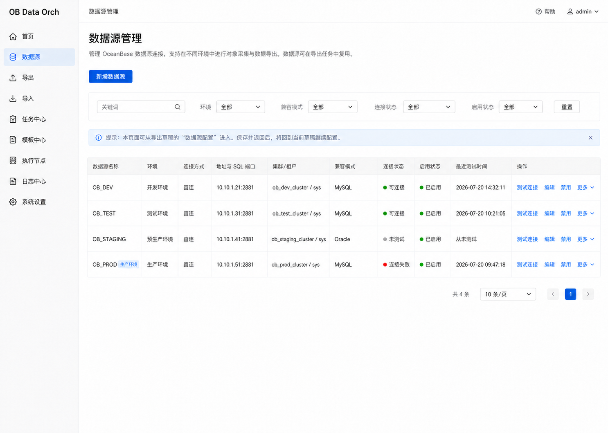
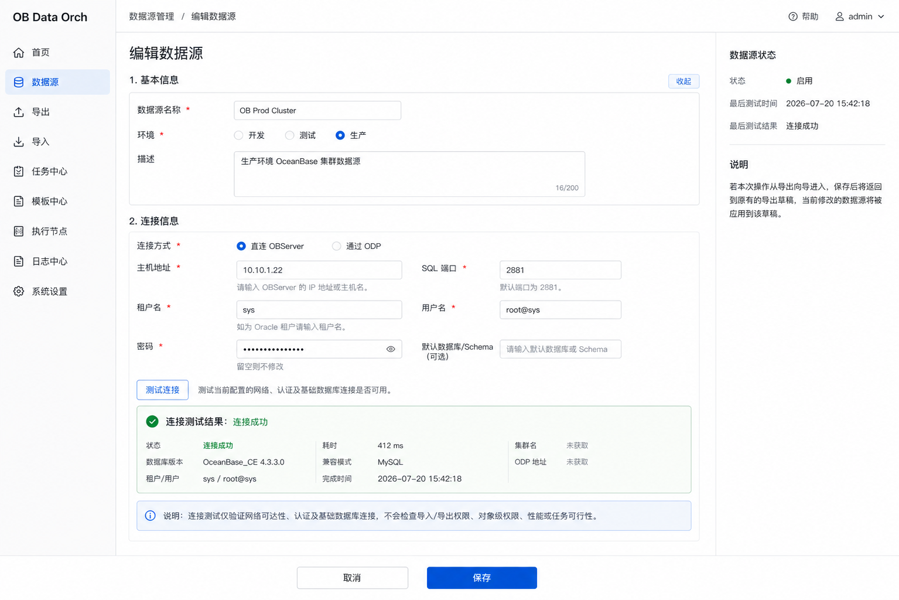
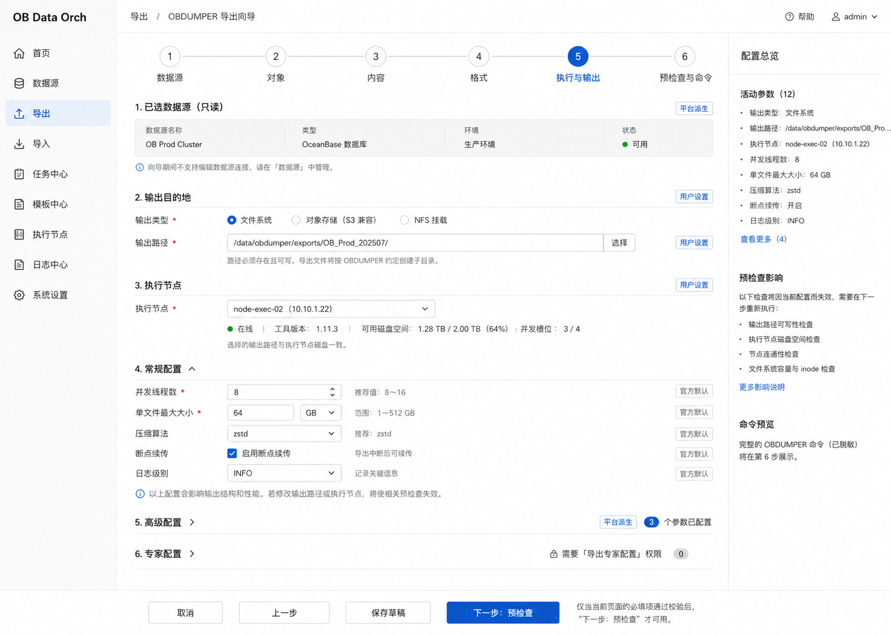
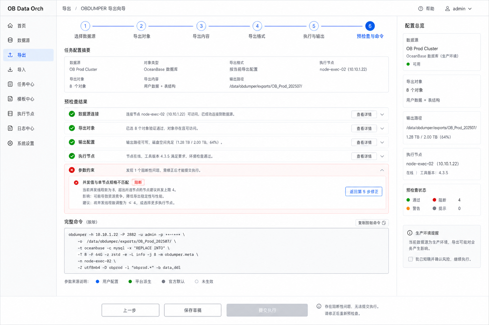
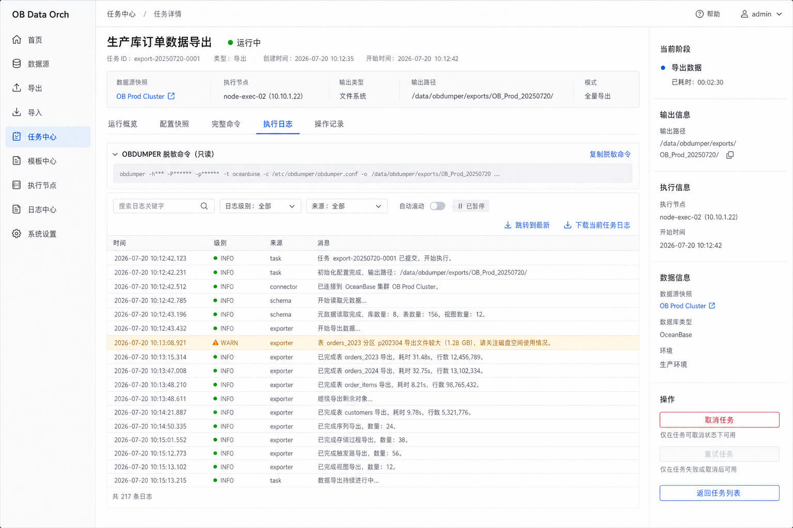

# 核心流程低保真基线

> 文档状态：首条核心链路低保真已确认  
> 评审范围：数据源管理 → 导出向导 → 命令确认 → 任务详情与日志  
> 依据：[总体 PRD](../01-product/PRD.md)、[产品设计基线收口评审](product-design-baseline-closure.md)  
> 评审结论：LF-R01～LF-R07 全部确认（2026-07-20）  
> 更新日期：2026-07-20

## 1. 文档目的

本文固化第一批低保真中的首条核心链路，用于验证页面信息密度、跨页返回、预检查、完整命令确认和任务追踪是否能够承接已经确认的产品语义。

本文是静态低保真布局与交互基线，不是高保真 UI、可运行原型或技术实现。图片中的示例名称、地址、时间、状态、命令和值只用于表达页面结构；字段、参数、条件和工具行为仍分别以字段规则、参数映射基线和受控验证证据为准。

## 2. 选定设计方向

采用“顶部流程画布”方向：

- 全局使用紧凑左侧导航，保持任务创建与公共管理模块的入口一致；
- 三类任务向导统一使用顶部六步流程条，不为旁路导入另造一套视觉语言；
- 表单页使用宽主画布承载完整配置，右侧仅放配置摘要、状态和必要说明；
- 页面底部固定放置当前步骤的主要操作，避免长参数页面中操作入口丢失；
- 颜色以中性灰和克制蓝色为主，成功、警告、阻断和危险状态使用独立语义色；
- 首页、列表页和详情页不机械展示向导步骤条，但沿用相同导航、间距、状态和操作语言。

## 3. 核心链路

```text
导出草稿选择数据源
→ 数据源列表
→ 新增或编辑数据源
→ 测试连接并保存
→ 返回原导出草稿
→ 完成导出步骤 1～5
→ 步骤 6 参数预检查与完整命令确认
→ 提交执行
→ 任务详情
→ 当前任务日志
```

数据源页面既可以独立进入，也可以从任务草稿进入。从草稿进入时，保存成功后返回原草稿并继续选择；不能另建一套向导内连接表单。

## 4. 页面基线

### LF-01 数据源列表



页面职责：

- 展示数据源名称、环境、连接方式、非敏感连接摘要、兼容模式、连接状态、启用状态和最近测试时间；
- 支持按关键字、环境、兼容模式、连接状态和启用状态筛选；
- 提供新增、编辑、测试连接、禁用和更多状态化操作；
- 从任务草稿进入时，明确提示保存后将返回原草稿继续配置；
- 连接状态与启用状态分别表达，不以“已启用”替代连接事实。

### LF-02 数据源编辑与连接测试



页面职责：

- 基本信息与连接信息分组，连接方式控制 ODP 专属字段的条件显示；
- 密码不可回显，编辑时使用“留空则不修改”的覆盖式语义；
- 测试结果展示连接状态、耗时、版本、兼容模式、租户/用户、完成时间和可直接取得的基础信息；
- 无法取得的可选信息显示“未获取”，不得推测或伪造；
- 连接测试只验证网络可达、认证和基础数据库连接，不检查导入/导出权限、对象级权限、性能或任务可行性。

### LF-03 导出步骤 5：执行与输出



页面职责：

- 顶部六步流程条持续显示任务创建位置；
- 宽主画布按执行节点、并发/资源和输出位置等产品分类承载配置；
- 右侧摘要只展示前序步骤已经形成的关键选择，不替代完整配置；
- 普通、高级、专家配置继续使用同一字段状态模型；所有已进入映射基线且适用于当前模式的参数均可被找到；
- 条件隐藏、互斥、依赖和清值规则以已确认字段矩阵为准，不因低保真简化而删除。

### LF-04 导出步骤 6：预检查与完整命令



页面职责：

- 按数据源连接、导出对象、输出配置、执行节点和参数约束分组展示预检查；
- 阻断项显示原因、影响和可执行修正入口，并禁止提交；
- 完整命令只读、默认脱敏并支持复制脱敏命令，不提供自由命令编辑；
- 参数来源区分用户配置、平台派生、官方默认和未生效；
- 返回上一步修改后，已有预检查结果失效，提交前必须重新检查；
- 图片内命令是布局示例，不构成参数适用性或命令正确性证据。

### LF-05 任务详情与执行日志



页面职责：

- 任务头部展示名称、ID、类型、稳定状态、当前阶段、关键时间和不可变快照摘要；
- 运行概览、配置快照、完整命令、执行日志和操作记录位于同一任务上下文；
- 进度仅依据可靠日志或总量证据展示；无法计算时展示当前阶段和持续时间，不伪造百分比和 ETA；
- 当前任务日志支持关键字、级别、来源、自动滚动暂停、跳转最新和当前任务日志下载；
- 命令保持只读和脱敏；任务运行中不允许编辑原配置；
- 取消和重试由任务状态、当前阶段、任务类型及官方行为证据共同决定。

## 5. 已确认低保真规则

| 编号 | 确认规则 | 状态 |
|---|---|---|
| LF-R01 | 采用紧凑左侧导航和蓝灰色低干扰视觉体系 | 已确认 |
| LF-R02 | 导出、普通导入和旁路导入统一采用顶部步骤条、宽表单画布、右侧摘要栏及底部固定操作区 | 已确认 |
| LF-R03 | 数据源连接测试只覆盖网络、认证和基础数据库连接，不承担任务可行性检查 | 已确认 |
| LF-R04 | 预检查结果按检查域分组；阻断项禁止提交并提供返回修正入口 | 已确认 |
| LF-R05 | 完整命令只读、默认脱敏、支持复制，并展示参数来源 | 已确认 |
| LF-R06 | 任务详情以可靠阶段和耗时表达进度，不虚构百分比和预计完成时间 | 已确认 |
| LF-R07 | 低保真中的示例值不构成产品或官方能力基线，最终以已确认规则、官方参数映射和验证证据为准 | 已确认 |

## 6. 跨页面一致性要求

- 数据源、导出向导和任务详情使用同一环境、状态、风险和脱敏术语；
- 页面跳转携带草稿或任务上下文，但不在 URL、日志或提示中暴露凭据；
- 从数据源管理返回草稿时重新判断数据源启用、连接结果和权限状态；
- 从步骤 6 返回修改任何影响命令的字段后，预检查与命令预览同时失效；
- 提交成功后直接进入任务详情，任务中心列表作为公共返回入口；
- 任务详情中的数据源、节点、配置和命令均为提交时快照，不随后续管理对象变更而改写。

## 7. 当前结论与边界

首条核心链路的静态低保真方向已经确认，足以作为普通导入、旁路导入和后续公共模块低保真设计的共同视觉与结构基线。

本次确认不表示：

- 第一批全部低保真已经完成；
- 可交互原型、响应式、键盘操作或无障碍检查已经完成；
- 图片中的命令和示例参数已经通过 OBDUMPER 4.3.5 受控验证；
- 技术设计或业务代码开发已经准入。

普通导入、旁路导入、任务中心全状态、模板复用、高风险权限和执行节点页面已经按该基线完成并确认，详见[普通导入低保真基线](normal-import-low-fidelity.md)、[旁路导入低保真基线](direct-load-low-fidelity.md)、[任务中心与任务详情全状态低保真基线](task-center-low-fidelity.md)、[模板中心复用链路低保真基线](template-center-low-fidelity.md)、[权限与安全高风险操作低保真基线](access-control-security-low-fidelity.md)和[执行节点管理低保真基线](execution-node-low-fidelity.md)。后续低保真优先覆盖首页、日志中心和系统设置等公共模块。

## 8. 评审记录

LF-R01～LF-R07 已于 2026-07-20 全部确认，并写入 [DEC-035](../01-product/decisions.md#dec-035-首条核心流程低保真基线)。
