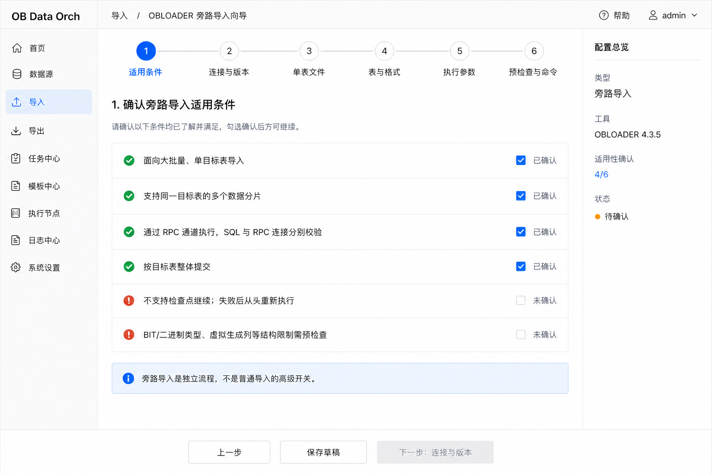
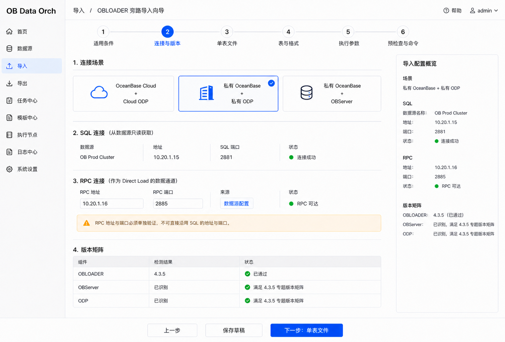
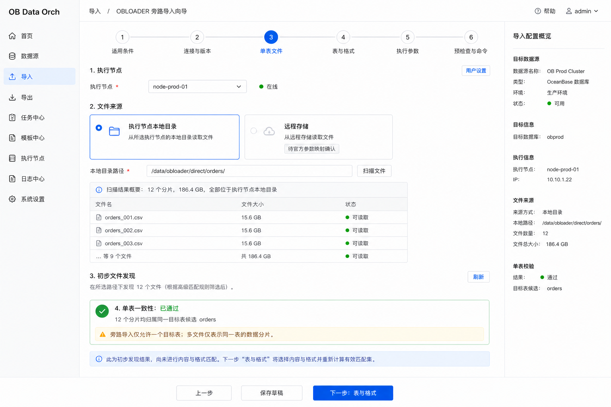
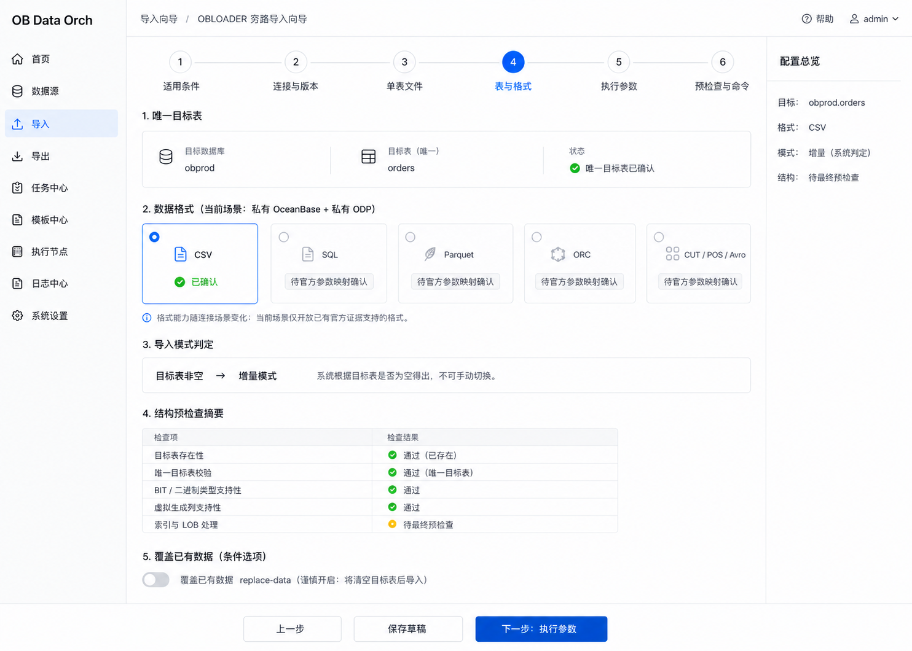
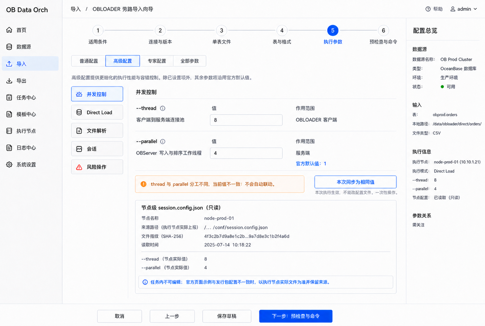
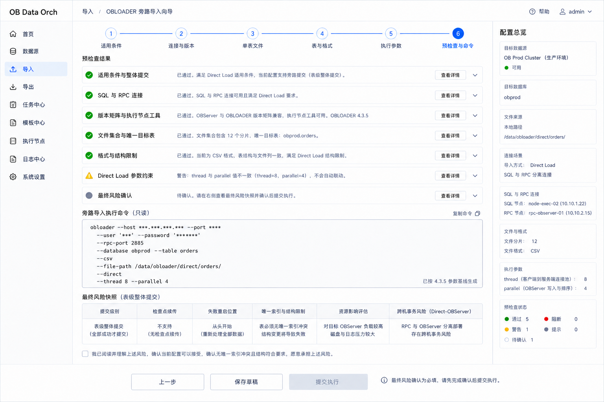
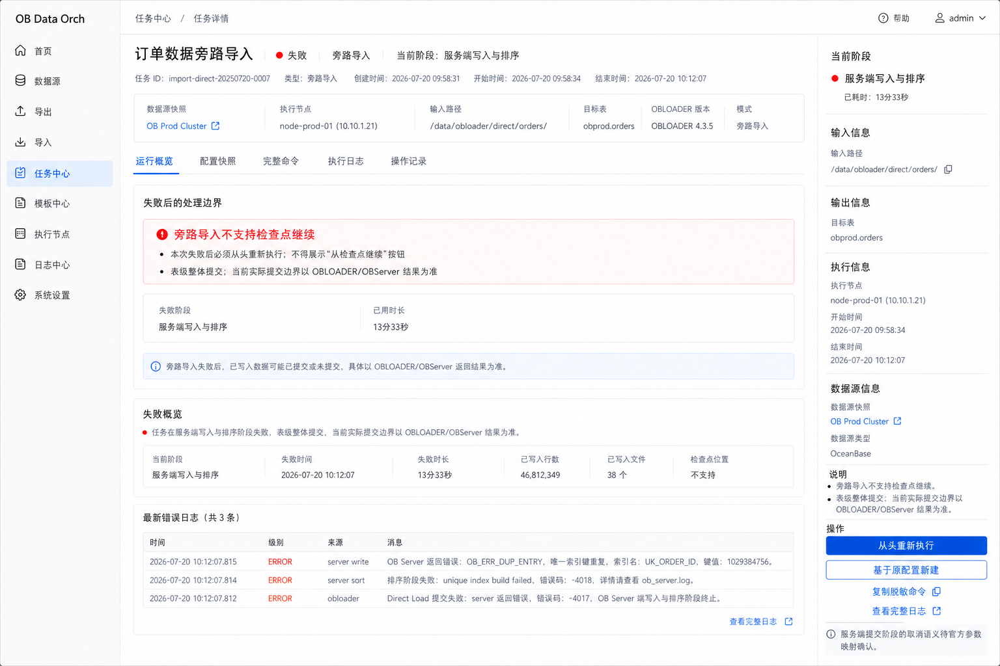

# 旁路导入低保真基线

> 文档状态：旁路导入关键流程低保真已确认  
> 评审范围：适用条件 → 连接与版本 → 单表文件 → 表与格式 → 执行参数 → 预检查、命令与风险确认 → 失败后从头执行  
> 依据：[旁路导入模块专项评审稿](direct-load-module.md)、[旁路导入字段与条件矩阵](direct-load-field-rules.md)  
> 评审结论：DL-LF-R01～DL-LF-R12 全部确认（2026-07-20）  
> 更新日期：2026-07-20

## 1. 评审目标

本文在[核心流程低保真基线](core-flow-low-fidelity.md)和[普通导入低保真基线](normal-import-low-fidelity.md)的共同页面骨架上，固化旁路导入独有的适用门槛、SQL/RPC 双连接、版本矩阵、单表分片、格式证据边界、Direct Load 并发、整体提交和失败处理交互。

本稿是静态低保真和产品交互基线，不是高保真 UI、可运行原型或命令实现。图片中的示例文件、地址、版本结果、命令和值只用于表达页面结构；参数适用性和实际行为仍以 OBLOADER 4.3.5 参数映射及受控验证证据为准。

## 2. 与普通导入统一的页面骨架

旁路导入不是另一套产品界面。六步向导统一复用普通导入的：

- 左侧导航、面包屑和顶部六步进度条；
- 宽主配置区和右侧分段配置总览；
- 编号分组、卡片、表格、提示和校验状态语言；
- 底部“上一步 / 保存草稿 / 下一步或提交执行”操作区；
- 普通、高级、专家和全部参数的展示层级；
- 分组预检查、只读脱敏命令、不可变快照和统一任务详情。

一致性只约束布局与公共交互，不覆盖官方能力差异。RPC、版本、单表、表级整体提交、结构限制和不支持检查点继续必须显式呈现。

## 3. 页面基线

### DL-LF-01 适用条件

- 明确旁路导入是独立流程，不是普通导入的高级开关；
- 用户需确认大批量单目标表、同表多分片、RPC 通道、表级整体提交、失败从头执行和结构限制；
- 不为“大批量”虚构固定数据量阈值；
- 未完成全部确认时禁止进入下一步。

### DL-LF-02 连接与版本

- 云 ODP、私有 ODP、私有 OBServer 三种连接场景显式单选；
- SQL 连接只读复用已有数据源，RPC 作为 Direct Load 数据通道单独展示和校验；
- RPC 地址和端口显示来源，不允许无依据复制 SQL 地址或端口；
- OBLOADER、OBServer 和 ODP 版本结果按 4.3.5 专题版本矩阵展示，无法取得时不得显示通过。

### DL-LF-03 单表文件

- 执行节点本地目录作为已确认来源；
- 远程存储在证据完成前禁用并标记“待官方参数映射确认”；
- 展示文件数量、总大小、有限样例和节点可读状态；
- 多文件只表示同一目标表的数据分片，零文件、多表或无法判定时阻断。

### DL-LF-04 唯一目标表、格式与结构

- 只允许一个明确目标表，不提供多选、全部对象、DDL 或 MIX；
- 格式按连接场景和官方证据开放，当前场景未确认的格式禁用；
- 全量或增量模式由目标表是否为空派生，不提供手工切换；
- 表存在性、BIT/二进制类型、虚拟生成列、索引和 LOB 纳入结构预检查；
- `replace-data` 仅按已确认条件显示，且不能被表达为唯一索引冲突解决方案。

### DL-LF-05 执行参数与节点配置

- 参数层级和分类入口与普通导入一致；
- `--thread` 表示 OBLOADER 客户端连接池，`--parallel` 表示 OBServer 写入与排序工作线程；
- 两者不一致时警告但不自动联动，可提供一次性同步填充；
- `session.config.json` 只读展示执行节点实际路径、指纹、读取时间和实际值；
- 任务向导不上传、编辑或保存节点级配置文件。

### DL-LF-06 预检查、完整命令与风险确认

- 预检查覆盖适用条件、SQL/RPC、版本、节点工具、文件、唯一目标表、格式结构和 Direct Load 参数约束；
- 命令只读、默认脱敏、支持复制，并只使用当前已确认的 4.3.5 参数基线；
- 最小命令结构包括 `--rpc-port`、唯一 `--table`、已确认格式、`--file-path`、`--direct`，以及用户显式设置的 `--thread`、`--parallel`；
- 表级整体提交、无检查点、失败从头执行、索引结构、资源影响和直连风险绑定当前任务快照确认；
- 未完成最终风险确认时禁止提交。

### DL-LF-07 失败后从头执行

- 任务详情骨架、配置快照、完整命令、执行日志和操作记录与普通导入一致；
- 不显示“从检查点继续”或“从失败点继续”；
- 只提供从头重新执行、基于原配置新建、复制脱敏命令和查看完整日志；
- 展示可靠阶段和持续时间，不虚构进度百分比或 ETA；
- 服务端提交阶段的取消语义未确认前，不承诺可安全取消或自动回滚。

## 4. 已确认低保真规则

| 编号 | 确认规则 | 状态 |
|---|---|---|
| DL-LF-R01 | 三类任务共用导航、向导、主区、右侧摘要和底部操作栏 | 已确认 |
| DL-LF-R02 | 旁路导入保持独立六步流程，不表达为普通导入高级开关 | 已确认 |
| DL-LF-R03 | 各步骤统一提供上一步、保存草稿和下一步或提交执行 | 已确认 |
| DL-LF-R04 | 右侧配置总览沿用普通导入的信息分组和密度 | 已确认 |
| DL-LF-R05 | 适用条件必须确认，但不设置未经确认的数据量阈值 | 已确认 |
| DL-LF-R06 | SQL 与 RPC 分别展示和校验，并显示连接场景及版本矩阵 | 已确认 |
| DL-LF-R07 | 只允许唯一目标表，同表多文件按数据分片处理 | 已确认 |
| DL-LF-R08 | 格式能力按连接场景开放；未确认项禁用并标记“待官方参数映射确认” | 已确认 |
| DL-LF-R09 | 全量或增量模式由目标表是否为空派生，不允许手工切换 | 已确认 |
| DL-LF-R10 | `thread` 与 `parallel` 分开配置且不自动联动；节点配置只读 | 已确认 |
| DL-LF-R11 | 命令预览仅生成已确认参数，保持只读、脱敏并绑定预检查结果 | 已确认 |
| DL-LF-R12 | 旁路失败不提供检查点继续，只允许从头执行或基于原配置新建 | 已确认 |

## 5. 普通导入与旁路导入的差异护栏

| 能力 | 普通导入 | 旁路导入 |
|---|---|---|
| 流程入口 | 普通导入独立入口 | 旁路导入独立入口 |
| 对象范围 | 按官方能力支持多对象表达 | 唯一目标表，同表多分片 |
| 连接 | SQL 数据源连接 | SQL 与 RPC 分开，并检查版本组合 |
| 内容与格式 | DDL、数据、DDL+数据、MIX 及已确认格式 | 仅数据；格式按连接场景证据开放 |
| 模式 | 由普通导入参数确定 | 全量/增量由目标表空状态派生 |
| 并发 | 普通导入线程和资源参数 | `thread` 客户端连接池与 `parallel` 服务端线程分工 |
| 提交与失败 | 符合条件时可检查点继续 | 表级整体提交，不支持检查点继续 |

视觉同构不得导致能力负偏离，也不得把普通导入参数无证据复制到旁路导入。

## 6. 当前边界

本次确认表示旁路导入关键静态低保真已经通过产品评审，但不表示：

- OBLOADER 4.3.5 的 Direct Load P0 受控验证已经执行；
- 私有 ODP/OBServer 下 SQL、Parquet、ORC 或远程存储已经获得旁路适用证据；
- 响应式、键盘操作、无障碍或真实大文件信息密度已经验证；
- 命令生成、版本检查、节点配置读取、状态解析或取消语义技术设计已经完成；
- 业务代码开发已经准入。

## 7. 评审记录

DL-LF-R01～DL-LF-R12 已于 2026-07-20 全部确认，并写入 [DEC-037](../01-product/decisions.md#dec-037-旁路导入关键流程低保真基线)。
