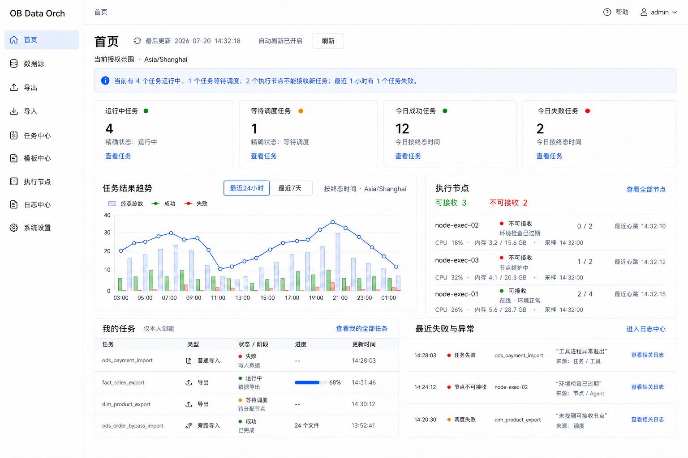
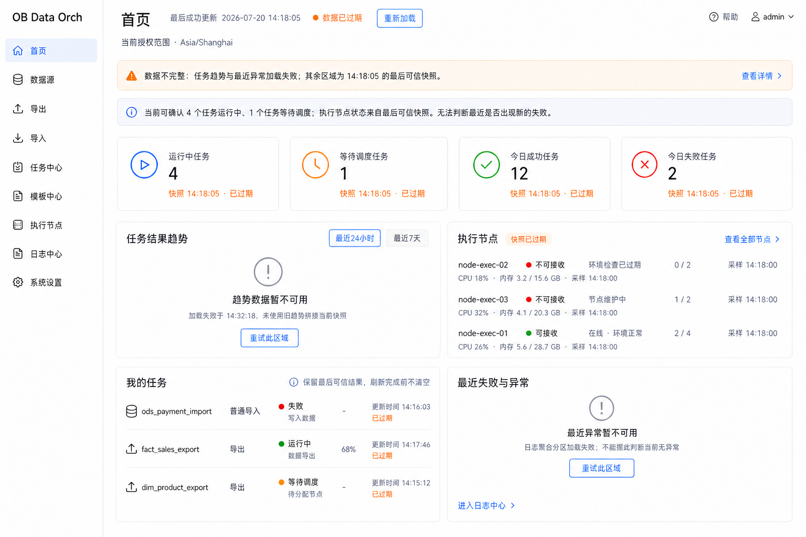
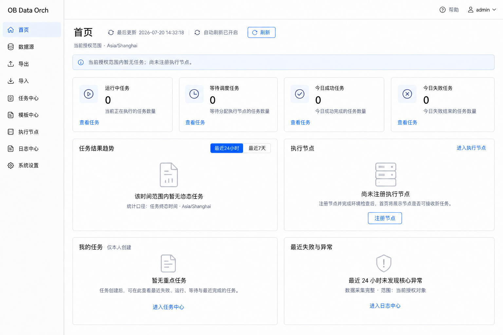
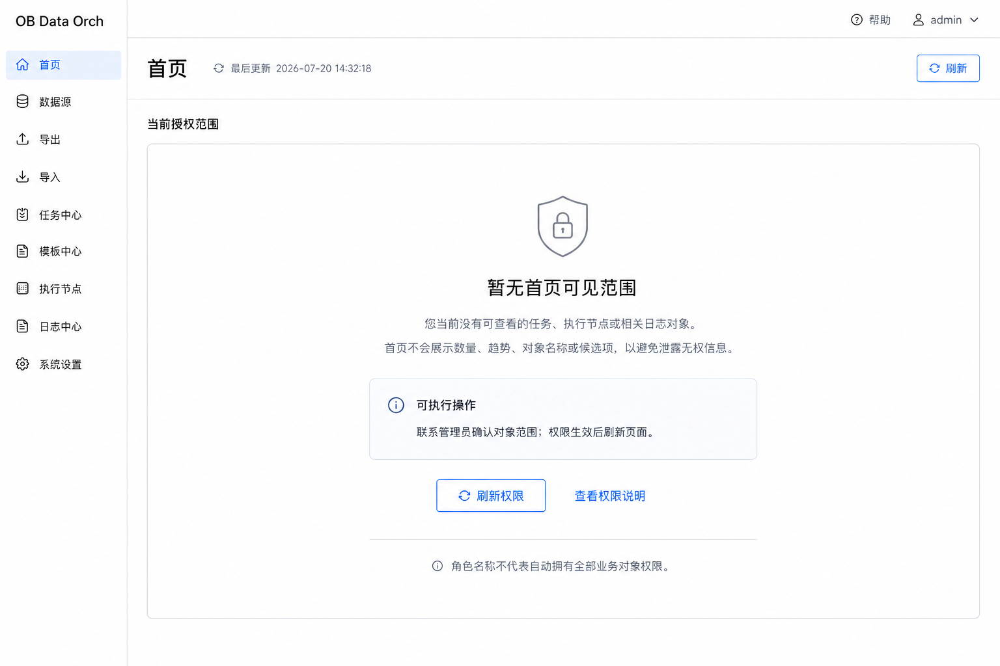

# 首页低保真基线

> 文档状态：首页低保真已确认  
> 评审范围：正常运行快照 → 部分失败与数据过期 → 真实空状态 → 无权限状态  
> 依据：[首页模块专项评审稿](home-module.md)、[首页字段与条件矩阵](home-field-rules.md)  
> 评审结论：HM-LF-R01～HM-LF-R18 全部确认（2026-07-20）  
> 更新日期：2026-07-20

## 1. 评审目标

本文将首页已经确认的授权范围、统一快照、运行摘要、四张指标卡、单一任务趋势、执行节点、我的任务、最近失败与异常以及页面状态落实为静态低保真。

首页只回答“当前授权范围内的任务是否正常、执行节点能否接收任务、本人有哪些重点任务、最近发生了什么”，并提供进入任务中心、任务详情、执行节点和日志中心的下钻入口。首页不是任务管理、服务器监控、BI、告警或自动诊断平台。

本稿不是聚合接口、缓存、自动刷新、响应式布局、阈值、告警、图表组件或权限编码技术设计。图片中的名称、时间、数量、资源值和趋势只用于表达页面结构，不构成部署默认值、实时数据或性能结论。

## 2. 最小页面集

| 页面 | 编号 | 评审重点 |
|---|---|---|
| 首页正常态 | HM-LF-01 | 统一快照、四项指标、单一趋势、节点事实、我的任务、最近异常和下钻入口 |
| 部分失败与数据过期 | HM-LF-02 | 最后可信快照、分区失败、过期提示、局部重试和不完整摘要 |
| 真实空状态 | HM-LF-03 | 查询成功为零、无终态任务、尚未注册节点、无本人重点任务和无异常 |
| 无权限状态 | HM-LF-04 | 不返回数量、趋势、名称、候选或经过遮挡的业务信息 |

V1.0 保持一个首页和四类关键页面状态，不增加监控大屏、卡片市场、自定义布局、保存视图、告警中心或首页专属详情页。

## 3. 页面基线

### HM-LF-01 首页正常态

- 页头固定展示当前授权范围、显示时区、统一快照更新时间、自动刷新状态和手动刷新入口；
- 运行摘要由受控模板生成，优先表达失败、节点不能接收、等待调度和运行中事实，不产生综合健康分；
- 四张指标卡固定为运行中、等待调度、今日成功和今日失败，只展示精确数量、必要口径和任务中心入口；
- 任务结果趋势是首页唯一图表，最近 24 小时按小时、最近 7 天按日，统一按终态时间统计；
- 执行节点优先展示不能接收任务的节点，保留原因、容量、最近心跳以及带采样时间的 CPU、内存快照；资源值只作为中性事实，不推断高负载；
- “我的任务”只展示本人创建的有限重点任务，不提供取消、重试、新建或其他状态化操作；
- 最近失败与异常保留对象、发生时间、简短事实和真实来源，不把跨来源时间接近解释为因果关系。

### HM-LF-02 部分失败与数据过期

- 页头展示最后成功更新时间和数据已过期状态，总体提示列出失败分区；
- 成功分区保留最后可信快照并明确快照时间，不能用旧值与新值拼接为同一时刻结论；
- 任务趋势和最近异常分区分别展示加载失败、失败时间与局部重试，不绘制零值趋势或“当前无异常”；
- 节点状态、容量、资源值和采样时间整体标记为过期，不表现为实时数据；
- 刷新时不清空现有内容，也不把未知值改成 0；
- 页面只表达已确认事实与未知范围，不产生“运行正常”或自动诊断结论。

### HM-LF-03 真实空状态

- 只有查询成功且口径明确为零时，四张指标卡才能展示 `0`；
- 趋势空状态保留时间范围与终态时间口径，不绘制伪造的零趋势线；
- 节点区明确“尚未注册执行节点”，不与无权限、全部离线或采集失败混淆；
- “我的任务”只提供进入任务中心的查看入口，不在首页直接创建任务；
- 最近异常只有在采集完整时才能说明指定范围内未发现核心异常；
- 空状态不填充示例任务、演示节点或虚构事件。

### HM-LF-04 无权限状态

- 用户没有任何首页可见对象范围时，不渲染指标卡、趋势、节点、任务或异常区；
- 不展示数量、对象名称、候选项、经过模糊或遮挡的数据，也不以 `0` 暗示无权对象数量；
- 页面仅说明当前没有可查看的任务、执行节点或日志对象，并提供刷新权限和权限说明入口；
- 角色名称不代表自动拥有全部业务对象权限；管理员仍按实际对象范围聚合；
- 无权限不是加载、失败或真实空状态，不提供重试数据分区或对象派生入口。

## 4. 布局与下钻边界

| 区域 | 首页职责 | 下钻目标 | 首页禁止 |
|---|---|---|---|
| 运行摘要 | 表达当前最需关注的事实 | 对应任务、节点或日志页面 | 综合评分、AI 结论、告警处置 |
| 指标卡 | 展示四个精确状态数量 | 带同口径条件进入任务中心 | 环比、同比、成功率、目标值 |
| 任务趋势 | 展示一个终态结果趋势 | 带终态时间和条件化状态进入任务中心 | 第二张图、预测、异常检测、BI 探索 |
| 执行节点 | 展示可接收结论、原因、容量和带时间资源快照 | 节点列表或节点详情 | 调度平台服务器资源、历史曲线、性能诊断 |
| 我的任务 | 展示本人有限重点任务 | 任务中心或任务详情 | 新建、取消、重试、保存模板、复制命令 |
| 最近失败与异常 | 展示有来源的核心事实 | 对象详情或日志中心 | 确认、忽略、指派、关闭、订阅、自动修复 |

所有跳转都必须显式携带并展示首页使用的同口径条件；目标页面重新进行权限校验，首页不得成为绕过对象权限的快捷入口。

## 5. 已确认低保真规则

| 编号 | 确认规则 | 状态 |
|---|---|---|
| HM-LF-R01 | 首页保持单页结构，不建设独立监控大屏或多层仪表盘 | 已确认 |
| HM-LF-R02 | 页面顶部固定展示授权范围、显示时区、快照更新时间和刷新状态 | 已确认 |
| HM-LF-R03 | 运行摘要使用受控事实模板，最多一至两句，不生成健康评分或 AI 结论 | 已确认 |
| HM-LF-R04 | 固定展示运行中、等待调度、今日成功、今日失败四张指标卡 | 已确认 |
| HM-LF-R05 | 指标未知时显示“未知”，仅查询成功且确认为零时展示 `0` | 已确认 |
| HM-LF-R06 | 首页只保留一张任务结果趋势图，支持最近 24 小时和最近 7 天 | 已确认 |
| HM-LF-R07 | 趋势统一按任务终态时间统计，点击后进入任务中心并带入同口径条件 | 已确认 |
| HM-LF-R08 | 执行节点区优先展示不可接收节点、原因、容量和最近心跳 | 已确认 |
| HM-LF-R09 | 执行节点 CPU、内存只作为带采样时间的中性快照，不推断高负载或异常 | 已确认 |
| HM-LF-R10 | 首页不展示调度平台所在服务器的 CPU、内存、磁盘或进程状态 | 已确认 |
| HM-LF-R11 | “我的任务”只展示本人创建的重点任务，首页不提供取消、重试或新建等任务操作 | 已确认 |
| HM-LF-R12 | 最近失败与异常必须展示真实对象、时间、摘要和来源，不推断跨来源因果关系 | 已确认 |
| HM-LF-R13 | 首页卡片只承担查看和下钻，对象管理与问题处理留在任务、节点和日志模块 | 已确认 |
| HM-LF-R14 | 刷新时保留最后可信快照；数据过期时所有旧值必须标明快照时间 | 已确认 |
| HM-LF-R15 | 分区加载失败独立提示并允许分区重试，不把失败分区表示为零或正常 | 已确认 |
| HM-LF-R16 | 无任务、无节点、无异常、数据未采集、加载失败和无权限分别使用不同状态 | 已确认 |
| HM-LF-R17 | 无权限时不展示数量、趋势、对象名称、候选项或经过遮挡的业务数据 | 已确认 |
| HM-LF-R18 | 首页不增加复杂筛选、分页、卡片定制、资源曲线、告警处置或自动诊断 | 已确认 |

## 6. 当前边界

本次确认表示首页关键静态低保真已经通过产品评审，但不表示：

- 自动刷新间隔、快照聚合超时、数据过期阈值或并发请求策略已经技术定版；
- 节点摘要、我的任务和最近异常的精确展示条数已经确定；
- 最近异常默认时间范围、同一底层事件标识和去重实现已经完成；
- CPU、内存阈值、趋势、容量预测或自动诊断已进入首页能力；
- 聚合接口、缓存、权限编码、图表组件、响应式布局或移动端降级已经设计；
- 图片中的时间、数量、任务、节点和资源值构成生产事实；
- 可交互原型、高保真 UI、技术设计或业务代码开发已经准入。

## 7. 评审记录

HM-LF-R01～HM-LF-R18 已于 2026-07-20 全部确认，并写入 [DEC-044](../01-product/decisions.md#dec-044-首页低保真基线)。
