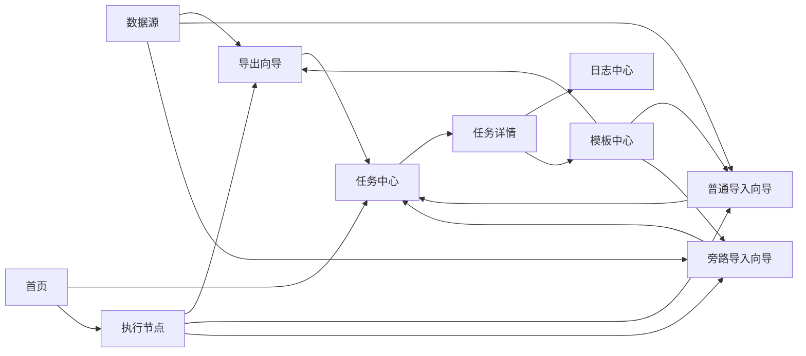

# OB Data Orch 信息架构

> 文档状态：产品设计语义基线已收口，导出公共链路、普通导入、旁路导入、任务中心、模板复用、高风险权限、执行节点、日志中心与系统设置低保真已确认  
> 依据：[总体 PRD](../01-product/PRD.md)  
> 更新日期：2026-07-20
> 关联低保真：[核心流程低保真基线](core-flow-low-fidelity.md)、[普通导入低保真基线](normal-import-low-fidelity.md)、[旁路导入低保真基线](direct-load-low-fidelity.md)、[任务中心全状态低保真基线](task-center-low-fidelity.md)、[模板中心复用链路低保真基线](template-center-low-fidelity.md)、[权限与安全高风险操作低保真基线](access-control-security-low-fidelity.md)、[执行节点管理低保真基线](execution-node-low-fidelity.md)、[日志中心低保真基线](log-center-low-fidelity.md)、[系统设置低保真基线](system-settings-low-fidelity.md)

## 架构目标

信息架构围绕“创建任务—确认命令—执行追踪—复盘排障”组织。核心流程与公共支撑模块分离，首页只看状态，列表用于管理，详情用于分析。

## 导航结构

```text
OB Data Orch
├── 首页
├── 数据源
│   ├── 数据源列表
│   └── 新增 / 编辑数据源
├── 导出
│   └── 新建导出任务
├── 导入
│   ├── 模式选择
│   ├── 新建普通导入
│   └── 新建旁路导入
├── 任务中心
│   ├── 任务列表
│   └── 任务详情
├── 模板中心
│   ├── 模板列表
│   └── 新建 / 编辑模板
├── 执行节点
│   ├── 节点列表
│   └── 节点详情
├── 日志中心
└── 系统设置
    └── 权限配置
```

日志中心和系统设置可在导航空间不足时收进“更多”或管理员菜单，但模块职责不改变。

## 页面与职责

| 一级导航 | 二级页面 | 页面职责 | 类型 | 优先级 |
|---|---|---|---|---|
| 首页 | 运行概览 | 展示平台摘要、任务指标、单一趋势图、执行节点健康、我的任务和最近异常 | 公共支撑 | P0 |
| 数据源 | 数据源列表 | 筛选、查看、测试、启停、删除或归档数据源 | 公共支撑 | P0 |
| 数据源 | 新增 / 编辑数据源 | 维护基础连接信息并执行基础连接测试 | 公共支撑 | P0 |
| 导出 | 新建导出任务 | 按 OBDUMPER 能力配置导出对象、内容、格式和执行参数 | 核心流程 | P0 |
| 导入 | 模式选择 | 解释普通导入与旁路导入边界并进入对应独立流程 | 核心流程 | P0 |
| 导入 | 新建普通导入 | 按 OBLOADER 客户端模式配置文件、目标对象、格式和执行参数 | 核心流程 | P0 |
| 导入 | 新建旁路导入 | 确认适用条件，配置单表文件、RPC 连接和旁路专属参数 | 核心流程 | P0 |
| 任务中心 | 任务列表 | 统一筛选和管理导出、普通导入、旁路导入任务；列表只承载定位、状态和状态化操作 | 核心流程 | P0 |
| 任务中心 | 任务详情 | 查看运行概览、不可变配置快照、命令、当前任务日志、失败摘要和操作记录 | 核心流程 | P0 |
| 模板中心 | 模板列表 | 筛选三类任务模板，查看兼容状态、数据源策略、版本、风险标识并执行使用、复制或删除 | 公共支撑 | P1 |
| 模板中心 | 新建 / 编辑模板 | 按对应任务字段保存活动显式可复用配置，查看保存/排除摘要并处理版本兼容差异 | 公共支撑 | P1 |
| 执行节点 | 节点列表 | 管理实际运行工具的机器，展示管理/心跳/环境/容量及接收新任务结论 | 公共支撑 | P0 |
| 执行节点 | 注册 / 编辑节点 | 维护管理字段、Agent 关联、活动工具路径、目录和最大并发 | 公共支撑 | P0 |
| 执行节点 | 节点详情 | 查看工具环境、工作目录、当前/最近任务、基础资源、最近事件和操作记录 | 公共支撑 | P1 |
| 日志中心 | 日志查询 | 按任务、节点、调度或审计预设查询真实来源日志，查看同来源上下文、采集完整性并下载脱敏结果 | 公共支撑 | P1 |
| 系统设置 | 平台基础 / 调度 / 安全 / 工具与兼容 | 管理平台级默认值、调度硬约束、安全基线和工具兼容基线，不承载任务参数或节点环境 | 公共支撑 | P1 |
| 系统设置 | 权限配置 | 为已认证用户分配五类固定角色、对象范围和独立高风险能力，查看有效权限与变更摘要 | 公共支撑 | P0 |

登录页是否存在取决于是否接入统一认证，不作为主要业务导航。

## 核心流程关系



## 跳转关系

### 首页

- 点击任务指标、趋势时间点、我的任务或失败摘要，进入任务中心并带入对应筛选条件。
- 点击某条任务进入任务详情。
- 点击节点健康摘要进入执行节点列表或节点详情。
- 首页所有数量、趋势和候选按当前用户权限过滤，并明确标注“当前授权范围”。
- 首页只提供一张任务结果趋势图和有限摘要，不承担任务操作、告警处置或平台服务器监控。
- 首页的快照、指标、趋势、节点、我的任务和异常口径见[首页模块专项评审稿](home-module.md)。

### 数据源与任务向导

- 数据源列表可进入新增、编辑或测试连接。
- 三类向导只选择已启用且当前可用的数据源，不允许在向导内编辑连接信息。
- 无可用数据源时跳转新增数据源；成功保存后返回原向导并刷新列表，恢复原任务草稿上下文。

### 三类任务创建

- 导出一级入口直接进入导出向导。
- 导入一级入口先进入模式选择，再分别进入普通导入或旁路导入。
- 三条向导完成预检查和命令确认后进入任务详情；提交前保存草稿则进入任务中心草稿视图。

### 任务中心与详情

- 任务列表进入任务详情。
- 任务详情的执行日志区提供任务上下文内日志；“查看更多日志”进入日志中心并带入任务 ID。
- 成功或失败任务可基于原配置新建对应类型任务；参数仍需按当前工具版本重新校验。
- 旁路导入失败任务不得出现“从失败点继续”。
- 任务中心和详情的专项状态、快照和操作语义见[任务中心与任务详情评审稿](task-center-module.md)。

### 模板、节点与设置

- 模板可由手工新建、复制或成功任务保存；非成功任务不提供保存入口。
- 使用模板只创建对应类型的新草稿，预填活动显式配置，不直接提交执行。
- 数据源按“使用时选择”或“固定引用作默认预选”处理；固定引用不可用或无权时要求重新选择，且不泄露详情。
- 执行节点、凭据、预检查、风险确认、命令和运行事实不进入模板；创建任务后按当前环境重新取得或检查。
- 模板兼容状态只描述工具与参数结构兼容性，不代替任务的数据源、节点、文件、权限和参数预检查。
- 模板的完整保存、兼容、复制、删除和使用边界见[模板中心模块专项评审稿](template-center-module.md)；列表、任务提取、兼容核查和草稿承接见[模板中心复用链路低保真基线](template-center-low-fidelity.md)。
- 节点列表进入节点详情；异常节点关联的任务可跳转任务详情。
- 节点注册、状态、环境检查、调度边界和任务关系见[执行节点管理模块专项评审稿](execution-node-module.md)；列表、注册、运行概览、只读检查、维护确认和失联任务页面见[执行节点管理低保真基线](execution-node-low-fidelity.md)。
- 系统设置使用单页面四分区并分别保存；不建立多级配置树、配置发布或环境覆盖体系。
- 系统设置只提供平台默认、调度约束、安全和工具兼容规则，具体任务实际生效值仍在任务确认和详情中展示。
- 新节点默认并发与节点实际并发分离；默认节点策略只排序或推荐，不静默选择或改派。
- 系统设置的完整边界、保存、生效和高影响变更规则见[系统设置模块专项评审稿](system-settings-module.md)。
- 权限配置位于系统设置安全分区，不新增一级导航、自定义角色、组织架构或审批流；角色、对象范围、生产和敏感命令规则见[权限与安全基线专项评审稿](access-control-security-module.md)，配置与运行时门禁页面见[权限与安全高风险操作低保真基线](access-control-security-low-fidelity.md)。

### 日志中心

- 从任务详情进入时携带任务 ID、任务时间范围和任务日志预设。
- 从节点详情进入时携带节点 ID、最近时间范围和节点 / Agent 预设。
- 日志中心可返回任务或节点详情并定位相关时间，但不修改任务或节点状态。
- 日志分类、查询、上下文、采集完整性、下载和权限边界见[日志中心模块专项评审稿](log-center-module.md)。

## 信息归属原则

- 连接凭据和基础连接状态属于数据源。
- 文件、对象、格式、权限和执行可行性属于具体任务的预执行检查。
- 工具安装、版本、工作目录和基础资源属于执行节点。
- 实际参数快照、完整命令、阶段、结果和日志属于任务详情。
- 跨任务日志检索属于日志中心。
- 固定角色、对象授权范围、生产任务能力和敏感操作能力属于权限配置；权限配置不保存业务对象内容或敏感凭据。
- 活动且由用户显式设置的可复用配置属于模板；明文密码、工具默认、节点派生值、一次性检查、风险确认、命令和运行事实不属于模板。
