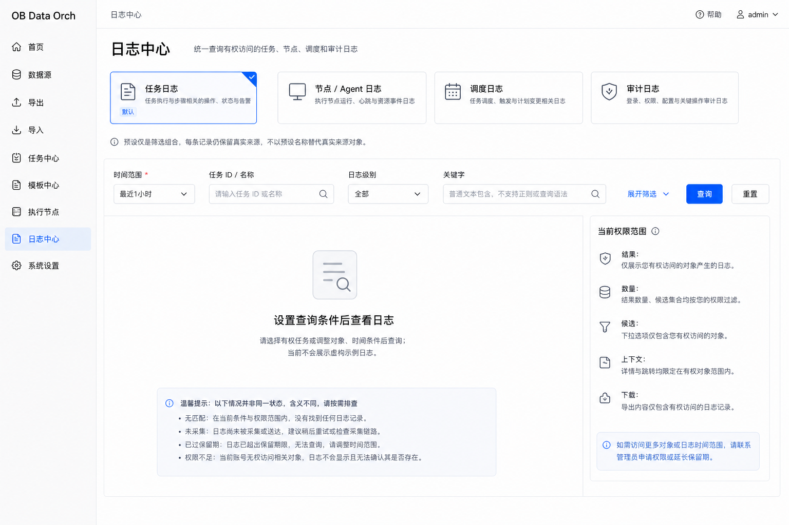
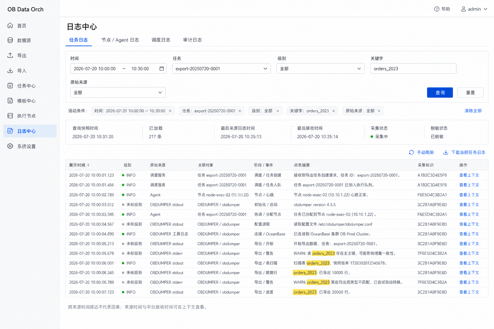
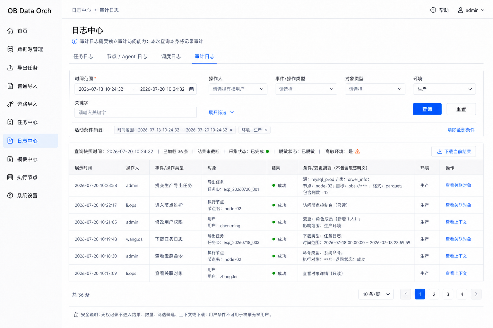
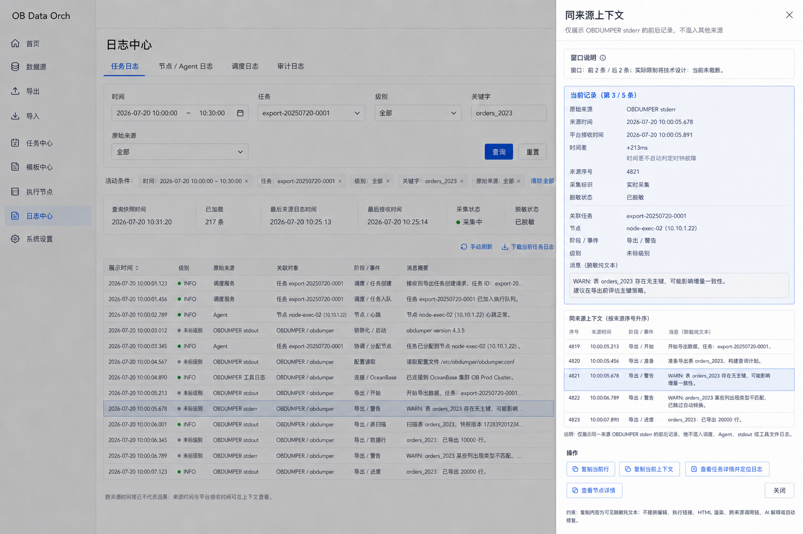
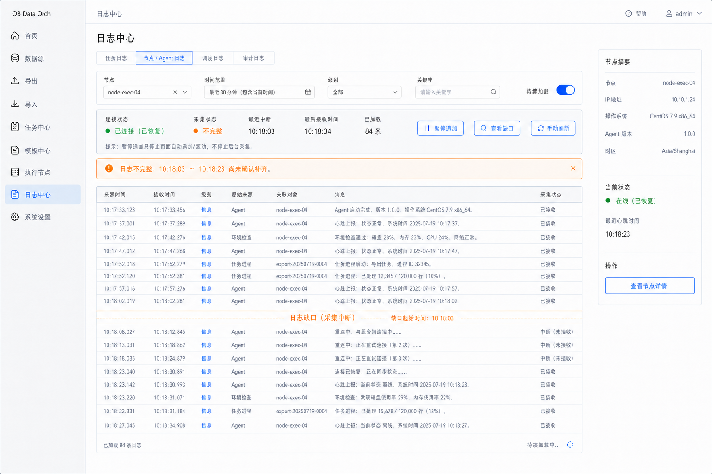
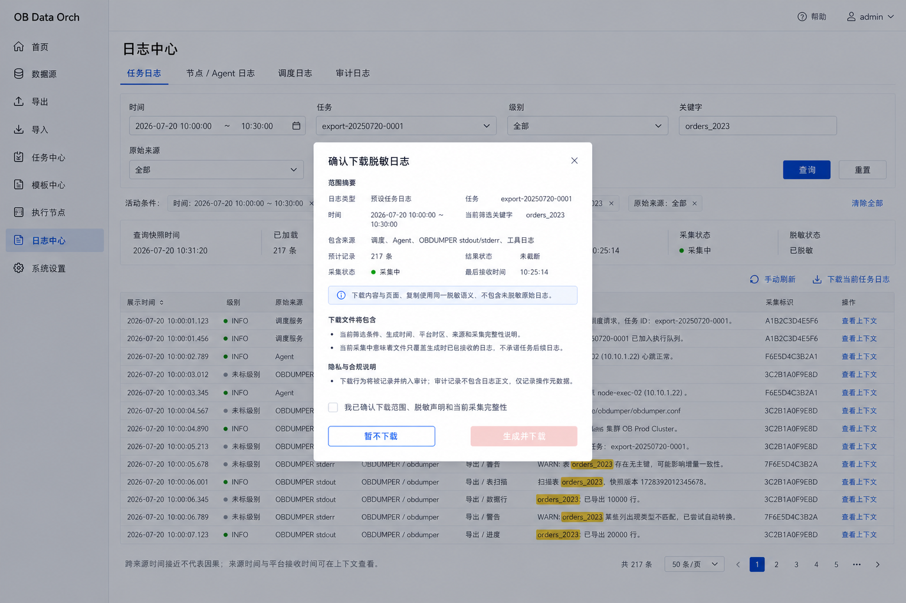

# 日志中心低保真基线

> 文档状态：日志中心低保真已确认  
> 评审范围：首次进入 → 任务聚合查询 → 审计查询 → 同来源上下文 → 持续加载与缺口 → 脱敏下载  
> 依据：[日志中心模块专项评审稿](log-center-module.md)、[日志中心字段与条件矩阵](log-center-field-rules.md)  
> 评审结论：LC-LF-R01～LC-LF-R18 全部确认（2026-07-20）  
> 更新日期：2026-07-20

## 1. 评审目标

本文将日志中心的统一查询、真实来源、同来源上下文、采集完整性、持续加载、权限和脱敏下载落实为静态低保真，覆盖用户从选择查询预设到定位日志、判断结果是否完整、查看上下文和下载结果的最小闭环。

设计目标是在单一查询页面内承载任务、节点/Agent、调度和审计四类预设，同时避免把预设名称误作真实日志来源、把时间接近误作因果关系、把连接恢复误作历史缺口已经补齐，或把日志中心扩展为日志分析与告警平台。

本稿不是日志采集协议、存储索引、查询引擎、告警平台或 AI 诊断设计。图片中的日志、任务、节点、时间、版本和数量均用于表达布局；实际事实以采集证据、权限规则、技术设计和受控验证结果为准。

## 2. 最小页面集

本轮使用六张页面覆盖日志中心主链路与关键状态：

| 能力 | 页面 | 说明 |
|---|---|---|
| 首次进入与查询预设 | LC-LF-01 | 验证四类预设、默认最近一小时、不自动宽查、权限范围和空状态区分 |
| 任务日志聚合查询 | LC-LF-02 | 验证任务相关多来源日志聚合、真实来源、双时间、原始级别和关键字高亮 |
| 审计日志查询 | LC-LF-03 | 验证独立审计权限、受限候选、条件摘要和敏感访问审计边界 |
| 同来源上下文 | LC-LF-04 | 验证有限前后窗口、来源一致、时间差异、脱敏复制和对象跳转 |
| 持续加载与日志缺口 | LC-LF-05 | 验证单对象持续加载、暂停追加、连接恢复、历史缺口和采集完整性 |
| 脱敏日志下载 | LC-LF-06 | 验证下载范围、来源、数量、截断、采集状态、脱敏声明和审计记录 |

V1.0 使用一个日志查询页面和一个同来源上下文抽屉，不新增日志仪表盘、查询编辑器、保存视图、异步导出中心或独立日志详情路由。

## 3. 页面基线

### LC-LF-01 首次进入与四类预设

- 页头提供任务、节点/Agent、调度和审计四类查询预设，预设只改变筛选组合；
- 从导航进入时初始化任务日志和最近一小时，但不自动执行宽范围查询或展示虚构日志；
- 时间范围必填，任务、节点、用户等候选与结果数量均受当前权限限制；
- 关键字只支持有权脱敏文本的普通包含和高亮；
- 无匹配、未采集、已过保留期和权限不足分别说明，不合并成统一空状态；
- 页面不增加趋势、告警、聚类、复杂查询或保存视图。

### LC-LF-02 任务日志聚合查询

- 任务预设聚合调度服务、Agent、OBDUMPER stdout/stderr 和工具日志等任务相关来源；
- 每条记录保留原始来源、关联对象、阶段/事件、来源时间或接收时间及采集标识；
- stdout、stderr 和消息文本不用于推断日志级别，无可靠级别时显示未标级别；
- 来源时间和平台接收时间分开保留，跨来源按展示规则排序但不承诺因果顺序；
- 查询结果使用快照，保留条件摘要、查询时间、已加载数量、最后来源时间、最后接收时间和采集状态；
- 查看上下文、手动刷新和下载均基于当前有权结果，不改变查询范围。

### LC-LF-03 审计日志查询

- 审计日志使用独立访问能力，不能仅凭系统管理员角色自动获得；
- 操作人、事件类型、对象、环境和候选集合按权限过滤，不能枚举无权对象；
- 查询、下载及高敏环境访问记录操作者、时间、条件范围和结果摘要；
- 审计记录不复制日志正文、密码、密钥、Token 或可恢复敏感值；
- 结果以纯文本摘要展示，关联对象和上下文跳转时重新校验权限；
- 不增加行为画像、风险评分、审批流或安全告警中心。

### LC-LF-04 同来源上下文

- 上下文通过右侧抽屉展示当前记录和同一原始来源的有限前后窗口；
- 上下文明确来源、窗口大小、来源序号以及是否因技术限制截断；
- 不混入时间相近的调度、Agent、stdout、stderr 或工具文件记录制造伪调用链；
- 来源时间和接收时间同时可得时展示差异，但不自动判定时钟故障；
- 复制当前行和复制上下文均使用页面同一脱敏语义；
- 跳转任务或节点详情时携带定位上下文，并重新执行对象权限校验。

### LC-LF-05 持续加载与日志缺口

- 持续加载只在单一活动对象且查询时间包含当前时提供，默认关闭；
- 暂停追加只停止页面自动追加和滚动，不停止后台采集；
- 页面分开展示实时连接状态、采集状态、最近中断、最后接收时间和已加载数量；
- 中断时保留已加载记录，恢复后继续接收，但不能因此宣称历史缺口已经补齐；
- 已确认缺口以范围和状态显式插入结果流，后续新日志不得覆盖或隐藏缺口；
- 采集延迟、中断、不完整和未知不直接改变关联任务的执行状态。

### LC-LF-06 脱敏日志下载确认

- 下载前确认预设、对象、时间、关键字、来源、预计数量、截断和采集完整性；
- 下载内容与页面和复制使用相同脱敏语义，不提供未脱敏原始日志；
- 文件包含查询条件、生成时间、平台时区、来源和完整性说明；
- 采集中时只下载生成时刻之前已经接收的日志，不承诺包含任务后续日志；
- 超过下载限制时要求缩小查询范围，不创建异步导出任务或导出中心；
- 下载成功或失败均记录不含正文和敏感值的审计元数据。

## 4. 状态与证据表达

| 维度 | 页面表达 | 禁止推断 |
|---|---|---|
| 查询预设 | 任务、节点/Agent、调度、审计 | 预设名称等于真实来源 |
| 来源 | 调度、Agent、stdout/stderr、工具文件、审计等 | 时间接近即存在调用关系 |
| 时间 | 来源时间、平台接收时间、查询快照时间 | 时间差自动代表节点时钟故障 |
| 级别 | 来源原值或未标级别 | stdout 等于 INFO、stderr 等于 ERROR |
| 连接 | 已连接、重连中、中断、恢复 | 连接恢复等于历史日志完整 |
| 采集 | 采集中、已完成、延迟、中断、不完整、未知 | 采集异常直接改变任务终态 |
| 结果 | 无匹配、未采集、已过期、无权限、已截断 | 所有无结果状态含义相同 |
| 安全 | 已授权、已脱敏、访问留痕 | 审计权限允许查看未脱敏原文 |

## 5. 已确认低保真规则

| 编号 | 确认规则 | 状态 |
|---|---|---|
| LC-LF-R01 | 日志中心采用统一查询页面，不建设日志仪表盘或独立日志详情路由 | 已确认 |
| LC-LF-R02 | 任务、节点/Agent、调度、审计是四组查询预设，不替代日志真实来源 | 已确认 |
| LC-LF-R03 | 首次进入默认最近一小时和任务日志预设，但不自动执行宽范围查询 | 已确认 |
| LC-LF-R04 | 时间范围必填；候选对象、数量和结果均按当前权限过滤 | 已确认 |
| LC-LF-R05 | 关键词仅支持普通文本包含与高亮，不提供正则、查询 DSL 或保存查询 | 已确认 |
| LC-LF-R06 | 任务聚合保留调度、Agent、stdout、stderr、工具日志等原始来源，不自动去重或推断因果 | 已确认 |
| LC-LF-R07 | 来源时间与平台接收时间分开展示；无可靠来源时间时明确使用接收时间 | 已确认 |
| LC-LF-R08 | 保留来源提供的日志级别；stdout 不等于 INFO，stderr 不等于 ERROR | 已确认 |
| LC-LF-R09 | 上下文只读取同一原始来源的有限前后记录，不混入其他来源 | 已确认 |
| LC-LF-R10 | 跨对象查询使用结果快照和手动刷新 | 已确认 |
| LC-LF-R11 | 持续加载仅适用于单个活动对象和包含当前时间的范围，默认关闭 | 已确认 |
| LC-LF-R12 | 暂停追加只暂停页面滚动与追加，不停止后台采集 | 已确认 |
| LC-LF-R13 | 采集中断时保留已加载记录；恢复连接不代表历史缺口已经补齐 | 已确认 |
| LC-LF-R14 | 采集状态和无结果状态分别表达；采集延迟或日志缺口不直接改变任务终态 | 已确认 |
| LC-LF-R15 | 页面、复制和下载使用相同脱敏规则；仅支持脱敏纯文本，不提供未脱敏原始日志 | 已确认 |
| LC-LF-R16 | 下载携带范围、时间、时区、来源和完整性；超限要求收窄，不建设异步导出中心 | 已确认 |
| LC-LF-R17 | 审计日志需要独立权限，查询、下载和高敏访问留痕；审计记录不复制正文 | 已确认 |
| LC-LF-R18 | 不提供趋势、告警、AI 诊断、自动修复、任意原始文件访问、未脱敏下载或手工删除 | 已确认 |

## 6. 当前边界

本次确认表示日志中心静态低保真已经通过产品评审，但不表示：

- Agent、调度器和工具日志的采集协议、认证、重连或可靠游标已经技术定版；
- 来源序号、日志缺口证明、跨来源排序、去重标记或时钟偏差处理已经实现；
- 单次查询跨度、结果上限、上下文窗口、查询超时或下载大小已经确定；
- 日志存储、全文索引、保留清理、审计独立保留或权限编码已经完成设计；
- 日志示例、任务 ID、节点、时间、数量或工具输出构成真实运行证据；
- 可交互原型、高保真 UI、日志分析平台、技术设计或业务代码开发已经准入。

## 7. 评审记录

LC-LF-R01～LC-LF-R18 已于 2026-07-20 全部确认，并写入 [DEC-042](../01-product/decisions.md#dec-042-日志中心低保真基线)。
