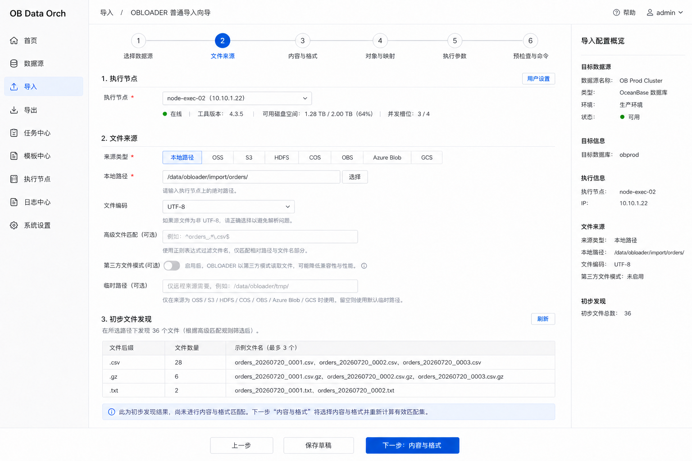
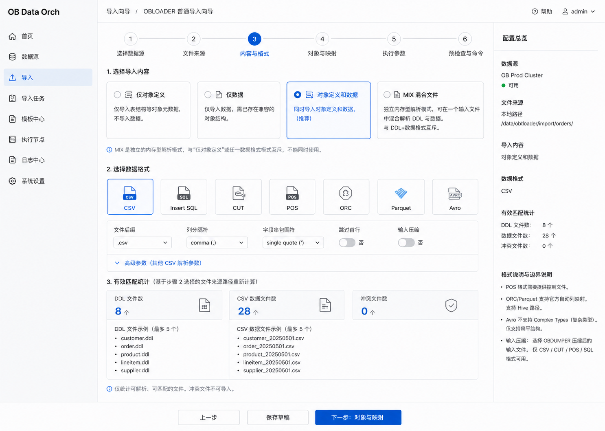
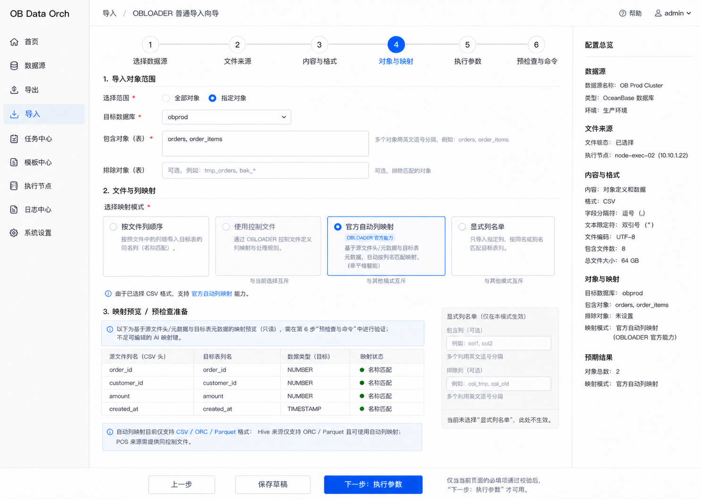
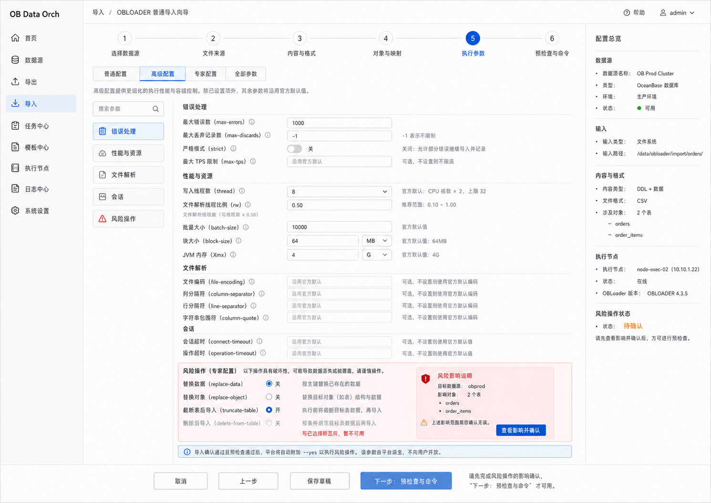
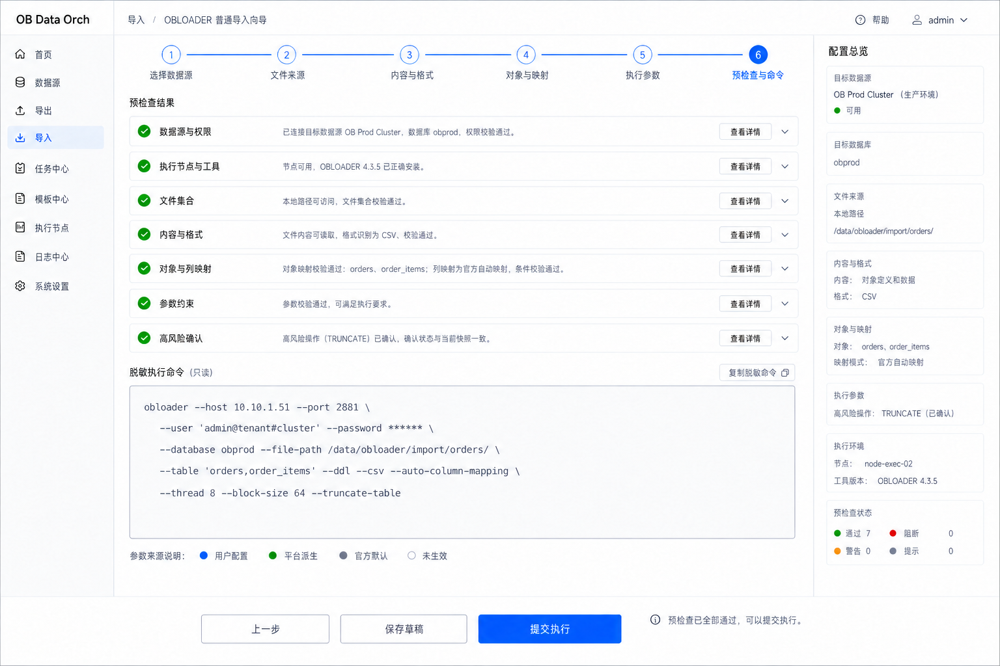
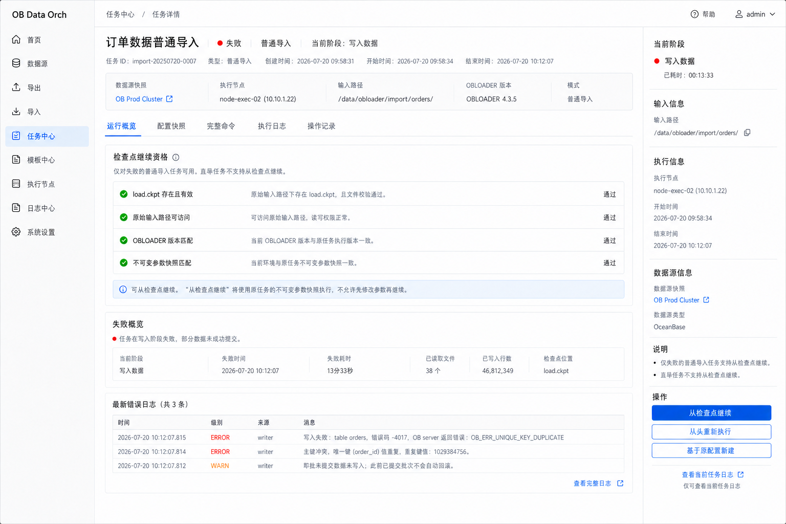

# 普通导入低保真基线

> 文档状态：普通导入关键流程低保真已确认  
> 评审范围：文件来源 → 内容与格式 → 对象与映射 → 执行参数 → 预检查与命令 → 检查点继续  
> 依据：[普通导入模块专项评审稿](normal-import-module.md)、[普通导入字段与条件矩阵](normal-import-field-rules.md)  
> 评审结论：NI-LF-R01～NI-LF-R08 全部确认（2026-07-20）  
> 更新日期：2026-07-20

## 1. 评审目标

本文在[核心流程低保真基线](core-flow-low-fidelity.md)的共同页面骨架上，固化普通导入独有的文件、格式、映射、高风险操作和检查点继续交互。

本稿是静态低保真和产品交互基线，不是高保真 UI、可运行原型或命令实现。图片中的示例文件、对象、地址、命令和值只用于表达页面结构；参数适用性和实际行为仍以 OBLOADER 4.3.5 参数映射及受控验证证据为准。

## 2. 六步顺序调整

低保真评审发现，原方案先配置“对象与映射”、后选择“内容与格式”，存在逆向依赖：

- 官方自动列映射只适用于 CSV、ORC、Parquet；
- Hive 来源只适用于 ORC/Parquet，并依赖自动列映射；
- POS 必须先明确格式，才能要求控制文件；
- 文件后缀、压缩和解析字段也依赖具体格式。

因此普通导入仍保持六步同构，但第 3、4 步交换为：

```text
1. 选择数据源
→ 2. 文件来源
→ 3. 内容与格式
→ 4. 对象与映射
→ 5. 执行参数
→ 6. 预检查与命令
→ 任务详情和日志
```

该调整只修正页面依赖顺序，不改变普通导入范围、参数承载原则或普通/旁路边界。

## 3. 页面基线

### NI-LF-01 文件来源与初步发现



- 选择执行节点可访问的本地绝对路径或官方支持的远程存储类型；
- 不提供浏览器上传、任意 URI、平台文件管理或文件内容编辑器；
- 第 2 步只展示路径可达性和按后缀分组的初步文件发现；
- 文件正则、编码、第三方文件模式和远程临时目录按条件展示；
- 第 3 步确定内容和格式后重新计算有效文件集。

### NI-LF-02 内容与格式



- 仅对象定义、仅数据、对象定义和数据、MIX 混合文件严格单选；
- MIX 是独立解析模式，与 DDL 加数据格式互斥，不把 MIX 表达成普通组合；
- CSV、Insert SQL、CUT、POS、ORC、Parquet、Avro 严格单选；
- 只显示当前格式活动字段，其他格式草稿值可暂存但不生效；
- 依据已选格式、后缀和解析条件重新计算 DDL 文件、数据文件和冲突文件；
- 压缩表达“读取 OBDUMPER 压缩输入”，不是再次压缩导入数据。

### NI-LF-03 对象与映射



- 全部对象和指定对象互斥；指定对象至少包含一种适用对象表达式；
- 映射方式为按文件列顺序、控制文件、官方自动列映射、显式列名单四选一；
- 官方自动列映射明确标记为 OBLOADER 能力，不包装成平台智能映射；
- 映射预览只展示源文件头/元数据和目标元数据形成的只读准备结果，最终在第 6 步验证；
- 平台不创建目标表、不修改表结构、不提供自由映射表达式编辑器。

### NI-LF-04 执行参数与高风险操作



- 普通、高级、专家和全部参数使用统一字段状态与分类搜索入口；
- 未设置的可选项显示“沿用官方默认”，不为追求命令长度主动写出；
- 性能字段展示官方默认或参数关系，不生成伪精确推荐值；
- `replace-data`、`replace-object`、`truncate-table`、`delete-from-table` 只按官方条件显示；
- `truncate-table` 与 `delete-from-table` 互斥；影响范围绑定目标数据库、对象、文件集和参数快照；
- `--yes` 不作为用户开关，平台仅在完成等价确认后为非交互任务派生。

### NI-LF-05 预检查与完整命令



- 预检查按数据源与权限、执行节点与工具、文件集合、内容与格式、对象与列映射、参数约束和高风险确认分组；
- 任一阻断项存在时禁止提交，并提供返回对应步骤修正的入口；
- 全部通过后才能提交，提交时保存不可变任务、文件、对象、参数和风险确认快照；
- 完整命令只读、默认脱敏并支持复制脱敏命令；
- 普通导入不得生成 `--direct`、`--rpc-port` 或 `--parallel`；
- 图片内示例命令不代替参数映射与受控验证。

### NI-LF-06 失败任务检查点继续



- 仅失败的普通导入任务可能显示“从检查点继续”；
- 必须同时满足原路径下存在有效 `load.ckpt`、输入路径仍可访问、工具版本匹配和不可变参数快照匹配；
- 继续使用原任务快照，不允许修改参数后继续；
- 不满足条件时仅提供从头重新执行或基于原配置新建；
- 已提交批次不会因后续失败自动回滚；
- 旁路导入不复用检查点继续能力。

## 4. 已确认低保真规则

| 编号 | 确认规则 | 状态 |
|---|---|---|
| NI-LF-R01 | 六步顺序调整为数据源、文件来源、内容与格式、对象与映射、执行参数、预检查与命令 | 已确认 |
| NI-LF-R02 | 第 2 步只做初步文件发现；选择格式后重新计算有效文件集 | 已确认 |
| NI-LF-R03 | DDL、数据、DDL+数据、MIX 单选；数据格式严格单选 | 已确认 |
| NI-LF-R04 | 顺序、控制文件、官方自动映射、显式列名单互斥，不提供智能字段映射 | 已确认 |
| NI-LF-R05 | 普通、高级、专家、全部参数通过分类与搜索承载，折叠不等于删除 | 已确认 |
| NI-LF-R06 | 高风险操作绑定对象和参数快照确认，`--yes` 仅由平台在等价确认后派生 | 已确认 |
| NI-LF-R07 | 预检查覆盖文件、格式、对象、映射、权限、参数和风险确认；命令只读且默认脱敏 | 已确认 |
| NI-LF-R08 | 仅失败普通导入在 `load.ckpt`、原路径、工具版本和不可变快照匹配时允许从检查点继续 | 已确认 |

## 5. 与公共基线及旁路导入的关系

- 导航、顶部步骤条、宽表单、右侧摘要和底部操作区沿用 LF-R01～LF-R07；
- 数据源选择、命令确认、任务详情和日志继续复用公共页面语言；
- 普通导入独有的是多对象/多文件、七种格式、列映射、错误容忍、高风险数据行为和检查点继续；
- [旁路导入低保真基线](direct-load-low-fidelity.md)沿用相同页面骨架，但保持独立流程；不允许因为视觉同构而引入普通导入的 `--retry`、多对象或普通错误容忍语义。

## 6. 当前边界

本次确认表示普通导入关键静态低保真已经通过产品评审，但不表示：

- OBLOADER 4.3.5 的 P0 受控验证已经执行；
- 响应式、键盘操作、无障碍或真实大文件信息密度已经验证；
- 参数元数据、命令生成、检查点或任务状态技术设计已经完成；
- 业务代码开发已经准入。

## 7. 评审记录

NI-LF-R01～NI-LF-R08 已于 2026-07-20 全部确认，并写入 [DEC-036](../01-product/decisions.md#dec-036-普通导入关键流程低保真基线)。
