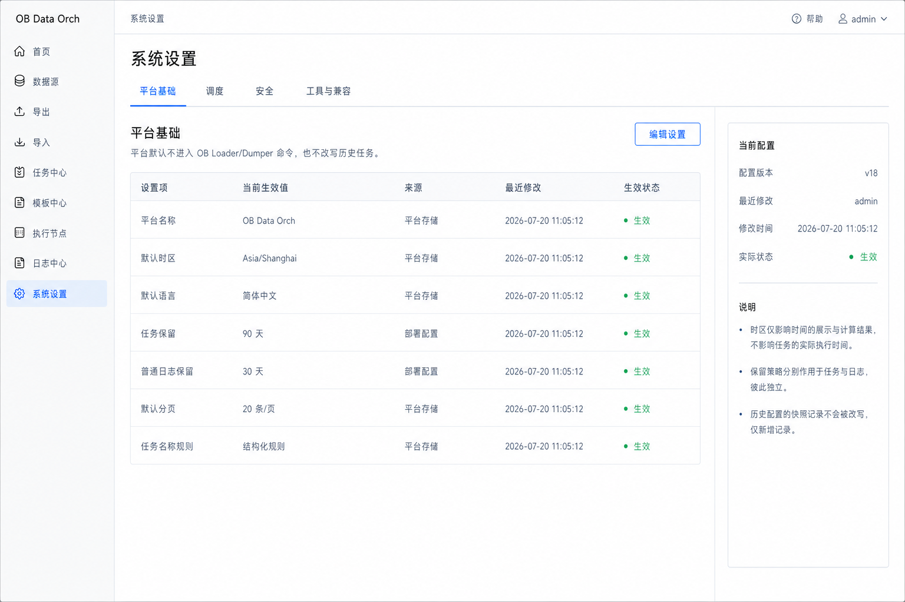
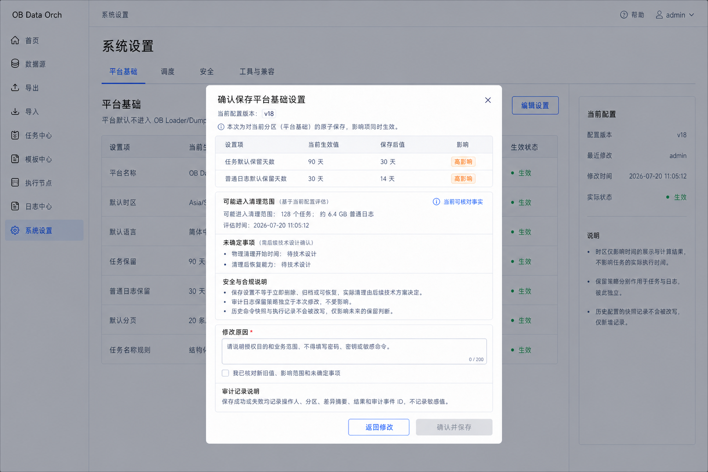
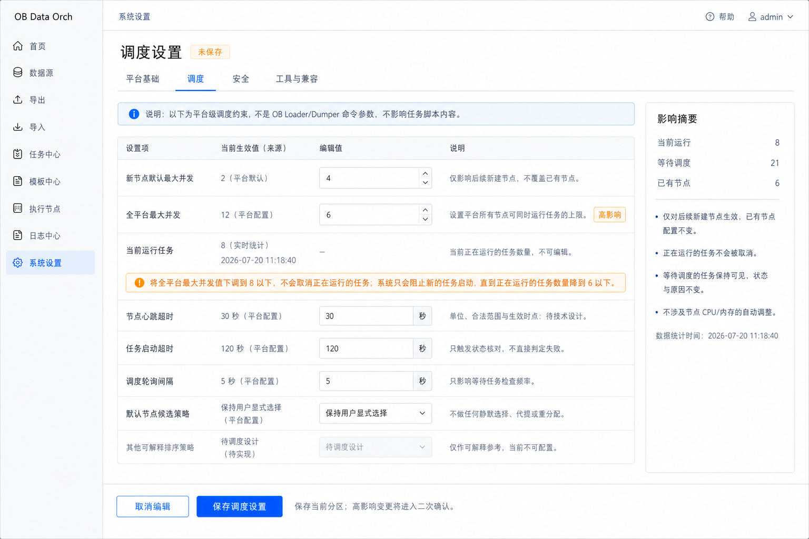
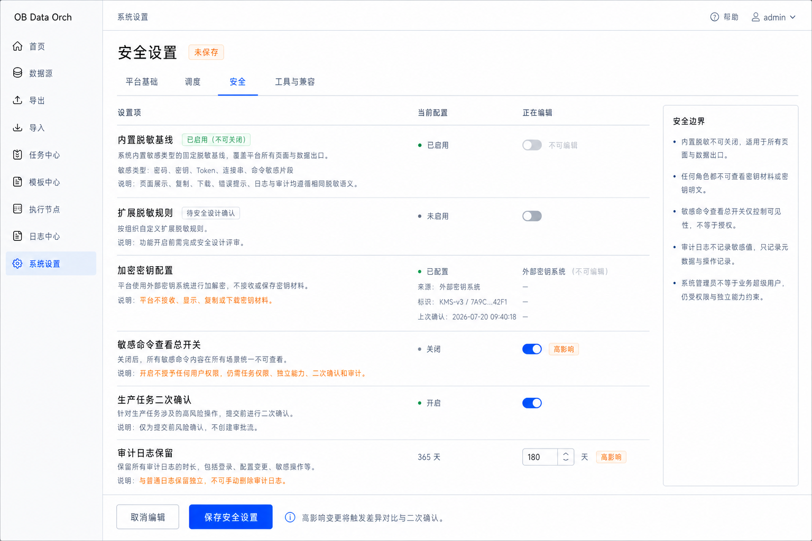
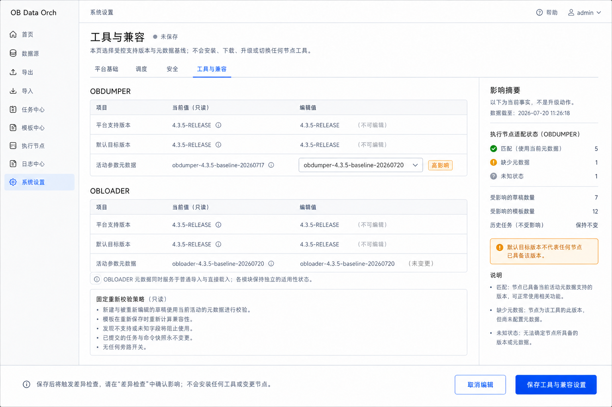
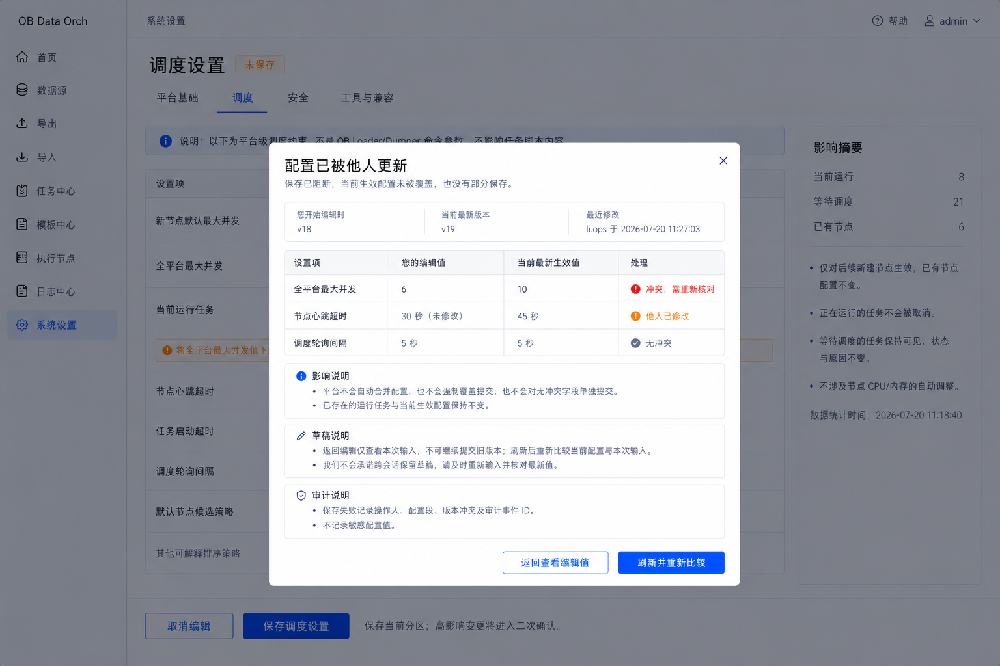

# 系统设置低保真基线

> 文档状态：系统设置低保真已确认  
> 评审范围：平台基础 → 保留期确认 → 调度约束 → 安全设置 → 工具与兼容 → 配置版本冲突  
> 依据：[系统设置模块专项评审稿](system-settings-module.md)、[系统设置字段与条件矩阵](system-settings-field-rules.md)  
> 评审结论：SS-LF-R01～SS-LF-R18 全部确认（2026-07-20）  
> 更新日期：2026-07-20

## 1. 评审目标

本文将系统设置的真实生效值、来源、分区编辑、影响比较、高风险确认、原子保存和并发冲突落实为静态低保真，覆盖管理员从查看当前配置到修改一个设置分区、核对影响并完成受控保存的最小闭环。

设计目标是让用户清楚区分平台展示默认、新建对象默认、调度硬约束、安全策略、工具与参数元数据基线，以及它们对历史任务、现有节点、草稿和模板的不同影响；同时避免系统设置演变为第二套任务参数、配置发布或远程运维平台。

本稿不是配置存储、调度算法、密钥系统、清理作业、元数据发布或权限编码技术设计。图片中的天数、并发数、超时、对象数量、配置版本和时间仅用于表达布局，不构成部署默认值或实现承诺。

## 2. 最小页面集

本轮使用六张页面覆盖系统设置主链路与关键异常：

| 能力 | 页面 | 说明 |
|---|---|---|
| 平台基础与真实生效值 | SS-LF-01 | 验证单页四分区、值来源、修改时间、生效状态和只读概览 |
| 降低保留期确认 | SS-LF-02 | 验证新旧值、已知影响、未确定事项、高影响确认和审计摘要 |
| 调度设置与并发影响 | SS-LF-03 | 验证新节点默认、平台硬上限、当前运行数、超时语义和节点选择边界 |
| 安全设置 | SS-LF-04 | 验证内置脱敏、密钥不可见、敏感命令总开关、生产确认和审计保留 |
| 工具与兼容设置 | SS-LF-05 | 验证支持范围、默认目标、活动元数据、节点实际版本和重新校验边界 |
| 配置版本冲突 | SS-LF-06 | 验证并发修改检测、差异比较、阻断覆盖和重新读取 |

V1.0 使用一个系统设置页面和平台基础、调度、安全、工具与兼容四个横向分区，不新增设置首页、多级配置树、全局搜索、配置发布、环境覆盖或历史回滚页面。

## 3. 页面基线

### SS-LF-01 平台基础与真实生效值

- 页面默认进入平台基础分区，其他三个分区使用相同页面骨架；
- 每项展示当前生效值、实际来源、最近修改时间和生效状态，未知时不显示猜测默认；
- 时区只影响时间展示和输入解释，语言只影响初始界面，分页只影响列表初次加载；
- 任务名称结构化规则只作用于新建或编辑草稿，不进入工具命令；
- 任务、普通日志和审计日志保留策略相互独立；
- 未编辑时只有一个“编辑设置”入口，不显示无意义的空保存按钮。

### SS-LF-02 降低保留期确认

- 降低任务或普通日志保留期属于高影响操作，保存前展示旧值、新值和当前可核对影响；
- 已知对象数量或数据量带统计时间，无法可靠计算时显示未知；
- 物理清理时间、清理后恢复和归档能力未定版时明确标注“待技术设计”；
- 保存不承诺立即删除、自动归档或可恢复，也不提供手工清理入口；
- 审计日志保留独立，不随平台基础分区的普通日志策略一起变更；
- 高影响确认要求核对差异、影响和未确定事项，并填写不含敏感值的修改原因。

### SS-LF-03 调度设置与并发影响

- 新节点默认最大并发只预填后续创建节点，不覆盖已有节点实际设置；
- 全平台最大并发是新调度决策的硬上限，并与当前运行任务数分开展示；
- 新上限低于当前运行数时不取消运行任务，只阻止新增启动直至运行数降到上限以下；
- 节点心跳超时只派生失联，任务启动超时只触发状态核对，调度轮询只影响等待任务检查频率；
- 超时和轮询的单位、合法范围与生效时点尚未技术定版时不在页面伪造约束；
- 默认节点策略保持用户显式选择，不静默选中、提交、改派或依据资源采样自动调整并发。

### SS-LF-04 安全设置

- 内置脱敏基线始终启用且不可关闭，页面、复制、下载、错误、日志和审计使用相同语义；
- 扩展脱敏规则在安全设计确认前保持不可配置，不提供正则或脚本编辑器；
- 密钥只展示配置状态、来源类型、不可逆标识和最后确认时间；
- 页面不接收、显示、复制或下载密钥材料，也不以普通表单代替生成和轮换流程；
- 敏感命令总开关默认关闭；开启不授予任何用户权限，仍需对象权限、独立能力、二次确认和审计；
- 生产任务二次确认只是提交前风险确认，不建设审批流；审计日志不提供手工删除。

### SS-LF-05 工具与兼容设置

- OBDUMPER 与 OBLOADER 分别展示平台支持范围、默认目标版本和活动参数元数据；
- 平台默认目标与执行节点实际安装版本分开展示，默认目标不证明任何节点已安装该版本；
- OBLOADER 元数据同时服务普通导入和旁路导入，但两个模块继续保留独立参数适用状态；
- 只允许选择已经受控发布的元数据版本，不提供上传、在线编辑或任意参数修改；
- 元数据变化使新建和重新编辑的草稿重新校验，使模板重新计算兼容状态；
- 已提交任务和命令快照保持不变，页面不安装、升级、切换节点工具或自动迁移模板。

### SS-LF-06 配置版本冲突

- 编辑开始时记录配置版本，保存时发现版本变化立即阻断覆盖；
- 冲突页区分用户编辑值、当前最新生效值、同字段冲突和他人修改；
- 冲突时当前生效配置和运行任务保持不变，不发生部分保存；
- 页面不自动合并、强制覆盖或拆分提交无冲突字段；
- 返回只能查看本次输入，旧版本不能继续提交；刷新后重新读取并比较；
- 保存失败记录分区、版本冲突、操作者、结果和审计事件 ID，不记录敏感值。

## 4. 生效范围与禁止推断

| 设置类型 | 页面表达 | 禁止推断 |
|---|---|---|
| 展示默认 | 时区、语言、分页及来源 | 会改写来源时间或历史数据 |
| 新建默认 | 新节点并发、默认目标等 | 会批量覆盖已有节点或对象 |
| 调度硬约束 | 平台并发、超时与等待原因 | 会自动取消、改派或判定失败 |
| 安全策略 | 脱敏、敏感命令、生产确认 | 总开关等于用户授权或审批 |
| 工具基线 | 支持范围、默认目标、元数据 | 节点已安装、自动升级或历史迁移 |
| 保留策略 | 当前策略和可能影响 | 立即删除、自动归档或保证恢复 |
| 配置版本 | 编辑版本、当前版本和冲突 | 自动合并或允许强制覆盖 |

## 5. 已确认低保真规则

| 编号 | 确认规则 | 状态 |
|---|---|---|
| SS-LF-R01 | 系统设置使用单页面四分区，不建设设置首页、多级配置树或全局搜索 | 已确认 |
| SS-LF-R02 | 每项展示真实生效值、来源、修改时间和生效状态；未知时不填充猜测值 | 已确认 |
| SS-LF-R03 | 查看与编辑权限分离；任何角色都不能查看密钥材料 | 已确认 |
| SS-LF-R04 | 一次只编辑当前分区，每个分区独立原子保存，不部分提交 | 已确认 |
| SS-LF-R05 | 存在未保存修改时，切换分区或离开页面必须提示 | 已确认 |
| SS-LF-R06 | 平台设置不静默生成工具参数，也不回写历史任务、命令和快照 | 已确认 |
| SS-LF-R07 | 时区、语言、分页和名称规则只影响对应展示或新建校验 | 已确认 |
| SS-LF-R08 | 任务、普通日志和审计日志保留策略相互独立；降低保留期展示已知影响与未确定事项，不承诺立即删除、归档或恢复 | 已确认 |
| SS-LF-R09 | 新节点默认并发仅影响后续创建节点，不覆盖已有节点 | 已确认 |
| SS-LF-R10 | 平台并发是调度硬上限；降低到当前运行数以下不取消任务，只阻止新增启动 | 已确认 |
| SS-LF-R11 | 心跳超时只派生失联，启动超时只触发状态核对，轮询间隔只影响调度频率；具体范围保持待技术设计 | 已确认 |
| SS-LF-R12 | 默认节点策略保持用户显式选择；未经调度设计确认，不提供自动选择、提交或改派 | 已确认 |
| SS-LF-R13 | 内置脱敏不可关闭；扩展脱敏规则未完成安全设计前保持不可配置 | 已确认 |
| SS-LF-R14 | 密钥只展示状态、来源类型和不可逆标识，不提供输入、回显、复制或下载 | 已确认 |
| SS-LF-R15 | 敏感命令总开关不授予用户权限；生产二次确认不扩展为审批流；审计日志不允许手工删除 | 已确认 |
| SS-LF-R16 | 工具支持范围、默认目标、参数元数据和节点实际版本分别表达；不提供工具安装、升级、切换或元数据在线编辑 | 已确认 |
| SS-LF-R17 | 元数据变化使草稿和模板重新校验，但不改写历史任务；高影响保存必须展示差异、影响和审计说明 | 已确认 |
| SS-LF-R18 | 配置版本冲突时阻断覆盖，不自动合并、强制保存或拆分提交，刷新后重新比较 | 已确认 |

## 6. 当前边界

本次确认表示系统设置静态低保真已经通过产品评审，但不表示：

- 任务、日志和审计日志的合法保留范围、清理周期、清理对象或恢复语义已经技术定版；
- 调度并发、心跳、启动超时和轮询间隔的单位、范围、初始值或生效时点已经确定；
- 默认节点候选策略的具体枚举、排序算法或推荐证据已经完成；
- 密钥生成、注入、轮换、备份、恢复或既有凭据重加密流程已经设计；
- 参数元数据包的制作、签名、上传、发布、回退或故障恢复机制已经实现；
- 页面中的示例值、对象数量、配置版本或时间构成生产配置事实；
- 可交互原型、高保真 UI、技术设计、配置服务或业务代码开发已经准入。

## 7. 评审记录

SS-LF-R01～SS-LF-R18 已于 2026-07-20 全部确认，并写入 [DEC-043](../01-product/decisions.md#dec-043-系统设置低保真基线)。
