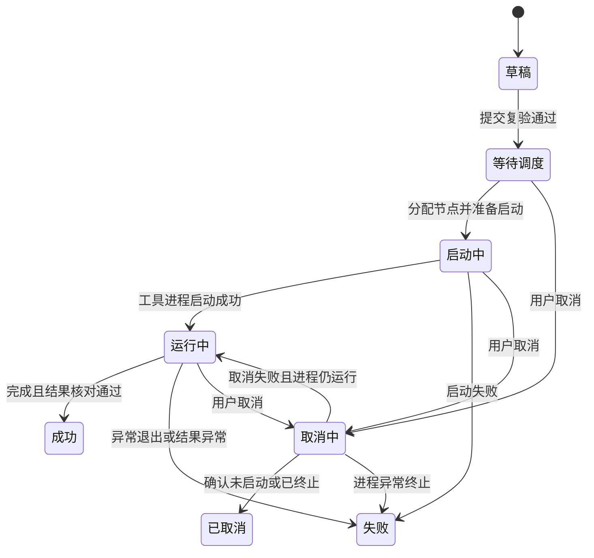

# 任务中心与详情设计

> 文档状态：产品、字段规则与全状态低保真已确认，精确工具行为边界待验证\
> 模块优先级：P0\
> 适用任务：导出、普通导入、旁路导入\
> 依据：[产品范围](../01-product/product-scope.md)\
> 更新日期：2026-08-03
> 产品决策依据：[DEC-020](../01-product/decisions.md#dec-020-任务中心与任务详情专项产品规则)\
> 字段决策依据：[DEC-021](../01-product/decisions.md#dec-021-任务中心与任务详情字段及条件规则)\
> 场景语义参考：[任务中心与任务详情场景矩阵](#business-scenarios)；视觉与页面架构以 [P0 MASTER](../../design-system/MASTER.md) 为准。
> 低保真决策依据：[DEC-038](../01-product/decisions.md#dec-038-任务中心与任务详情全状态低保真基线)

阅读导航：[模块方案](#module-design) · [字段与条件](#field-rules) · [业务场景](#business-scenarios)。本页定义业务规则；视觉以 [P0 MASTER](../../design-system/MASTER.md) 与对应 P1 为准。

<a id="module-design"></a>

## 1. 评审目标

建立三类任务共用的执行追踪和排障入口，让用户能够回答：有哪些任务、当前是否真在运行、执行到哪里、实际用了什么配置和命令、结果在哪里、为什么失败，以及当前允许哪些安全操作。

本模块只统一任务管理和任务上下文，不重新定义导出、普通导入和旁路导入的参数或失败语义。三类任务的差异由已确认的模块规则驱动，不为某一类任务单独造一套详情页。

本稿不定义 API、数据库表、调度算法、日志存储实现或高保真 UI。

## 2. 已确认基线

- 三类任务提交后共用任务中心、任务详情和日志能力。
- 任务详情显示提交时的不可变配置快照、工具版本和完整命令。
- 命令只读，默认脱敏；敏感查看和复制受权限、二次确认和审计约束。
- 只有工具输出可靠解析时展示百分比；否则降级为阶段和持续时间，不伪造 ETA。
- 导出和普通导入只在检查点、原路径、工具版本和快照条件均满足时可从检查点继续。
- 旁路导入不支持检查点续传，失败后只能基于原配置新建或从头重新执行。
- 取消任务必须核对工具进程和可能的数据库端任务，不得只修改平台状态。
- 公共模块以支撑任务创建、执行、排障和审计为边界，不建设通用运维或日志分析平台。

## 3. 模块边界

### 包含

- 统一任务列表、筛选、状态、阶段、可靠进度和行级操作。
- 任务详情页头摘要、运行概览、配置快照、命令、任务日志和操作记录。
- 草稿继续编辑、取消、基于原配置新建、从头重新执行和条件化检查点继续。
- 任务来源和派生关系、敏感操作记录和当前任务排障上下文。

### 不包含

- 定时计划、依赖编排、DAG、优先级队列可视化或跨任务工作流。
- 批量取消、批量重试、批量删除或批量修改节点等高风险操作。
- 自定义列布局、保存筛选视图、拖拽编排或任务看板。
- 全文日志分析、日志聚类、AI 根因诊断或未经验证的自动修复。
- 输出文件浏览器、数据预览、对象管理或导入结果的业务数据校验。
- 平台级任务保留、日志保留、告警和通知策略，这些属于系统设置或后续模块。

## 4. 轻量化设计原则

1. 列表用于定位和管理，不在单行塞入全部参数和日志。
2. 详情用于理解和排障，不允许原地修改已提交配置。
3. 状态只表达稳定执行生命周期，具体步骤放入“当前阶段”，避免状态枚举无限扩张。
4. 端口、路径、格式、对象和参数等事实由任务快照提供，不从当前数据源或模板反查后覆盖历史。
5. 失败摘要放在运行概览的高显著位置，不为大量非失败任务常驻一个空“错误信息”页签。
6. 当平台暂时无法证明进程真实状态时，显示“状态核对中”附加标识，不立即把任务判为失败，也不新增一批业务状态。

## 5. 任务对象与不可变边界

| 对象 | 产品语义 | 可修改性 |
|---|---|---|
| 草稿 | 用户尚未完成提交的向导配置 | 可编辑、可删除，没有实际执行命令 |
| 已提交任务 | 一次独立执行，具有唯一任务 ID、不可变快照和状态 | 不允许修改配置、数据源、执行节点或命令 |
| 派生任务 | 基于原配置新建、从头重新执行或从检查点继续形成的新任务 | 使用新任务 ID，保留来源任务和派生方式 |

V1.0 在产品层采用“一个已提交任务对应一次执行”。这使列表状态、实际命令、执行节点和输出结果始终一一对应，避免把多次尝试压在同一行后造成“当前状态到底属于哪次执行”的歧义。技术设计可以使用执行记录实体，但不改变这个面向用户的语义。

## 6. 任务列表

### 6.1 页面结构

1. 页头：模块标题、三类新建任务入口和最后更新时间。
2. 基础筛选：关键字、任务类型、状态和创建时间。
3. 展开筛选：数据源、环境、执行节点、创建人、开始时间和标签。
4. 结果区：活动筛选摘要、任务表格、空状态、加载/刷新状态和分页。

首页、执行节点和日志中心跳转过来时，筛选条件显式展示且可清除；返回列表时保留原筛选、排序和页码。

### 6.2 默认列

| 列 | 内容 | 密度处理 |
|---|---|---|
| 任务 | 任务名称、ID、环境标识 | 合并为一列，名称主显示 |
| 类型 | 导出、普通导入或旁路导入 | 使用稳定文案和标识 |
| 数据源 / 对象 | 历史数据源名称与 Schema/表/对象摘要 | 超长截断，完整内容在详情查看 |
| 状态 / 阶段 | 稳定状态、当前阶段和状态新鲜度 | 状态主显示，阶段次显示 |
| 进度 | 可靠百分比、阶段或持续时间 | 只展示可验证信息 |
| 执行节点 | 快照中的节点名称 | 未分配时显示“待分配” |
| 创建人 | 任务创建人 | 按权限显示 |
| 时间 | 开始时间和当前/最终耗时 | 未开始时显示创建时间 |
| 操作 | 查看与当前状态下的一个主操作 | 其余收入更多菜单 |

V1.0 不提供自定义列或多套保存视图。任务列表以快速定位异常和进入详情为主，参数、命令和完整错误不进入列表。

## 7. 任务状态与阶段

### 7.1 V1.0 持久状态

```text
草稿、等待调度、启动中、运行中、取消中、成功、失败、已取消
```

PRD 原稿建议将“待校验”和“校验失败”作为任务状态。已确认 V1.0 不将它们持久化：向导已在提交前完成预检查，提交时的服务端复验是一次操作过程。复验失败时保留草稿、显示失败项并记录操作；复验通过后直接进入“等待调度”。这样可以避免列表长期积累不能执行的“校验失败任务”。

### 7.2 状态流转



取消请求失败不等于任务失败。如果工具进程仍然运行，任务恢复为“运行中”并显示取消操作失败；只有进程已异常终止或执行结果失败时才进入“失败”。

### 7.3 阶段与状态核对

- 统一状态表达生命周期，“当前阶段”按任务类型从可靠日志中映射。
- 导出可展示连接/准备、对象定义导出、数据导出、写入输出、完成等已能可靠识别的阶段，精确日志映射待受控验证。
- 普通导入可展示文件预处理、定义/数据导入、合并/完成等可靠阶段，精确日志映射待受控验证。
- 旁路导入沿用已确认的参数校验、文件预处理、数据写入、服务端处理/提交等阶段。
- 执行节点失联、平台重启或日志中断时，保留最后已证实状态，显示“状态核对中”和最后更新时间；核对完成后再更新终态。

## 8. 列表操作

| 状态 | 主操作 | 其他操作 | 边界 |
|---|---|---|---|
| 草稿 | 继续编辑 | 删除、提交执行 | 提交仍进入对应向导最终复验 |
| 等待调度 | 查看详情 | 取消 | 不允许原地修改执行节点或配置 |
| 启动中 / 运行中 | 查看详情 | 查看日志、条件化取消 | 取消能力由任务类型和当前阶段决定 |
| 取消中 | 查看详情 | 查看日志 | 不重复提交取消请求 |
| 成功 | 查看详情 | 复制脱敏命令、基于原配置新建、保存为模板 | 按模板创建权限提取活动显式非敏感配置，并展示保存、排除和待补摘要 |
| 失败 | 查看错误 | 日志、复制命令、基于原配置新建、从头重新执行、条件化检查点继续 | 旁路导入永不显示检查点继续 |
| 已取消 | 查看详情 | 日志、基于原配置新建、从头重新执行 | 新执行使用新任务 ID |

等待任务不提供“调整执行节点”。该操作会改变已提交快照，与历史命令可追溯性冲突。V1.0 需要换节点时，先取消原任务，再使用“基于原配置新建”选择新节点并重新预检查。

## 9. 任务详情信息架构

任务详情使用“页头摘要 + 五个内容区”：

1. **运行概览**：状态、阶段、可靠进度、时间、数据源、节点、对象、输入/输出、结果和条件化失败摘要。
2. **配置快照**：按原向导步骤展示用户值、实际生效值、派生来源、工具默认和预检查/风险确认证据。
3. **命令**：展示计划执行命令或实际启动命令、工具版本、启动目录和脱敏复制。
4. **执行日志**：当前任务的实时/历史增量日志、过滤、错误定位和下载。
5. **操作记录**：创建、编辑、提交、调度、启动、取消、重新执行、敏感查看和日志下载。

失败或状态异常时，运行概览顶部增加错误摘要和“跳转错误日志”，不常驻第六个错误页签。

## 10. 运行概览、进度与结果

### 10.1 概览内容

- 任务名称、ID、类型、环境、创建人和派生关系。
- 状态、当前阶段、进度证据类型、开始/结束时间、耗时和最后更新。
- 提交时的数据源和执行节点快照；当前对象已删除或无权时仍显示历史名称。
- 导出任务显示对象范围、输出位置和可靠文件/记录摘要。
- 普通导入显示文件集、目标对象和工具可靠输出的成功/失败摘要。
- 旁路导入显示单表、文件集、全量/增量模式和表粒度整体提交结果。

页面不把平台统计值或推测值写成工具结果。文件数、导入行数、影响行数或速率只在有明确日志/结果证据时展示；否则显示输出位置、最终状态和可核对证据。

### 10.2 进度降级

| 证据能力 | 展示 | 禁止 |
|---|---|---|
| 可靠总量 + 已完成量 | 百分比、当前阶段和持续时间 | 伪造 ETA |
| 只能可靠识别阶段 | 阶段和持续时间 | 伪造阶段完成比例 |
| 无可靠解析 | 运行状态、持续时间和最新日志时间 | 百分比、ETA 或“即将完成” |

## 11. 配置快照与命令

### 11.1 配置快照

- 按原向导步骤和参数分类展示，不将所有字段摊成一张长表。
- 区分用户显式值、平台派生值、未显式传参的工具默认和非活动未生效值。
- 展示派生来源、工具版本、参数元数据版本、数据源快照、执行节点和提交时的预检查/风险确认摘要。
- 快照不因数据源、模板、节点或参数元数据后续修改而变化。

### 11.2 命令

- 尚未启动时显示“计划执行命令”；启动后显示“实际启动命令”。
- 如果平台运行时包装导致两者存在可见差异，分别展示并解释差异来源，不得用计划命令冒充实际命令。
- 命令只读，默认脱敏；默认复制脱敏命令。
- 显示或复制敏感命令只对有权限用户提供，并要求二次确认和审计；技术实现仍应尽量避免可恢复明文凭据。

## 12. 日志、错误与操作记录

### 12.1 执行日志

- 默认显示当前任务的工具标准输出/错误输出和必要的调度上下文。
- 经人工确认，已授权任务日志保留当前工具输出中的完整非秘密运行上下文，包括连接、对象、路径、非密码命令令牌和原始工具诊断；该规则不提供原始节点文件或未授权任务日志。
- 运行时增量加载，支持暂停自动滚动、关键字/级别过滤、跳转错误位置和手动刷新。
- 实时连接中断时保留已加载内容，显示中断时间和重连操作，不清空屏幕。
- 大日志使用分页、游标或按时间增量加载；下载完整日志受权限和审计约束。
- “查看更多日志”跳转日志中心并带入任务 ID，任务详情不承担跨任务日志检索。

### 12.2 错误摘要

- 展示平台错误分类、原始错误、发生阶段、时间和可定位的参数/文件。
- 原始错误保留上下文，只遮蔽密码、令牌、密钥和安全材料；错误摘要不篡改工具原意。
- 建议检查项只来自已确认规则，不生成未经验证的自动修复或 AI 诊断。

### 12.3 操作记录

任务上下文中记录操作类型、操作人、时间、结果和必要摘要。操作记录是任务级追溯视图，不替代平台全量审计日志。

## 13. 取消、重新执行与检查点继续

### 13.1 取消

- 等待调度的任务在确认未分发后可取消。
- 启动中和运行中的任务只在当前类型/阶段具有安全终止语义时显示取消；未确认项标记“待官方参数映射确认”。
- 取消确认显示任务类型、当前阶段、可能影响和“取消不代表回滚已写入数据/文件”。
- 取消后先进入“取消中”，确认工具进程和相关数据库端任务终止后才进入“已取消”。

### 13.2 基于原配置新建

- 创建可编辑新草稿，复制非敏感用户配置并标记来源任务。
- 不复用敏感明文、原预检查结果、风险确认、任务状态或日志。
- 按当前工具版本和参数元数据重新校验，用户可修改可编辑配置。

### 13.3 从头重新执行

- 使用原任务的标准化非敏感配置生成新任务，标记“从头重新执行”和来源任务。
- 不允许在操作确认弹窗内修改参数；如需修改，使用“基于原配置新建”。
- 提交前仍使用当前工具/参数版本完成数据源、节点、路径、权限和风险复验；复验不通过时改为新草稿等待处理，不盲目执行。

### 13.4 从检查点继续

- 只对失败的导出或普通导入任务显示，并必须存在有效 `dump.ckpt` 或 `load.ckpt`。
- 原输入/输出路径可访问、工具版本与不可变快照符合条件，且检查点语义通过受控验证。
- 创建新任务 ID，使用原快照和 `--retry`，不允许修改参数。
- 旁路导入永不显示该操作。

## 14. 权限、脱敏与审计

- 普通用户默认查看自己创建或被授权的任务，管理权限不在本模块重新设计。
- 列表筛选、数量和导出结果均基于用户有权限的任务集合，不通过计数泄露无权任务。
- 密码、存储密钥、令牌和安全材料在配置、命令、错误、日志和操作记录中默认脱敏；已授权任务日志保留非秘密运行上下文。
- 取消、删除草稿、从头重新执行、检查点继续、显示/复制敏感命令和下载完整日志需要记录审计事件。

## 15. 任务中心约束矩阵首版

| 编号 | 条件 | 系统行为 | 依据状态 |
|---|---|---|---|
| TC-C01 | 任务类型不是导出/普通导入/旁路导入 | 不进入 V1.0 任务列表模型 | 产品范围 |
| TC-C02 | 用户无任务查看权限 | 不返回任务、数量或筛选候选值 | 已确认权限原则 |
| TC-C03 | 草稿未通过提交复验 | 保持草稿并展示校验失败，不创建可执行任务 | TC-R06 / TC-FR02 |
| TC-C04 | 已提交任务请求修改配置或节点 | 不提供原地编辑，引导取消后基于原配置新建 | 不可变快照 |
| TC-C05 | 任务状态与进程/结果冲突 | 标记状态核对中，核对进程、日志和结果后再更新 | PRD 已确认 |
| TC-C06 | 日志无可靠总量 | 不展示百分比或 ETA | DEC-010 |
| TC-C07 | 日志只能识别阶段 | 展示阶段和持续时间 | DEC-010 |
| TC-C08 | 数据源或节点后续修改/删除 | 历史任务继续显示快照，不覆盖 | 快照原则 |
| TC-C09 | 只存在计划命令、尚未启动 | 明确标注“计划执行命令” | 透明性原则 |
| TC-C10 | 实际启动命令与计划命令有可见差异 | 分别展示并记录差异来源 | 透明性原则 |
| TC-C11 | 用户无敏感命令权限 | 只显示/复制脱敏命令 | 已确认安全规则 |
| TC-C12 | 错误建议没有明确规则来源 | 不展示自动修复或确定性建议 | DEC-002/012 |
| TC-C13 | 日志实时连接中断 | 保留已加载内容，提示重连 | 全局交互规范 |
| TC-C14 | 任务尚未分发且取消确认成功 | 经取消中进入已取消 | PRD 取消原则 |
| TC-C15 | 运行任务请求取消 | 核对任务类型、阶段、工具进程和数据库端任务 | PRD 取消原则 |
| TC-C16 | 取消失败且工具进程仍运行 | 恢复运行中，另行提示取消操作失败 | TC-R17 / TC-FR10 |
| TC-C17 | 终态任务请求取消 | 不显示取消 | 状态规则 |
| TC-C18 | 旁路失败任务 | 不显示检查点继续 | DEC-011 |
| TC-C19 | 导出/普通导入不满足检查点条件 | 不显示检查点继续，说明不满足项 | 已确认模块规则 |
| TC-C20 | 基于原配置新建 | 创建可编辑新草稿，清除旧检查和风险确认 | 已确认模块规则 |
| TC-C21 | 从头重新执行或检查点继续 | 生成新任务 ID 并保留来源关系 | TC-R18～TC-R19 / TC-FR11～TC-FR12 |
| TC-C22 | 结果数量无可靠证据 | 不展示推测行数、文件数或速率 | DEC-010 扩展 |
| TC-C23 | 列表批量选中任务 | V1.0 不提供批量高风险操作 | DEC-012 |
| TC-C24 | 从详情返回列表 | 保留原筛选、排序和页码 | 公共交互规则 |
| TC-C25 | 请求跨任务日志检索 | 跳转日志中心并带入任务条件 | 信息架构边界 |
| TC-C26 | 成功任务请求保存为模板 | 有模板创建权限时，按模板中心提取规则进入保存预览；非成功任务不显示入口 | TP-R09～TP-R10 |

## 16. 已确认产品决策

TC-R01～TC-R20 已于 2026-07-17 全部确认。确认的是任务对象、列表、状态、详情架构、快照、命令、日志、取消和派生任务的产品语义；三类任务的精确取消阶段、日志映射、检查点兼容条件和结果解析口径仍保持待官方确认或受控验证。

| 编号 | 议题 | 已确认方案 |
|---|---|---|
| TC-R01 | 模块边界 | 任务中心只统一三类任务的管理、追踪和排障，不扩展计划调度、DAG、告警或日志分析 |
| TC-R02 | 任务对象 | 一个已提交任务对应一次执行；重新执行和检查点继续创建新任务并保留关系 |
| TC-R03 | 列表密度 | 采用固定默认列和基础/展开筛选，V1.0 不做自定义列、保存视图或看板 |
| TC-R04 | 批量操作 | V1.0 不提供批量取消、重试、删除或改节点 |
| TC-R05 | 持久状态 | 收敛为草稿、等待调度、启动中、运行中、取消中、成功、失败、已取消八种 |
| TC-R06 | 提交校验 | 待校验/校验失败不作长期任务状态；复验失败保持草稿，通过后进入等待调度 |
| TC-R07 | 状态新鲜度 | 进程不可核对时保留最后已证实状态，使用“状态核对中”附加标识，不伪造失败 |
| TC-R08 | 已提交快照 | 提交后配置、数据源、节点和命令不可原地修改；等待任务也不例外 |
| TC-R09 | 详情架构 | 使用页头摘要和运行概览、配置快照、命令、执行日志、操作记录五个内容区；错误放在概览高显著区 |
| TC-R10 | 进度展示 | 依证据降级为百分比、阶段或仅运行状态/持续时间，不显示伪造 ETA |
| TC-R11 | 结果展示 | 导出和导入只展示工具日志或结果文件可靠证明的数量、位置和结果，不推测 |
| TC-R12 | 配置快照 | 按原向导展示用户值、实际值、派生来源、工具默认、版本和预检查/风险证据 |
| TC-R13 | 命令展示 | 区分计划命令和实际启动命令，默认脱敏、只读、复制脱敏内容 |
| TC-R14 | 日志边界 | 详情只查当前任务增量日志；跨任务查询跳转日志中心 |
| TC-R15 | 错误处理 | 错误摘要优先显示分类、原始错误、阶段和定位信息，不做未验证自动修复 |
| TC-R16 | 取消语义 | 只在可安全终止状态/阶段显示；确认进程和数据库端任务终止后才标记已取消 |
| TC-R17 | 取消失败 | 取消失败且进程仍运行时恢复运行中，不把操作失败误写成任务失败 |
| TC-R18 | 新建/重新执行 | 基于原配置新建可编辑草稿；从头重新执行不就地改参，均重新预检查 |
| TC-R19 | 检查点继续 | 仅失败导出/普通导入在检查点、路径、版本和原快照条件均满足时创建新 `--retry` 任务 |
| TC-R20 | 权限与审计 | 列表、详情、命令、日志和操作都基于任务权限；高风险与敏感操作记录审计 |

## 17. 验收基线

1. 导出、普通导入和旁路导入使用同一任务列表、状态和详情架构。
2. 列表可以按关键字、类型、状态、时间及展开条件定位任务，且不显得像参数表。
3. 任务状态与实际进程/结果一致，暂不可核对时不伪造终态。
4. 详情可以追溯提交时配置、派生值、工具版本、数据源/节点快照和实际命令。
5. 进度、结果数量和错误建议都具有可追溯证据，不用界面推测值代替工具事实。
6. 任务日志增量加载，连接中断不会清空已加载内容。
7. 已提交任务不能通过列表或详情原地改参数或执行节点。
8. 取消不会在未确认终止时过早标记已取消，取消操作失败不会被写成任务失败。
9. 旁路导入失败任务永不出现检查点续传，从头重新执行使用明确文案。
10. 新建、从头重新执行和检查点继续使用新任务 ID 并可追溯来源。
11. 敏感配置、命令、错误和日志默认脱敏，高风险操作可审计。
12. V1.0 不因“任务中心”名称扩展为计划调度、DAG、告警、看板或日志分析平台。

## 18. 待官方确认与受控验证项

- 三类任务可安全取消的精确状态/阶段：待官方参数映射确认。
- 导出、普通导入阶段与进度的精确日志映射，以及检查点继续的完整兼容条件。
- 旁路导入数据写入、服务端排序/索引构建/提交阶段的取消安全性。
- 任务结果可靠解析的文件数、行数、影响行和速率口径。

<a id="field-rules"></a>

## 附录 A：字段与条件

> 文档状态：字段规则已确认，精确工具行为边界待验证\
> 适用任务：导出、普通导入、旁路导入\
> 更新日期：2026-08-03
> 字段决策依据：[DEC-021](../01-product/decisions.md#dec-021-任务中心与任务详情字段及条件规则)\
> 低保真依据：[任务中心与任务详情全状态低保真基线](#business-scenarios)

<a id="field-rules-1-目的"></a>

### 1. 目的

将任务列表、详情、日志、错误和操作规则落到可逐项评审的字段/操作层。本矩阵不反向修改三类任务已确认的参数、检查点、进度或取消语义；当工具事实未确认时，保持“待官方参数映射确认”。

<a id="field-rules-2-通用显示状态"></a>

### 2. 通用显示状态

| 状态 | 含义 | 交互处理 |
|---|---|---|
| 可用 | 当前任务状态、类型、阶段和权限均允许 | 显示并允许操作 |
| 不可用 | 用户可理解该能力，但当前条件不允许 | 仅在有教育价值时禁用并说明原因 |
| 不显示 | 能力与当前任务类型/状态无关，或用户无权限 | 不占用页面空间 |
| 核对中 | 平台暂时不能确认进程真实状态 | 保留最后已证实值，显示最后更新时间 |
| 已脱敏 | 字段包含密码、密钥、令牌或其他秘密 | 默认不显示原值；已授权任务日志保留非秘密运行上下文，不将其误作秘密删除 |

<a id="field-rules-3-列表筛选与页面控件"></a>

### 3. 列表筛选与页面控件

| ID | 字段/操作 | 默认位置 | 规则 |
|---|---|---|---|
| TC-F001 | 任务名称 / ID 关键字 | 基础筛选 | 同一输入框，不增加多字段高级搜索 |
| TC-F002 | 任务类型 | 基础筛选 | 导出、普通导入、旁路导入，可多选 |
| TC-F003 | 任务状态 | 基础筛选 | 使用八种持久状态，阶段不作状态候选值 |
| TC-F004 | 创建时间 | 基础筛选 | 时间范围，不推测用户时区 |
| TC-F005 | 数据源 | 展开筛选 | 候选项只包含用户有权任务中出现的历史快照名称 |
| TC-F006 | 环境 | 展开筛选 | 开发、测试、预生产、生产 |
| TC-F007 | 执行节点 | 展开筛选 | 使用任务快照/实际分配节点，历史节点不因当前已删除而消失 |
| TC-F008 | 创建人 | 展开筛选 | 只显示用户权限范围内的候选人 |
| TC-F009 | 开始时间 | 展开筛选 | 未开始草稿/等待任务不命中 |
| TC-F010 | 标签 | 展开筛选 | 仅使用任务现有标签，V1.0 不新增标签管理模块 |
| TC-F011 | 活动筛选摘要 | 列表上方 | 显示跳转带入和用户选择条件，单项可移除 |
| TC-F012 | 清除筛选 | 列表上方 | 恢复默认任务视图，不改变用户权限范围 |
| TC-F013 | 刷新 / 最后更新 | 页头 | 运行任务可自动刷新，并显示列表最后成功更新时间；不向用户暴露轮询参数 |
| TC-F014 | 分页 | 列表底部 | 使用可预期的上一页/下一页游标分页，显示当前页和按当前授权范围、当前每页条数计算的总页数；默认每页 10 条，用户只能选择 10、20 或 50 条。切换每页条数回到首页，不返回全局任务总数，返回时保留页码 |

<a id="field-rules-4-列表字段"></a>

### 4. 列表字段

| ID | 列/字段 | 来源 | 显示规则 |
|---|---|---|---|
| TC-F015 | 任务名称 | 草稿/任务 | 主文本，超长截断 |
| TC-F016 | 任务 ID | 平台任务 | 次文本，可复制 |
| TC-F017 | 环境标识 | 数据源快照 | 与任务名称同列，生产环境保持明确风险识别 |
| TC-F018 | 任务类型 | 任务快照 | 固定三类文案，不使用含义不清的“导入”合并标签 |
| TC-F019 | 数据源名称 | 数据源快照 | 即使当前数据源删除/归档也保留历史名称 |
| TC-F020 | 对象摘要 | 标准化任务快照 | 展示 Schema/表/范围摘要，不在列表完整展开 |
| TC-F021 | 任务状态 | 平台核对结果 | 使用八种持久状态 |
| TC-F022 | 当前阶段 | 可靠日志映射 | 运行类状态时显示；未知时不伪造 |
| TC-F023 | 进度 | 可靠总量/阶段证据 | 百分比、阶段或持续时间降级显示 |
| TC-F024 | 状态核对标识 | 节点/进程/平台心跳 | 仅不能确认当前真实状态时显示 |
| TC-F025 | 执行节点 | 任务快照/调度结果 | 未分配时显示待分配 |
| TC-F026 | 创建人 | 任务快照 | 按权限显示 |
| TC-F027 | 开始/创建时间 | 任务时间 | 已开始显示开始时间，否则显示创建时间并明确标签 |
| TC-F028 | 耗时 | 开始/结束/当前时间 | 运行时持续更新，终态固定 |

<a id="field-rules-5-列表与详情操作"></a>

### 5. 列表与详情操作

| ID | 操作 | 显示条件 | 规则 |
|---|---|---|---|
| TC-F029 | 查看详情 | 已提交任务 | 保留列表筛选上下文 |
| TC-F030 | 继续编辑 | 草稿 | 进入对应类型向导并恢复草稿 |
| TC-F031 | 删除草稿 | 草稿且有权限 | 二次确认，不影响数据源、模板或其他任务 |
| TC-F032 | 提交执行 | 草稿 | 进入对应向导预检查/命令确认，不绕过复验 |
| TC-F033 | 查看日志 | 启动后或已产生调度日志 | 直接打开详情日志区 |
| TC-F034 | 取消任务 | 等待调度/启动中/运行中且类型/阶段允许 | 二次确认，进入取消中 |
| TC-F035 | 复制脱敏命令 | 已生成计划或实际命令 | 默认安全操作，保留复制成功/失败反馈 |
| TC-F036 | 基于原配置新建 | 已提交任务 | 新建可编辑草稿，清除敏感值、检查和确认 |
| TC-F037 | 从头重新执行 | 失败、已取消或按规则允许的终态 | 新任务 ID，不在确认弹窗修改参数，重新复验 |
| TC-F038 | 从检查点继续 | 失败导出/普通导入且所有条件满足 | 新任务 ID，使用原快照和 `--retry`，不可改参 |
| TC-F039 | 保存为模板 | 成功任务且有模板创建权限 | 按模板中心规则提取活动显式非敏感值；不复制任务状态、检查、确认、命令、日志或结果 |
| TC-F040 | 查看来源/派生任务 | 存在任务关系 | 双向跳转并保留当前任务上下文 |

<a id="field-rules-6-任务详情页头与运行概览"></a>

### 6. 任务详情页头与运行概览

| ID | 字段/区块 | 来源 | 规则 |
|---|---|---|---|
| TC-F041 | 任务名称 / ID | 任务 | 页头主标识，ID 可复制 |
| TC-F042 | 任务类型 / 环境 | 任务/数据源快照 | 保持三类任务和生产环境的高识别度 |
| TC-F043 | 任务状态 | 状态核对 | 与列表一致，不使用前端本地推测 |
| TC-F044 | 当前/最终阶段 | 日志映射 | 仅显示可靠阶段，已终止任务显示失败/取消阶段 |
| TC-F045 | 进度与证据类型 | 工具日志/结果 | 百分比时能解释来源；否则降级 |
| TC-F046 | 状态核对中 | 心跳/进程/结果核对 | 显示最后可信状态和最后更新时间 |
| TC-F047 | 创建/提交/开始/结束时间 | 任务时间线 | 未发生的时间不伪造值 |
| TC-F048 | 耗时 | 开始与结束/当前时间 | 运行时动态，终态固定 |
| TC-F049 | 创建人 | 任务快照 | 只读 |
| TC-F050 | 数据源快照摘要 | 提交快照 | 展示历史名称、环境和必要连接摘要，敏感值脱敏 |
| TC-F051 | 执行节点快照摘要 | 提交/调度快照 | 节点名称、工具版本和必要工作目录 |
| TC-F052 | 对象摘要 | 标准化任务快照 | 按类型展示导出范围或导入目标 |
| TC-F053 | 输入 / 输出位置 | 任务快照 | 只读、脱敏，不提供文件浏览器 |
| TC-F054 | 结果摘要 | 可靠日志/结果文件 | 只展示可证明的文件数、行数、成功/失败等结果 |
| TC-F055 | 错误摘要 | 失败/异常信息 | 失败或状态异常时在概览顶部显示 |
| TC-F056 | 来源任务关系 | 派生关系 | 显示基于原配置、从头重新执行或检查点继续 |
| TC-F057 | 页头操作区 | 状态/类型/权限 | 最多一个主操作，其余收入更多菜单 |

<a id="field-rules-7-配置快照与命令"></a>

### 7. 配置快照与命令

| ID | 字段/区块 | 来源 | 规则 |
|---|---|---|---|
| TC-F058 | 向导步骤分组 | 任务类型 | 按原类型向导组织配置，不将三类参数混在一起 |
| TC-F059 | 用户显式值 | 提交快照 | 显示用户真正选择/填写的值 |
| TC-F060 | 实际生效值 | 标准化参数快照 | 与用户值不同时显示来源和原因 |
| TC-F061 | 工具默认 | 参数元数据快照 | 未显式传参时标注“使用工具默认”，不冒充平台设置 |
| TC-F062 | 派生值来源 | 数据源/节点/环境/规则 | 派生值可追溯，历史来源后续变化不覆盖快照 |
| TC-F063 | 预检查摘要 | 提交证据 | 显示检查时间、结果和关键项，不当作当前实时状态 |
| TC-F064 | 风险确认摘要 | 提交证据 | 显示确认的风险范围和时间，敏感信息脱敏 |
| TC-F065 | 工具版本 | 任务快照/实际启动 | 如实际启动版本不同则阻断或标记异常，不静默替换 |
| TC-F066 | 参数元数据版本 | 提交快照 | 用于历史解释和派生任务重新校验 |
| TC-F067 | 计划执行命令 | 提交快照 | 未启动时明确标注，只读和脱敏 |
| TC-F068 | 实际启动命令 | 执行节点启动证据 | 启动后显示；与计划命令存在差异时解释来源 |
| TC-F069 | 启动目录 | 实际启动证据 | 只读、敏感路径按安全规则处理 |
| TC-F070 | 复制脱敏命令 | 命令区 | 默认操作 |
| TC-F071 | 显示/复制敏感命令 | 命令区 | 需要独立权限、二次确认和审计；具体是否允许留待安全设计 |
| TC-F072 | 命令差异摘要 | 计划/实际命令对比 | 只展示平台运行时包装或派生的可见差异，不泄露敏感值 |

<a id="field-rules-8-日志错误与操作记录"></a>

### 8. 日志、错误与操作记录

| ID | 字段/操作 | 显示条件 | 规则 |
|---|---|---|---|
| TC-F073 | 任务执行日志 | 已产生日志 | 运行时增量加载，终态按分页/游标加载；保留当前工具输出中的非秘密连接、对象、路径、命令令牌和诊断上下文 |
| TC-F074 | 暂停自动滚动 | 实时日志 | 只停止界面自动滚动，不停止后台采集 |
| TC-F075 | 日志关键字过滤 | 日志区 | 仅过滤当前任务已加载/可查日志，不变为跨任务全文搜索 |
| TC-F076 | 日志级别过滤 | 日志区 | 只使用实际可取得级别，未标级别不伪造 |
| TC-F077 | 跳转错误位置 | 存在可定位错误 | 保留错误上下文，不只显示单行 |
| TC-F078 | 日志连接/最新时间 | 实时日志 | 中断时保留内容并提供重连/刷新 |
| TC-F079 | 下载完整日志 | 有日志且有权限 | 审计记录，下载前确认脱敏策略 |
| TC-F080 | 错误分类 | 失败/异常 | 使用已确认分类，不代替原始错误 |
| TC-F081 | 原始错误 | 失败/异常 | 尽量完整保留；只遮蔽密码、令牌、密钥和安全材料，不删除非秘密运行上下文 |
| TC-F082 | 发生阶段/时间 | 失败/异常 | 来自实际日志或调度记录 |
| TC-F083 | 参数/文件定位 | 可靠解析时 | 不做无证据归因 |
| TC-F084 | 建议检查项 | 存在已确认规则 | 显示规则来源，不生成自动修复 |
| TC-F085 | 操作记录 | 所有已提交任务 | 显示操作、操作人、时间、结果和必要摘要；敏感内容脱敏 |

<a id="field-rules-9-已确认字段规则"></a>

### 9. 已确认字段规则

TC-FR01～TC-FR14 已于 2026-07-17 全部确认。确认的是列表、状态、详情、快照、命令、日志、操作、权限和审计的字段语义；精确工具行为仍以各模块官方映射或受控验证结果为准。

| 编号 | 议题 | 已确认方案 |
|---|---|---|
| TC-FR01 | 列表密度 | 固定默认列，基础/展开筛选；V1.0 不做自定义列、保存视图和批量高风险操作 |
| TC-FR02 | 状态与校验 | 使用八种持久状态；提交复验失败保持草稿，不产生长期“校验失败”任务 |
| TC-FR03 | 状态核对 | 无法证明真实进程状态时，保留最后可信值并显示核对中，不伪造失败 |
| TC-FR04 | 任务不可变 | 已提交任务不原地修改配置、数据源、节点和命令，等待任务同样适用 |
| TC-FR05 | 详情区块 | 使用运行概览、配置快照、命令、执行日志、操作记录五区；失败摘要条件显示 |
| TC-FR06 | 进度与结果 | 百分比、阶段、持续时间依证据降级；结果数量也只展示可靠值 |
| TC-FR07 | 配置快照 | 按原向导展示用户值、实际值、工具默认、派生来源、版本和检查/确认证据 |
| TC-FR08 | 命令 | 区分计划命令和实际启动命令，只读、默认脱敏，敏感操作受权限和审计约束 |
| TC-FR09 | 日志与错误 | 详情只承载当前任务增量日志；日志和错误保留非秘密运行上下文与原始语义，秘密继续双层遮蔽；建议只来自确认规则 |
| TC-FR10 | 取消 | 依类型/阶段显示，核对进程和数据库端任务后再标记已取消；操作失败不等于任务失败 |
| TC-FR11 | 派生任务 | 基于原配置、从头重新执行、检查点继续均产生新任务 ID 并保留来源关系 |
| TC-FR12 | 检查点继续 | 仅导出/普通导入失败任务在快照、路径、版本和 checkpoint 均满足时显示；旁路永不显示 |
| TC-FR13 | 操作收敛 | 列表/页头最多一个主操作，其余收入更多菜单，不平铺高风险按钮 |
| TC-FR14 | 权限与审计 | 列表数量、筛选、详情、命令和日志均基于任务权限；敏感/高风险操作可审计 |

<a id="field-rules-10-字段覆盖验收"></a>

### 10. 字段覆盖验收

1. TC-F001～TC-F085 可覆盖任务定位、状态追踪、配置/命令追溯、日志排障和失败操作。
2. 列表不展开详情级参数、命令或错误，详情不承担跨任务检索。
3. 三类任务共用相同字段和操作名称，差异只来自已确认工具能力。
4. 任务状态、阶段、进度和结果数量不使用界面推测。
5. 历史快照不因数据源、节点、模板或参数元数据后续变化而被改写。
6. 取消、重新执行和检查点继续不能绕过类型边界、复验、权限和审计。
7. 敏感配置和秘密默认脱敏；已授权任务日志、错误和非密码命令上下文按日志契约保留。

<a id="business-scenarios"></a>

## 附录 B：业务场景

> 设计治理状态：**P3 业务场景事实，不是当前视觉基线。** Product Shell、布局、Token、视口与截图不作为前端实现依据；视觉决策以 [P0 MASTER](../../design-system/MASTER.md) 为准。

> 文档状态：任务中心与任务详情全状态低保真已确认\
> 评审范围：任务列表 → 八种持久状态 → 状态核对 → 配置快照 → 命令证据 → 日志 → 取消 → 成功/失败与派生任务\
> 评审结论：TC-LF-R01～TC-LF-R14 全部确认（2026-07-20）\
> 更新日期：2026-07-20

<a id="business-scenarios-1-评审目标"></a>

### 1. 评审目标

本文保留三类任务共用的状态核对、不可变快照、计划/实际命令、取消、成功结果和失败恢复等 P3 业务语义；不继承任何历史页面骨架。

设计目标是让用户能够回答：任务当前处于什么状态、平台掌握了哪些可靠证据、为什么某个操作出现或不可用、历史实际执行了什么，以及失败或取消后应该进入哪条安全路径。

本稿是静态低保真和产品交互基线，不是高保真 UI、可运行原型或技术实现。图片中的示例名称、时间、数量、路径、命令和值只用于表达页面结构；工具阶段、进度、结果和取消语义仍以参数映射及受控验证证据为准。

<a id="business-scenarios-2-最小页面集"></a>

### 2. 最小页面集

本轮新增六张页面，并复用三张已有页面，不为每个状态机械复制一张详情页：

| 能力 | 页面来源 | 说明 |
|---|---|---|
| 任务列表与八种持久状态 | TC-LF-01 | 在同一列表验证筛选、密度、状态/阶段、进度降级和行级操作 |
| 状态核对中 | TC-LF-02 | 作为附加标识保留最后可信状态，不新增第九种持久状态 |
| 配置快照 | TC-LF-03 | 验证不可变快照、原向导分组和值来源 |
| 计划/实际命令 | TC-LF-04 | 验证两类命令证据、差异说明和脱敏复制 |
| 取消确认 | TC-LF-05 | 验证取消请求、取消中、终止核对和取消失败回退语义 |
| 成功结果 | TC-LF-06 | 验证可靠结果、来源关系、模板提取和终态操作 |
| 运行日志 | LF-05 | 复用当前任务实时日志页 |
| 普通导入失败与检查点 | NI-LF-06 | 复用满足条件时的检查点继续布局 |
| 旁路导入失败 | DL-LF-07 | 复用不支持检查点、从头重新执行布局 |

这套页面覆盖状态和关键交互，不扩展为看板、调度编排、批量运维或日志分析产品。

<a id="business-scenarios-3-页面基线"></a>

### 3. 业务场景

<a id="business-scenarios-tc-lf-01-任务列表与八种持久状态"></a>

#### TC-LF-01 任务列表与八种持久状态


- 基础筛选包括关键字、任务类型、任务状态和创建时间；数据源、环境、执行节点、创建人等放入展开筛选；
- 默认列固定为任务、类型、数据源/对象、状态/阶段、进度、执行节点、创建人、时间和操作；
- 草稿、等待调度、启动中、运行中、取消中、成功、失败、已取消八种状态使用稳定文案；
- 当前阶段与持久状态分开，可靠进度按百分比、阶段或持续时间降级；
- 每行最多一个主操作，其余收入更多菜单；
- V1.0 不提供自定义列、保存视图、看板或批量取消/重试/删除。

<a id="business-scenarios-tc-lf-02-状态核对中"></a>

#### TC-LF-02 状态核对中


- “状态核对中”是附加标识，不是第九种持久状态；
- 平台保留最后可信的状态、阶段、更新时间、节点心跳和日志时间；
- 进程和结果未知时显示“待核对”，不使用 0、失败或正常代替未知；
- 核对完成前，不依据旧阶段继续暴露高风险取消操作；
- 用户可以重新核对状态或查看当前已取得日志。

<a id="business-scenarios-tc-lf-03-不可变配置快照"></a>

#### TC-LF-03 不可变配置快照


- 快照按原任务向导步骤组织，不把三类任务参数混成一张通用长表；
- 区分用户提交值、实际生效值、平台派生、工具默认和非活动未生效值；
- 展示工具版本、参数元数据版本、快照时间、预检查和风险确认证据；
- 数据源、节点、模板或参数元数据后续变化不得改写历史快照；
- 已提交任务没有原地编辑入口。

<a id="business-scenarios-tc-lf-04-计划命令与实际启动命令"></a>

#### TC-LF-04 计划命令与实际启动命令


- 未启动时明确显示计划执行命令，启动后保留实际启动命令；
- 两者均只读、默认脱敏并支持复制脱敏内容；
- 实际命令中的运行时派生差异必须单独说明来源；
- 展示实际启动时间、启动目录、工具版本和执行节点证据；
- 无敏感命令权限时不展示敏感查看入口，不提供自由命令编辑。

<a id="business-scenarios-tc-lf-05-取消确认"></a>

#### TC-LF-05 取消确认


- 取消确认绑定任务 ID、任务类型、当前状态、阶段和执行节点；
- 取消是终止请求，不代表自动回滚已经写入的文件或数据；
- 请求提交后先进入“取消中”，核对工具进程和相关数据库端任务后才进入“已取消”；
- 取消失败且工具进程仍运行时恢复“运行中”，并单独记录操作失败；
- 精确可安全取消的任务类型和阶段仍由官方/受控验证证据决定；未确认时不得因低保真示例直接开放。

<a id="business-scenarios-tc-lf-06-成功结果与派生关系"></a>

#### TC-LF-06 成功结果与派生关系


- 成功页只展示工具日志或结果清单能够可靠证明的文件数、大小、对象和位置；
- 未取得可靠行数、速率或影响数量时不显示推测值；
- 基于原配置、从头重新执行和检查点继续均生成新任务 ID，并保留双向来源关系；
- 成功任务可在有权限时保存为模板，但只提取活动、显式、非敏感配置；
- 模板不复制任务状态、预检查、风险确认、命令、日志或结果。

<a id="business-scenarios-4-复用页面"></a>

### 4. 复用页面

<a id="business-scenarios-运行任务执行日志"></a>

#### 运行任务执行日志


- 任务详情只查询当前任务日志，跨任务查询跳转日志中心；
- 实时日志支持暂停自动滚动、关键字/级别过滤、跳转最新和下载；
- 连接中断时保留已加载内容，不清空页面；
- 当前任务运行中不允许修改原配置。

<a id="business-scenarios-普通导入失败与检查点继续"></a>

#### 普通导入失败与检查点继续


- 仅失败的导出或普通导入在 checkpoint、原路径、工具版本和不可变快照全部满足时允许继续；
- 检查点继续使用原快照并生成新任务 ID，不允许先改参再继续；
- 不满足条件时只提供从头重新执行或基于原配置新建。

<a id="business-scenarios-旁路导入失败与从头执行"></a>

#### 旁路导入失败与从头执行


- 旁路导入永不显示检查点继续；
- 失败后只提供从头重新执行、基于原配置新建、复制脱敏命令和查看日志；
- 表级整体提交的实际边界以 OBLOADER/OBServer 结果为准，不承诺自动回滚。

<a id="business-scenarios-5-状态覆盖"></a>

### 5. 状态覆盖

| 持久状态 | 列表表达 | 详情重点 | 主要操作原则 |
|---|---|---|---|
| 草稿 | 未提交配置 | 返回原类型向导 | 继续编辑；提交仍需复验 |
| 等待调度 | 待分配或待启动 | 计划命令和不可变快照 | 查看详情；条件化取消 |
| 启动中 | 工具进程准备 | 启动证据和当前阶段 | 查看详情/日志；取消按证据 |
| 运行中 | 稳定状态 + 可靠阶段 | 概览、快照、命令和日志 | 查看日志；取消按类型/阶段 |
| 取消中 | 正在核对终止结果 | 取消操作和进程证据 | 不重复提交取消 |
| 成功 | 可靠完成结果 | 结果、命令、日志和来源关系 | 保存模板、基于原配置新建 |
| 失败 | 错误阶段和原始错误 | 错误、日志、检查点资格 | 按类型显示安全派生操作 |
| 已取消 | 已确认终止 | 取消证据和已有结果边界 | 基于原配置新建或从头执行 |

“状态核对中”可以附加在等待调度、启动中、运行中或取消中等需要重新核对的状态上，但不替换持久状态。

<a id="business-scenarios-6-已确认场景规则"></a>

### 6. 已确认场景规则

| 编号 | 确认规则 | 状态 |
|---|---|---|
| TC-LF-R01 | 列表使用固定默认列和基础/展开筛选，不提供自定义视图、看板或批量高风险操作 | 已确认 |
| TC-LF-R02 | 持久状态固定为八种；“状态核对中”仅作为附加标识 | 已确认 |
| TC-LF-R03 | 进度依证据降级为百分比、阶段或持续时间，不展示伪造 ETA | 已确认 |
| TC-LF-R04 | 列表和页头最多一个主操作，其余收入更多菜单 | 已确认 |
| TC-LF-R05 | 已提交任务不可原地修改配置、数据源、节点或命令 | 已确认 |
| TC-LF-R06 | 详情统一使用运行概览、配置快照、完整命令、执行日志和操作记录五区 | 已确认 |
| TC-LF-R07 | 配置快照按原向导组织，并区分用户值、派生值、工具默认和非活动值 | 已确认 |
| TC-LF-R08 | 计划命令与实际启动命令分别保留、只读脱敏，并解释可见差异 | 已确认 |
| TC-LF-R09 | 任务详情只承载当前任务日志，跨任务查询进入日志中心 | 已确认 |
| TC-LF-R10 | 取消先进入取消中，核对进程后才能成为已取消；取消失败且进程仍运行时恢复运行中 | 已确认 |
| TC-LF-R11 | 基于原配置新建、从头执行和检查点继续均生成新任务 ID | 已确认 |
| TC-LF-R12 | 检查点继续只适用于满足条件的导出和普通导入；旁路导入永不显示 | 已确认 |
| TC-LF-R13 | 成功结果只展示可靠证据；保存模板不复制状态、命令、日志或结果 | 已确认 |
| TC-LF-R14 | 敏感命令、日志下载和高风险操作受权限与审计控制，不提供 AI 诊断或自动修复 | 已确认 |

<a id="business-scenarios-7-当前边界"></a>

### 7. 当前边界

本次确认表示任务中心和任务详情的关键静态低保真已经通过产品评审，但不表示：

- 三类任务的精确阶段、进度或结果解析已经通过 P0 受控验证；
- 启动中、运行中和服务端提交阶段的安全取消边界已经全部确认；
- 导出和普通导入检查点兼容条件已经完成实际验证；
- 实时日志协议、命令证据采集、审计存储或权限实现已经完成技术设计；
- 可交互原型、高保真 UI 或业务代码开发已经准入。

<a id="business-scenarios-8-评审记录"></a>

### 8. 评审记录

TC-LF-R01～TC-LF-R14 已于 2026-07-20 全部确认，并写入 [DEC-038](../01-product/decisions.md#dec-038-任务中心与任务详情全状态低保真基线)。
