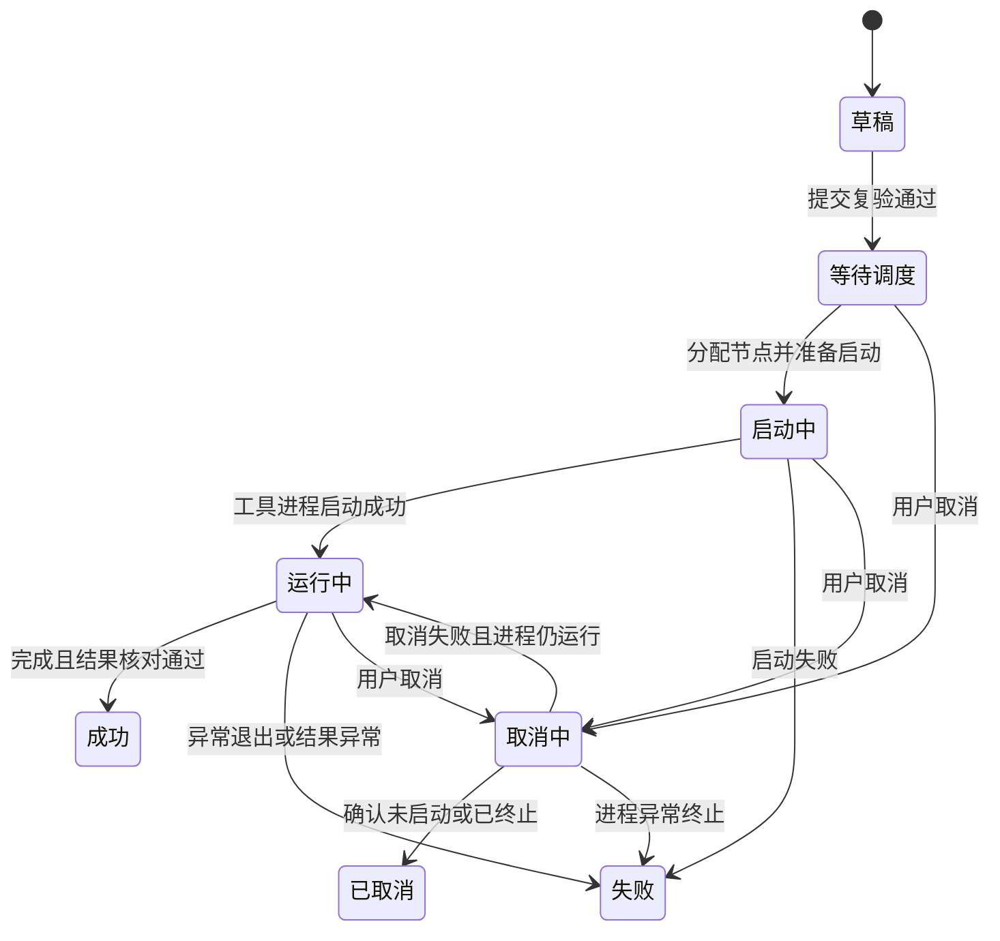

# 任务中心与任务详情模块专项评审稿

> 文档状态：产品、字段规则与全状态低保真已确认，精确工具行为边界待验证  
> 模块优先级：P0  
> 适用任务：导出、普通导入、旁路导入  
> 依据：[总体 PRD 第 11～12 章](../01-product/PRD.md)  
> 更新日期：2026-08-03
> 产品决策依据：[DEC-020](../01-product/decisions.md#dec-020-任务中心与任务详情专项产品规则)  
> 字段决策依据：[DEC-021](../01-product/decisions.md#dec-021-任务中心与任务详情字段及条件规则)  
> 关联低保真：[核心流程低保真基线](core-flow-low-fidelity.md)、[任务中心与任务详情全状态低保真基线](task-center-low-fidelity.md)  
> 低保真决策依据：[DEC-038](../01-product/decisions.md#dec-038-任务中心与任务详情全状态低保真基线)

## 1. 评审目标

建立三类任务共用的执行追踪和排障入口，让用户能够回答：有哪些任务、当前是否真在运行、执行到哪里、实际用了什么配置和命令、结果在哪里、为什么失败，以及当前允许哪些安全操作。

本模块只统一任务管理和任务上下文，不重新定义导出、普通导入和旁路导入的参数或失败语义。三类任务的差异由已确认的模块规则驱动，不为某一类任务单独造一套详情页。

本稿不定义 API、数据库表、调度算法、日志存储实现或高保真 UI。

## 2. 已确认基线

- 三类任务提交后共用任务中心、任务详情和日志能力。
- 任务详情显示提交时的不可变配置快照、工具版本和完整命令。
- 命令只读，默认脱敏；敏感查看和复制受权限、二次确认和审计约束。
- 只有工具输出可靠解析时展示百分比；否则降级为阶段和持续时间，不伪造 ETA。
- 导出和普通导入只在检查点、原路径、工具版本和快照条件均满足时可从检查点继续。
- 旁路导入不支持检查点续传，失败后只能基于原配置新建或从头重新执行。
- 取消任务必须核对工具进程和可能的数据库端任务，不得只修改平台状态。
- 公共模块以支撑任务创建、执行、排障和审计为边界，不建设通用运维或日志分析平台。

## 3. 模块边界

### 包含

- 统一任务列表、筛选、状态、阶段、可靠进度和行级操作。
- 任务详情页头摘要、运行概览、配置快照、命令、任务日志和操作记录。
- 草稿继续编辑、取消、基于原配置新建、从头重新执行和条件化检查点继续。
- 任务来源和派生关系、敏感操作记录和当前任务排障上下文。

### 不包含

- 定时计划、依赖编排、DAG、优先级队列可视化或跨任务工作流。
- 批量取消、批量重试、批量删除或批量修改节点等高风险操作。
- 自定义列布局、保存筛选视图、拖拽编排或任务看板。
- 全文日志分析、日志聚类、AI 根因诊断或未经验证的自动修复。
- 输出文件浏览器、数据预览、对象管理或导入结果的业务数据校验。
- 平台级任务保留、日志保留、告警和通知策略，这些属于系统设置或后续模块。

## 4. 轻量化设计原则

1. 列表用于定位和管理，不在单行塞入全部参数和日志。
2. 详情用于理解和排障，不允许原地修改已提交配置。
3. 状态只表达稳定执行生命周期，具体步骤放入“当前阶段”，避免状态枚举无限扩张。
4. 端口、路径、格式、对象和参数等事实由任务快照提供，不从当前数据源或模板反查后覆盖历史。
5. 失败摘要放在运行概览的高显著位置，不为大量非失败任务常驻一个空“错误信息”页签。
6. 当平台暂时无法证明进程真实状态时，显示“状态核对中”附加标识，不立即把任务判为失败，也不新增一批业务状态。

## 5. 任务对象与不可变边界

| 对象 | 产品语义 | 可修改性 |
|---|---|---|
| 草稿 | 用户尚未完成提交的向导配置 | 可编辑、可删除，没有实际执行命令 |
| 已提交任务 | 一次独立执行，具有唯一任务 ID、不可变快照和状态 | 不允许修改配置、数据源、执行节点或命令 |
| 派生任务 | 基于原配置新建、从头重新执行或从检查点继续形成的新任务 | 使用新任务 ID，保留来源任务和派生方式 |

V1.0 在产品层采用“一个已提交任务对应一次执行”。这使列表状态、实际命令、执行节点和输出结果始终一一对应，避免把多次尝试压在同一行后造成“当前状态到底属于哪次执行”的歧义。技术设计可以使用执行记录实体，但不改变这个面向用户的语义。

## 6. 任务列表

### 6.1 页面结构

1. 页头：模块标题、三类新建任务入口和最后更新时间。
2. 基础筛选：关键字、任务类型、状态和创建时间。
3. 展开筛选：数据源、环境、执行节点、创建人、开始时间和标签。
4. 结果区：活动筛选摘要、任务表格、空状态、加载/刷新状态和分页。

首页、执行节点和日志中心跳转过来时，筛选条件显式展示且可清除；返回列表时保留原筛选、排序和页码。

### 6.2 默认列

| 列 | 内容 | 密度处理 |
|---|---|---|
| 任务 | 任务名称、ID、环境标识 | 合并为一列，名称主显示 |
| 类型 | 导出、普通导入或旁路导入 | 使用稳定文案和标识 |
| 数据源 / 对象 | 历史数据源名称与 Schema/表/对象摘要 | 超长截断，完整内容在详情查看 |
| 状态 / 阶段 | 稳定状态、当前阶段和状态新鲜度 | 状态主显示，阶段次显示 |
| 进度 | 可靠百分比、阶段或持续时间 | 只展示可验证信息 |
| 执行节点 | 快照中的节点名称 | 未分配时显示“待分配” |
| 创建人 | 任务创建人 | 按权限显示 |
| 时间 | 开始时间和当前/最终耗时 | 未开始时显示创建时间 |
| 操作 | 查看与当前状态下的一个主操作 | 其余收入更多菜单 |

V1.0 不提供自定义列或多套保存视图。任务列表以快速定位异常和进入详情为主，参数、命令和完整错误不进入列表。

## 7. 任务状态与阶段

### 7.1 V1.0 持久状态

```text
草稿、等待调度、启动中、运行中、取消中、成功、失败、已取消
```

PRD 原稿建议将“待校验”和“校验失败”作为任务状态。已确认 V1.0 不将它们持久化：向导已在提交前完成预检查，提交时的服务端复验是一次操作过程。复验失败时保留草稿、显示失败项并记录操作；复验通过后直接进入“等待调度”。这样可以避免列表长期积累不能执行的“校验失败任务”。

### 7.2 状态流转



取消请求失败不等于任务失败。如果工具进程仍然运行，任务恢复为“运行中”并显示取消操作失败；只有进程已异常终止或执行结果失败时才进入“失败”。

### 7.3 阶段与状态核对

- 统一状态表达生命周期，“当前阶段”按任务类型从可靠日志中映射。
- 导出可展示连接/准备、对象定义导出、数据导出、写入输出、完成等已能可靠识别的阶段，精确日志映射待受控验证。
- 普通导入可展示文件预处理、定义/数据导入、合并/完成等可靠阶段，精确日志映射待受控验证。
- 旁路导入沿用已确认的参数校验、文件预处理、数据写入、服务端处理/提交等阶段。
- 执行节点失联、平台重启或日志中断时，保留最后已证实状态，显示“状态核对中”和最后更新时间；核对完成后再更新终态。

## 8. 列表操作

| 状态 | 主操作 | 其他操作 | 边界 |
|---|---|---|---|
| 草稿 | 继续编辑 | 删除、提交执行 | 提交仍进入对应向导最终复验 |
| 等待调度 | 查看详情 | 取消 | 不允许原地修改执行节点或配置 |
| 启动中 / 运行中 | 查看详情 | 查看日志、条件化取消 | 取消能力由任务类型和当前阶段决定 |
| 取消中 | 查看详情 | 查看日志 | 不重复提交取消请求 |
| 成功 | 查看详情 | 复制脱敏命令、基于原配置新建、保存为模板 | 按模板创建权限提取活动显式非敏感配置，并展示保存、排除和待补摘要 |
| 失败 | 查看错误 | 日志、复制命令、基于原配置新建、从头重新执行、条件化检查点继续 | 旁路导入永不显示检查点继续 |
| 已取消 | 查看详情 | 日志、基于原配置新建、从头重新执行 | 新执行使用新任务 ID |

等待任务不提供“调整执行节点”。该操作会改变已提交快照，与历史命令可追溯性冲突。V1.0 需要换节点时，先取消原任务，再使用“基于原配置新建”选择新节点并重新预检查。

## 9. 任务详情信息架构

任务详情使用“页头摘要 + 五个内容区”：

1. **运行概览**：状态、阶段、可靠进度、时间、数据源、节点、对象、输入/输出、结果和条件化失败摘要。
2. **配置快照**：按原向导步骤展示用户值、实际生效值、派生来源、工具默认和预检查/风险确认证据。
3. **命令**：展示计划执行命令或实际启动命令、工具版本、启动目录和脱敏复制。
4. **执行日志**：当前任务的实时/历史增量日志、过滤、错误定位和下载。
5. **操作记录**：创建、编辑、提交、调度、启动、取消、重新执行、敏感查看和日志下载。

失败或状态异常时，运行概览顶部增加错误摘要和“跳转错误日志”，不常驻第六个错误页签。

## 10. 运行概览、进度与结果

### 10.1 概览内容

- 任务名称、ID、类型、环境、创建人和派生关系。
- 状态、当前阶段、进度证据类型、开始/结束时间、耗时和最后更新。
- 提交时的数据源和执行节点快照；当前对象已删除或无权时仍显示历史名称。
- 导出任务显示对象范围、输出位置和可靠文件/记录摘要。
- 普通导入显示文件集、目标对象和工具可靠输出的成功/失败摘要。
- 旁路导入显示单表、文件集、全量/增量模式和表粒度整体提交结果。

页面不把平台统计值或推测值写成工具结果。文件数、导入行数、影响行数或速率只在有明确日志/结果证据时展示；否则显示输出位置、最终状态和可核对证据。

### 10.2 进度降级

| 证据能力 | 展示 | 禁止 |
|---|---|---|
| 可靠总量 + 已完成量 | 百分比、当前阶段和持续时间 | 伪造 ETA |
| 只能可靠识别阶段 | 阶段和持续时间 | 伪造阶段完成比例 |
| 无可靠解析 | 运行状态、持续时间和最新日志时间 | 百分比、ETA 或“即将完成” |

## 11. 配置快照与命令

### 11.1 配置快照

- 按原向导步骤和参数分类展示，不将所有字段摊成一张长表。
- 区分用户显式值、平台派生值、未显式传参的工具默认和非活动未生效值。
- 展示派生来源、工具版本、参数元数据版本、数据源快照、执行节点和提交时的预检查/风险确认摘要。
- 快照不因数据源、模板、节点或参数元数据后续修改而变化。

### 11.2 命令

- 尚未启动时显示“计划执行命令”；启动后显示“实际启动命令”。
- 如果平台运行时包装导致两者存在可见差异，分别展示并解释差异来源，不得用计划命令冒充实际命令。
- 命令只读，默认脱敏；默认复制脱敏命令。
- 显示或复制敏感命令只对有权限用户提供，并要求二次确认和审计；技术实现仍应尽量避免可恢复明文凭据。

## 12. 日志、错误与操作记录

### 12.1 执行日志

- 默认显示当前任务的工具标准输出/错误输出和必要的调度上下文。
- 经人工确认，已授权任务日志保留当前工具输出中的完整非秘密运行上下文，包括连接、对象、路径、非密码命令令牌和原始工具诊断；该规则不提供原始节点文件或未授权任务日志。
- 运行时增量加载，支持暂停自动滚动、关键字/级别过滤、跳转错误位置和手动刷新。
- 实时连接中断时保留已加载内容，显示中断时间和重连操作，不清空屏幕。
- 大日志使用分页、游标或按时间增量加载；下载完整日志受权限和审计约束。
- “查看更多日志”跳转日志中心并带入任务 ID，任务详情不承担跨任务日志检索。

### 12.2 错误摘要

- 展示平台错误分类、原始错误、发生阶段、时间和可定位的参数/文件。
- 原始错误保留上下文，只遮蔽密码、令牌、密钥和安全材料；错误摘要不篡改工具原意。
- 建议检查项只来自已确认规则，不生成未经验证的自动修复或 AI 诊断。

### 12.3 操作记录

任务上下文中记录操作类型、操作人、时间、结果和必要摘要。操作记录是任务级追溯视图，不替代平台全量审计日志。

## 13. 取消、重新执行与检查点继续

### 13.1 取消

- 等待调度的任务在确认未分发后可取消。
- 启动中和运行中的任务只在当前类型/阶段具有安全终止语义时显示取消；未确认项标记“待官方参数映射确认”。
- 取消确认显示任务类型、当前阶段、可能影响和“取消不代表回滚已写入数据/文件”。
- 取消后先进入“取消中”，确认工具进程和相关数据库端任务终止后才进入“已取消”。

### 13.2 基于原配置新建

- 创建可编辑新草稿，复制非敏感用户配置并标记来源任务。
- 不复用敏感明文、原预检查结果、风险确认、任务状态或日志。
- 按当前工具版本和参数元数据重新校验，用户可修改可编辑配置。

### 13.3 从头重新执行

- 使用原任务的标准化非敏感配置生成新任务，标记“从头重新执行”和来源任务。
- 不允许在操作确认弹窗内修改参数；如需修改，使用“基于原配置新建”。
- 提交前仍使用当前工具/参数版本完成数据源、节点、路径、权限和风险复验；复验不通过时改为新草稿等待处理，不盲目执行。

### 13.4 从检查点继续

- 只对失败的导出或普通导入任务显示，并必须存在有效 `dump.ckpt` 或 `load.ckpt`。
- 原输入/输出路径可访问、工具版本与不可变快照符合条件，且检查点语义通过受控验证。
- 创建新任务 ID，使用原快照和 `--retry`，不允许修改参数。
- 旁路导入永不显示该操作。

## 14. 权限、脱敏与审计

- 普通用户默认查看自己创建或被授权的任务，管理权限不在本模块重新设计。
- 列表筛选、数量和导出结果均基于用户有权限的任务集合，不通过计数泄露无权任务。
- 密码、存储密钥、令牌和安全材料在配置、命令、错误、日志和操作记录中默认脱敏；已授权任务日志保留非秘密运行上下文。
- 取消、删除草稿、从头重新执行、检查点继续、显示/复制敏感命令和下载完整日志需要记录审计事件。

## 15. 任务中心约束矩阵首版

| 编号 | 条件 | 系统行为 | 依据状态 |
|---|---|---|---|
| TC-C01 | 任务类型不是导出/普通导入/旁路导入 | 不进入 V1.0 任务列表模型 | 产品范围 |
| TC-C02 | 用户无任务查看权限 | 不返回任务、数量或筛选候选值 | 已确认权限原则 |
| TC-C03 | 草稿未通过提交复验 | 保持草稿并展示校验失败，不创建可执行任务 | TC-R06 / TC-FR02 |
| TC-C04 | 已提交任务请求修改配置或节点 | 不提供原地编辑，引导取消后基于原配置新建 | 不可变快照 |
| TC-C05 | 任务状态与进程/结果冲突 | 标记状态核对中，核对进程、日志和结果后再更新 | PRD 已确认 |
| TC-C06 | 日志无可靠总量 | 不展示百分比或 ETA | DEC-010 |
| TC-C07 | 日志只能识别阶段 | 展示阶段和持续时间 | DEC-010 |
| TC-C08 | 数据源或节点后续修改/删除 | 历史任务继续显示快照，不覆盖 | 快照原则 |
| TC-C09 | 只存在计划命令、尚未启动 | 明确标注“计划执行命令” | 透明性原则 |
| TC-C10 | 实际启动命令与计划命令有可见差异 | 分别展示并记录差异来源 | 透明性原则 |
| TC-C11 | 用户无敏感命令权限 | 只显示/复制脱敏命令 | 已确认安全规则 |
| TC-C12 | 错误建议没有明确规则来源 | 不展示自动修复或确定性建议 | DEC-002/012 |
| TC-C13 | 日志实时连接中断 | 保留已加载内容，提示重连 | 全局交互规范 |
| TC-C14 | 任务尚未分发且取消确认成功 | 经取消中进入已取消 | PRD 取消原则 |
| TC-C15 | 运行任务请求取消 | 核对任务类型、阶段、工具进程和数据库端任务 | PRD 取消原则 |
| TC-C16 | 取消失败且工具进程仍运行 | 恢复运行中，另行提示取消操作失败 | TC-R17 / TC-FR10 |
| TC-C17 | 终态任务请求取消 | 不显示取消 | 状态规则 |
| TC-C18 | 旁路失败任务 | 不显示检查点继续 | DEC-011 |
| TC-C19 | 导出/普通导入不满足检查点条件 | 不显示检查点继续，说明不满足项 | 已确认模块规则 |
| TC-C20 | 基于原配置新建 | 创建可编辑新草稿，清除旧检查和风险确认 | 已确认模块规则 |
| TC-C21 | 从头重新执行或检查点继续 | 生成新任务 ID 并保留来源关系 | TC-R18～TC-R19 / TC-FR11～TC-FR12 |
| TC-C22 | 结果数量无可靠证据 | 不展示推测行数、文件数或速率 | DEC-010 扩展 |
| TC-C23 | 列表批量选中任务 | V1.0 不提供批量高风险操作 | DEC-012 |
| TC-C24 | 从详情返回列表 | 保留原筛选、排序和页码 | 公共交互规则 |
| TC-C25 | 请求跨任务日志检索 | 跳转日志中心并带入任务条件 | 信息架构边界 |
| TC-C26 | 成功任务请求保存为模板 | 有模板创建权限时，按模板中心提取规则进入保存预览；非成功任务不显示入口 | TP-R09～TP-R10 |

## 16. 已确认产品决策

TC-R01～TC-R20 已于 2026-07-17 全部确认。确认的是任务对象、列表、状态、详情架构、快照、命令、日志、取消和派生任务的产品语义；三类任务的精确取消阶段、日志映射、检查点兼容条件和结果解析口径仍保持待官方确认或受控验证。

| 编号 | 议题 | 已确认方案 |
|---|---|---|
| TC-R01 | 模块边界 | 任务中心只统一三类任务的管理、追踪和排障，不扩展计划调度、DAG、告警或日志分析 |
| TC-R02 | 任务对象 | 一个已提交任务对应一次执行；重新执行和检查点继续创建新任务并保留关系 |
| TC-R03 | 列表密度 | 采用固定默认列和基础/展开筛选，V1.0 不做自定义列、保存视图或看板 |
| TC-R04 | 批量操作 | V1.0 不提供批量取消、重试、删除或改节点 |
| TC-R05 | 持久状态 | 收敛为草稿、等待调度、启动中、运行中、取消中、成功、失败、已取消八种 |
| TC-R06 | 提交校验 | 待校验/校验失败不作长期任务状态；复验失败保持草稿，通过后进入等待调度 |
| TC-R07 | 状态新鲜度 | 进程不可核对时保留最后已证实状态，使用“状态核对中”附加标识，不伪造失败 |
| TC-R08 | 已提交快照 | 提交后配置、数据源、节点和命令不可原地修改；等待任务也不例外 |
| TC-R09 | 详情架构 | 使用页头摘要和运行概览、配置快照、命令、执行日志、操作记录五个内容区；错误放在概览高显著区 |
| TC-R10 | 进度展示 | 依证据降级为百分比、阶段或仅运行状态/持续时间，不显示伪造 ETA |
| TC-R11 | 结果展示 | 导出和导入只展示工具日志或结果文件可靠证明的数量、位置和结果，不推测 |
| TC-R12 | 配置快照 | 按原向导展示用户值、实际值、派生来源、工具默认、版本和预检查/风险证据 |
| TC-R13 | 命令展示 | 区分计划命令和实际启动命令，默认脱敏、只读、复制脱敏内容 |
| TC-R14 | 日志边界 | 详情只查当前任务增量日志；跨任务查询跳转日志中心 |
| TC-R15 | 错误处理 | 错误摘要优先显示分类、原始错误、阶段和定位信息，不做未验证自动修复 |
| TC-R16 | 取消语义 | 只在可安全终止状态/阶段显示；确认进程和数据库端任务终止后才标记已取消 |
| TC-R17 | 取消失败 | 取消失败且进程仍运行时恢复运行中，不把操作失败误写成任务失败 |
| TC-R18 | 新建/重新执行 | 基于原配置新建可编辑草稿；从头重新执行不就地改参，均重新预检查 |
| TC-R19 | 检查点继续 | 仅失败导出/普通导入在检查点、路径、版本和原快照条件均满足时创建新 `--retry` 任务 |
| TC-R20 | 权限与审计 | 列表、详情、命令、日志和操作都基于任务权限；高风险与敏感操作记录审计 |

## 17. 验收基线

1. 导出、普通导入和旁路导入使用同一任务列表、状态和详情架构。
2. 列表可以按关键字、类型、状态、时间及展开条件定位任务，且不显得像参数表。
3. 任务状态与实际进程/结果一致，暂不可核对时不伪造终态。
4. 详情可以追溯提交时配置、派生值、工具版本、数据源/节点快照和实际命令。
5. 进度、结果数量和错误建议都具有可追溯证据，不用界面推测值代替工具事实。
6. 任务日志增量加载，连接中断不会清空已加载内容。
7. 已提交任务不能通过列表或详情原地改参数或执行节点。
8. 取消不会在未确认终止时过早标记已取消，取消操作失败不会被写成任务失败。
9. 旁路导入失败任务永不出现检查点续传，从头重新执行使用明确文案。
10. 新建、从头重新执行和检查点继续使用新任务 ID 并可追溯来源。
11. 敏感配置、命令、错误和日志默认脱敏，高风险操作可审计。
12. V1.0 不因“任务中心”名称扩展为计划调度、DAG、告警、看板或日志分析平台。

## 18. 待官方确认与受控验证项

- 三类任务可安全取消的精确状态/阶段：待官方参数映射确认。
- 导出、普通导入阶段与进度的精确日志映射，以及检查点继续的完整兼容条件。
- 旁路导入数据写入、服务端排序/索引构建/提交阶段的取消安全性。
- 任务结果可靠解析的文件数、行数、影响行和速率口径。
